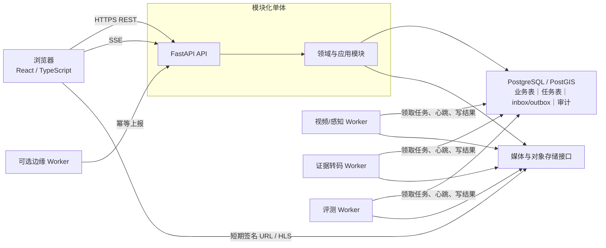
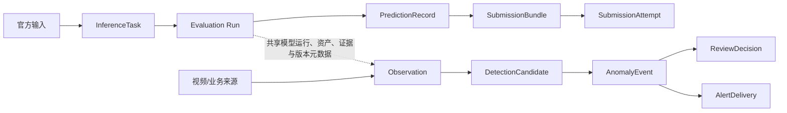

# 前后端工程框架

> 文档状态：赛前工程基线候选  
> 适用范围：高点视频、异常证据、人工研判、数据看板、评测导出  
> 不在本文展开：遥感算法与预处理细节，由遥感负责人维护；完整工单、三维孪生、无人机调度不进入首版

## 0. 结论先行

当前最合适的工程形态是：

> **React + TypeScript 单页前端 + FastAPI 模块化单体 + PostgreSQL/PostGIS + 对象存储抽象 + 独立 Worker**

这不是把所有能力写进一个文件。模块化单体仍按领域边界隔离代码、表和接口，只是不在需求、负载和团队边界尚未稳定时提前拆成微服务。视频解码、模型推理、证据转码等长耗时任务放到独立 Worker，避免阻塞 API 进程。

首版固定四条边界：

1. **评测链与产品链隔离。** 官方输入只进入 `InferenceTask → PredictionRecord → SubmissionBundle`；事件合并、拆分、人工复核不得改变官方样本 ID、数量、顺序和空结果语义。
2. **观测、候选、事件、复核、告警分离。** `Observation` 不是 `AnomalyEvent`，人工确认不是修改模型原始结果，告警投递也不是事件处置完成。
3. **数据库任务表先于消息中间件。** PostgreSQL 任务租约、inbox/outbox 和幂等约束足以支撑首版；没有实测吞吐证据前不引入 Kafka。
4. **浏览器只读受控媒体。** 前端不直连 RTSP、不读取模型目录、不接触对象存储密钥，只使用 API 返回的短期签名 URL、HLS 地址和结构化叠加数据。

本方案明确不建设：

- Kubernetes、多集群服务治理或 Kafka；
- 完整工单、执法或河长制平台；
- 三维数字孪生；
- 无真实设备条件下的 GB/T 28181 信令平台；
- 浏览器端模型推理；
- 与正式评测输出共用的“万能 DetectionResult”。

## 1. 运行时拓扑



### 1.1 为什么选择模块化单体

| 判断项 | 当前证据 | 选择 |
|---|---|---|
| 团队规模 | 小团队、多角色兼任 | 单仓库、单 API 发布单元 |
| 业务边界 | 仍随官方数据和规则变化 | 先保持模块内聚，不做网络级拆分 |
| 资源隔离 | 视频/模型任务明显长耗时 | API 与 Worker 进程隔离 |
| 一致性 | 复核、事件版本、outbox 需要事务一致性 | 同一 PostgreSQL 事务 |
| 部署环境 | 本地、边云、封闭评测、线下演示都可能出现 | 同一代码，多配置档 |
| 吞吐证据 | 尚无真实摄像机数量和任务峰值 | 任务表起步，压测后再决定队列 |

只有出现以下任一证据，才评估拆服务：模块由独立团队独立发布；资源曲线完全不同且进程隔离仍不够；数据库任务表在压测中成为瓶颈；正式环境明确提供并要求服务编排。拆分时优先拆媒体/推理 Worker，不先拆事务关联紧密的事件与复核。

## 2. 推荐仓库目录

下面是目标结构，不要求一次性搬完。目录名表达职责，不能把具体框架对象当领域边界。

```text
shanshui-zhijian/
├── apps/
│   ├── api/                         # FastAPI 组合根、路由、鉴权、异常映射
│   │   ├── main.py
│   │   ├── dependencies.py
│   │   └── routers/
│   ├── worker/                      # Worker 启动入口与任务处理器注册
│   └── evaluation/                  # 封闭评测入口；不依赖产品事件流
├── frontend/
│   ├── src/
│   │   ├── app/                     # Providers、错误边界、全局布局
│   │   ├── api/                     # OpenAPI 生成客户端、HTTP 基座、鉴权与错误归一化
│   │   ├── routes/                  # React Router 路由、权限元数据、懒加载
│   │   ├── pages/                   # 五个页面
│   │   ├── features/                # 业务模块；各自拥有公开组件、API Adapter、Query 与测试
│   │   ├── components/              # 无业务状态的通用组件
│   │   ├── hooks/                   # SSE、媒体时钟、授权刷新等复用逻辑
│   │   ├── state/                   # Zustand：会话、UI、无敏感偏好
│   │   └── styles/
│   ├── tests/
│   └── package.json
├── modules/
│   ├── sources/
│   ├── observations/
│   ├── candidates/
│   ├── events/
│   ├── reviews/
│   ├── evidence/
│   ├── alerts/
│   ├── runs/
│   ├── submissions/
│   ├── identity/
│   └── audit/
│       └── <module>/
│           ├── domain.py            # 实体、值对象、状态机；不依赖 FastAPI
│           ├── commands.py          # 写操作用例
│           ├── queries.py           # 查询用例
│           ├── ports.py             # Repository、对象存储、模型等接口
│           ├── schemas.py           # API/事件 Schema，不等同 ORM
│           └── infrastructure.py    # PostgreSQL、对象存储等适配
├── platform/
│   ├── db/                          # Session、事务、公共类型
│   ├── tasks/                       # 任务领取、租约、重试
│   ├── messaging/                   # inbox/outbox；不绑定 Kafka
│   ├── media/                       # URI、签名 URL、HLS 元数据
│   ├── security/
│   ├── observability/
│   └── config/
├── adapters/
│   ├── video/                       # MP4/RTSP 等 SourceAdapter
│   ├── model_provider/              # 官方地址/本地模型适配
│   ├── geospatial/                  # 仅接口；遥感实现由负责人维护
│   └── competition/                 # 官方输入与 JSON 导出适配
├── schemas/
│   ├── internal/                    # 版本化 JSON Schema
│   ├── official/                    # 官方 Schema 原文或映射，禁止自行猜测
│   └── openapi/
├── migrations/                      # Alembic 迁移
├── tests/
│   ├── unit/
│   ├── contract/
│   ├── integration/
│   ├── e2e/
│   └── fixtures/
├── deploy/
│   ├── local-demo/
│   ├── edge-cloud/
│   ├── sealed-eval/
│   └── offline-roadshow/
├── data/
│   ├── manifests/                   # 只提交清单、许可和校验信息
│   └── README.md                    # 不提交未获授权原始数据
├── docs/
├── pyproject.toml
└── README.md
```

依赖方向必须保持：

```text
API/Worker → 应用用例 → 领域对象
                    ↑
             基础设施实现接口
```

领域层不得导入 FastAPI、SQLAlchemy、前端类型或某个模型 SDK。ORM 模型、Pydantic API Schema、内部领域对象可以字段相近，但不能强行共用一个类。

## 3. 后端模块与职责

| 模块 | 写入职责 | 查询职责 | 明确不负责 |
|---|---|---|---|
| `sources` | 注册数据源、启停、健康摘要 | 源列表、详情、健康历史 | 生成业务事件 |
| `observations` | 幂等接收机器观测 | 按来源、时空、运行查询 | 人工确认、告警 |
| `candidates` | 从观测形成不可变候选、抑制/替代 | 候选队列、关联证据 | 覆盖原始 Observation |
| `events` | 聚合候选、状态流转、合并/拆分/重开 | 事件列表、详情、时间线 | 工单处置状态 |
| `reviews` | 追加人工决策、理由码和版本前置条件 | 审核历史、待审队列 | 原地改写历史审核 |
| `evidence` | 登记媒体与派生证据、签发上传/读取授权 | 证据元数据、可视化引用 | 存储密钥暴露给浏览器 |
| `alerts` | 在确认、规则和权限门禁后创建投递 outbox | 投递状态、回执、失败原因 | 把“已发送”写成“已处置” |
| `runs` | 创建预处理/推理/转码/评测任务 | 进度、日志摘要、输入输出 | 用日志文本代替状态机 |
| `submissions` | 构建、预检、复核、记录平台尝试 | Bundle、Attempt、分数引用 | 从 AnomalyEvent 直接导出 |
| `identity` | 身份映射、角色与范围 | 当前用户权限 | 自建复杂账号中心 |
| `audit` | 追加审计条目、关联 request/trace | 按对象和操作者追溯 | 保存密钥和完整模型原始敏感响应 |

### 3.1 存储分工

| 数据 | 首版位置 | 约束 |
|---|---|---|
| 领域元数据、状态、版本 | PostgreSQL | 事务、外键、唯一约束 |
| 地理几何、AOI、空间查询 | PostGIS | 明确 SRID；API 输出 GeoJSON 时转换为 WGS84 |
| 视频、图像、掩膜、提交包 | 对象存储接口；本地档可用受控目录实现 | 数据库只存 URI、哈希、大小、媒体类型、血缘 |
| 短期任务协调 | PostgreSQL `task` 表 | 租约、心跳、重试、死信 |
| 领域通知 | PostgreSQL `outbox` | 与业务写入同事务 |
| 外部上报去重 | PostgreSQL `inbox` | `producer + message_id` 唯一 |
| 审计 | 追加式 `audit_entry` | 不允许普通业务 API 更新或删除 |

关系数据库不保存大视频和大栅格二进制；对象存储中的对象也不能只靠易变本地路径识别。每个对象至少记录 `object_uri`、`sha256`、`size_bytes`、`content_type`、`created_at`、`parent_asset_id`、`retention_class` 和授权/数据模式引用。

### 3.2 任务表

`task` 是首版 Worker 协调协议，不是业务事实表。

| 字段 | 含义 |
|---|---|
| `task_id` | 稳定任务 ID |
| `task_type` | `video_infer / evidence_transcode / evaluation / export` 等枚举 |
| `dedupe_key` | 同一业务输入与版本的唯一键 |
| `payload_ref` | 结构化输入引用，不塞大媒体 |
| `status` | `queued / running / succeeded / failed / dead / cancelled` |
| `priority`、`available_at` | 调度优先级和最早领取时间 |
| `lease_owner`、`lease_expires_at` | Worker 租约；不能只用进程内锁 |
| `heartbeat_at` | 长任务存活时间 |
| `attempt_count`、`max_attempts` | 有界重试 |
| `last_error_code`、`last_error_ref` | 机器可读错误和受控详情引用 |
| `result_ref` | 输出对象/运行引用 |
| `created_at`、`started_at`、`finished_at` | UTC 时间 |

多个 Worker 通过 `SELECT … FOR UPDATE SKIP LOCKED` 领取可用行并立刻提交短事务，再在事务外执行长任务。PostgreSQL 官方文档明确说明 `SKIP LOCKED` 可用于多个消费者访问队列式表，但它不是通用一致性查询视图，因此业务查询不能借此跳过对象。参考：[PostgreSQL SELECT 锁定子句](https://www.postgresql.org/docs/current/sql-select.html)。

任务规则：

- 同一 `dedupe_key` 只允许一个未终结任务；
- Worker 必须周期性续租，超时任务才能被其他 Worker 回收；
- 每次尝试创建独立 `ProcessRun`，不得覆盖上一次错误；
- 只重试被分类为可重试的错误；Schema 错误、缺字段和无权限不自动重试；
- 超过 `max_attempts` 进入 `dead`，由人工显式重放；
- 取消是状态命令，不删除任务和运行证据。

### 3.3 inbox / outbox

**接收路径：**

```text
边缘或 Worker 消息
→ 先插入 inbox(producer, message_id)
→ 同事务写 Observation/Candidate 等业务对象
→ 提交
→ 重复 message_id 直接返回首次处理结果
```

**发送路径：**

```text
业务命令
→ 同事务写 Event/AlertDelivery 与 outbox
→ 投递 Worker 领取 outbox
→ 调用外部渠道
→ 记录回执
→ 以 delivery_id / idempotency_key 防重
```

outbox 提供的是“业务事实与待发送记录同事务提交”；外部网络仍是至少一次尝试，端到端不重复依赖接收方幂等。任何无法证明的链路都不得宣称“绝对不丢不重”。

### 3.4 幂等、并发与审计

| 场景 | 机制 |
|---|---|
| 创建 Source、Run、Review、Alert、Submission Bundle | `Idempotency-Key` 请求头 + 调用者范围内唯一约束 |
| 接收边缘观测 | `producer_id + message_id` inbox 唯一约束 |
| 模型任务 | `input_hash + model/config version + task_type` 形成 `dedupe_key` |
| 事件关联候选 | `event_id + candidate_id` 唯一约束 |
| 告警投递 | `event_id + event_version + channel + recipient + policy_version` 唯一约束 |
| 赛事记录 | `inference_task_id` 按官方规则唯一对应 `PredictionRecord` |

同一 `Idempotency-Key`、同一路径、同一调用者和相同请求哈希返回首次结果；键相同但请求体不同返回 `409 idempotency_key_reused`。幂等结果设置保留期，赛事构建和审核记录不得在比赛审计期内过期。

可变聚合根使用整数 `version`：

- `GET` 返回 `ETag: "event-<id>-v<version>"`；
- 复核、合并、拆分、重开等命令必须带 `If-Match` 或请求体 `expected_version`；
- 版本不一致返回 `412 version_conflict` 并附当前版本；
- 数据库更新使用 `WHERE id = ? AND version = ?`，影响行数为零即冲突；
- 不使用“最后写入覆盖前一审核”。

审计条目至少含：

`audit_id、occurred_at、actor_type、actor_id、action、object_type、object_id、object_version、request_id、trace_id、reason_code、before_hash、after_hash、metadata`

审计正文不保存令牌、口令、签名 URL、完整外部模型响应或未脱敏个人信息。普通业务事务只能追加，不能更新历史条目。

## 4. 评测链与产品链隔离



隔离规则：

1. `PredictionRecord` 的主键和排序来自 `InferenceTask`，不是事件 ID。
2. 赛事导出器只读取 `InferenceTask` 与 `PredictionRecord`；不得读取人工审核后的 `AnomalyEvent` 作为必需输入。
3. 产品链可复用相同模型权重、预处理和 `ModelRun`，但映射到 `Observation`。
4. 产品链的去重、合并、拆分只影响业务研判，不回写官方预测记录。
5. 官方 Schema 未发布前，`PredictionRecord.payload` 只能标注为内部占位；不得把当前内部 JSON 对外称为官方格式。
6. `SubmissionBundle` 一经构建不可变；修正生成新 Bundle，不覆盖旧文件。
7. 每次平台上传创建 `SubmissionAttempt`，保存 Bundle 哈希、复核者、上传时间和回执；平台分数不写回模型原始结果。

## 5. REST API 最小契约

### 5.1 通用约定

- 基址：`/api/v1`；OpenAPI 是接口快照，不是领域模型唯一来源。
- JSON 字段使用 `snake_case`，时间使用带时区的 RFC 3339 UTC。
- 对外地理对象使用符合 [RFC 7946](https://www.rfc-editor.org/rfc/rfc7946) 的 GeoJSON/WGS84；像素坐标必须显式写 `coordinate_space=pixel`、宽高和原点。
- 列表使用 `limit + cursor`，返回 `items + next_cursor`；禁止以无稳定排序的 offset 作为主分页。
- 异步命令返回 `202`、`run_id` 和状态 URL；同步创建返回 `201`。
- 所有响应带 `request_id`；长任务由 `run_id` 关联。
- 创建型命令要求 `Idempotency-Key`；并发修改要求 `If-Match`/`expected_version`。
- 受保护媒体接口只返回短期签名 URL；URL 不得进入长期日志或审计。

错误使用 `application/problem+json`，结构遵循 [RFC 9457 Problem Details](https://www.rfc-editor.org/rfc/rfc9457)：

```json
{
  "type": "https://example.invalid/problems/version-conflict",
  "title": "Version conflict",
  "status": 412,
  "code": "version_conflict",
  "detail": "Event was updated by another reviewer.",
  "instance": "/api/v1/events/evt_01/reviews",
  "request_id": "req_01",
  "errors": [
    {"path": "expected_version", "reason": "expected 3, current 4"}
  ]
}
```

`detail` 用于人读，前端分支只能依赖稳定 `code` 和字段路径。

### 5.2 Sources

| 方法与路径 | 用途 | 核心请求字段 | 结果 |
|---|---|---|---|
| `POST /sources` | 注册视频/文件/外部来源 | `source_type、name、data_mode、connection_ref、location/coverage、capabilities` | `201 Source` |
| `GET /sources` | 来源列表 | `status、source_type、data_mode、cursor` | 分页摘要 |
| `GET /sources/{source_id}` | 来源详情 | 无 | Source + 最近健康 |
| `POST /sources/{source_id}/commands/check-health` | 发起健康检查 | `expected_version` | `202 run_id` |
| `POST /sources/{source_id}/commands/set-state` | 启用/停用 | `target_state、reason_code、expected_version` | 新版本 Source |
| `POST /sources/{source_id}/playback-authorizations` | 申请浏览器预览授权 | `purpose、profile` | 短期 HLS/WebRTC 地址、`expires_at`；不返回 RTSP 凭据 |

`connection_ref` 只能指向密钥系统/受控配置项，不接受把 RTSP 用户名口令直接存入请求正文。

### 5.3 Observations

| 方法与路径 | 用途 | 核心请求字段 | 结果 |
|---|---|---|---|
| `POST /observations:ingest` | Worker/边缘幂等上报 | `message_id、producer_id、source_id、asset_ref、task_type、observed_extent、spatial、label、score、quality、model_run_ref、evidence_refs、schema_version` | `201` 或重复时 `200` 首次结果 |
| `GET /observations` | 时空/来源查询 | `source_id、run_id、label、from、to、bbox、cursor` | 分页 Observation |
| `GET /observations/{observation_id}` | 原始结构结果 | 无 | Observation，不含未授权原始响应 |

`score` 必须同时给 `score_type` 和校准/模型引用；缺少可靠定位时 `geometry` 可空，不能伪造经纬度。

### 5.4 Candidates

| 方法与路径 | 用途 | 核心请求字段 | 结果 |
|---|---|---|---|
| `POST /candidates` | 由规则/Worker 从观测形成候选 | `observation_refs、candidate_type、temporal_extent、spatial、score、quality、rule_version、evidence_refs` | `201 Candidate` |
| `GET /candidates` | 待聚合/被抑制候选 | `status、candidate_type、source_id、event_id、cursor` | 分页候选 |
| `GET /candidates/{candidate_id}` | 候选详情 | 无 | Candidate + 关联 |
| `POST /candidates/{id}/commands/suppress` | 质量/时序规则抑制 | `reason_code、expected_version` | 新状态；不删除观测 |

候选修正通过创建新候选并写 `supersedes_candidate_id`，不原地改模型事实。

### 5.5 Events 与 Reviews

| 方法与路径 | 用途 | 核心请求字段 | 结果 |
|---|---|---|---|
| `POST /events` | 从候选创建待研判事件 | `candidate_refs、event_type、scene、assessment、policy_version`；数据模式由服务端按候选血缘推导 | `201 Event` |
| `GET /events` | 事件队列/地图 | `status、event_type、severity、data_mode、from、to、bbox、source_id、assignee、cursor` | 摘要和聚合计数 |
| `GET /events/{event_id}` | 事件详情 | 无 | Event、证据链接、审核时间线、`ETag` |
| `POST /events/{id}/commands/merge` | 合并事件 | `target_event_id、reason_code、expected_source_version、expected_target_version` | 源/目标新版本 |
| `POST /events/{id}/commands/split` | 拆分事件 | `parts[{candidate_refs,event_type}]、reason_code、expected_version` | 原事件 `superseded` + 新事件 |
| `POST /events/{id}/commands/reopen` | 新证据下重开 | `reason_code、expected_version` | `reopened` 新版本 |
| `POST /events/{id}/reviews` | 追加审核 | `decision、reason_codes、note、corrected_type、expected_version` | `201 ReviewDecision` + Event 新版本 |
| `GET /events/{id}/reviews` | 审核历史 | `cursor` | 追加式决策列表 |

`decision` 首版限定为 `confirm / reject / reclassify / request_more_evidence`。合并、拆分、重开使用独立命令，避免一个万能 `action` 字符串绕过字段校验。

审核备注不是理由码的替代品；确认和驳回都要求至少一个枚举 `reason_code`。同一事件两个审核者并发提交时，只有版本匹配者成功，另一请求收到 `412 version_conflict`。

### 5.6 Evidence

| 方法与路径 | 用途 | 核心请求字段 | 结果 |
|---|---|---|---|
| `POST /evidence/upload-intents` | 申请受控上传 | `content_type、size_bytes、sha256、data_mode、retention_class、parent_asset_ref` | `upload_id` + 短期上传 URL |
| `POST /evidence/{evidence_id}/commands/finalize` | 完成哈希/大小校验 | `upload_id、sha256` | `201 Evidence` |
| `GET /evidence/{evidence_id}` | 元数据 | 无 | 不含永久内部路径 |
| `POST /evidence/{evidence_id}/access-url` | 获取短期读 URL | `purpose` | `expires_at、url` |
| `POST /events/{event_id}/evidence-links` | 关联证据 | `evidence_id、stance、reason_codes、uncertainty、expected_version` | Event 新版本 |

服务端必须验证声明的大小、媒体类型和 SHA-256；上传意图不能允许调用者指定任意桶、宿主机路径或外部回调 URL。

### 5.7 Alerts

| 方法与路径 | 用途 | 核心请求字段 | 结果 |
|---|---|---|---|
| `POST /events/{event_id}/alerts` | 对确认事件创建投递 | `event_version、channel、recipient_ref、policy_version` | `202 delivery_id` |
| `GET /alerts` | 投递台账 | `status、channel、event_id、cursor` | 分页 AlertDelivery |
| `GET /alerts/{delivery_id}` | 详情/回执 | 无 | 尝试历史与错误码 |
| `POST /alerts/{id}/commands/retry` | 人工重试死信 | `reason_code、expected_version` | `202` |

未确认事件、过期事件版本、规则不命中或调用者无权向该接收方投递时，返回明确错误，不静默创建 outbox。

### 5.8 Runs

| 方法与路径 | 用途 | 核心请求字段 | 结果 |
|---|---|---|---|
| `POST /runs` | 创建视频推理、转码或评测运行 | `run_type、input_refs、config_version、model_ref、data_mode、requested_outputs` | `202 Run` |
| `GET /runs` | 运行列表 | `run_type、status、data_mode、cursor` | 分页 Run |
| `GET /runs/{run_id}` | 进度与摘要 | 无 | 状态、阶段、计数、错误摘要、产物引用 |
| `POST /runs/{run_id}/commands/cancel` | 请求取消 | `reason_code、expected_version` | `202` |
| `POST /runs/{run_id}/commands/retry` | 按失败清单新建运行 | `reason_code、failed_items_only` | 新 `run_id` |

重试创建新 Run/Attempt，不把失败运行改回 `queued`。进度必须可由持久数据恢复，不能只存在进程内。

### 5.9 Submissions

| 方法与路径 | 用途 | 核心请求字段 | 结果 |
|---|---|---|---|
| `POST /submissions/bundles` | 从评测预测构建候选包 | `evaluation_run_id、official_schema_version、exporter_version` | `202 run_id` |
| `GET /submissions/bundles/{bundle_id}` | 包详情与预检 | 无 | 哈希、样本统计、校验报告 |
| `POST /submissions/bundles/{id}/commands/precheck` | 重跑只读预检 | `precheck_profile` | `202 run_id` |
| `POST /submissions/bundles/{id}/approvals` | 第二人复核 | `decision、reason_codes、bundle_sha256` | 追加式 Approval |
| `POST /submissions/bundles/{id}/attempts` | 记录一次实际上传 | `platform、quota_slot、approved_bundle_sha256` | `201 SubmissionAttempt` |
| `PATCH /submissions/attempts/{id}/receipt` | 录入平台回执 | `receipt_ref、platform_status、score_ref、expected_version` | 新版本 Attempt |

`SubmissionAttempt` 不代替平台操作自动化。若正式平台没有受支持 API，浏览器上传由参赛者完成，系统只做预检、复核和台账，不模拟点击或保存平台账号。

### 5.10 错误语义

| HTTP | `code` | 语义 |
|---:|---|---|
| 400 | `malformed_request` | JSON/查询语法无法解析 |
| 401 | `unauthenticated` | 未认证或令牌失效 |
| 403 | `forbidden` | 已认证但无对象/动作权限 |
| 404 | `not_found` | 对象不存在或按安全策略不可见 |
| 409 | `invalid_transition` | 当前生命周期不允许命令 |
| 409 | `idempotency_key_reused` | 同键对应不同请求体 |
| 412 | `version_conflict` | `If-Match`/`expected_version` 过期 |
| 413 | `payload_too_large` | 超过媒体或 JSON 上限 |
| 415 | `unsupported_media_type` | 媒体类型不支持 |
| 422 | `validation_error` | 字段、Schema、几何或业务前置条件错误 |
| 429 | `rate_limited` | 速率/额度门禁，带 `Retry-After` |
| 503 | `dependency_unavailable` | 模型/媒体服务暂不可用，可按错误类别重试 |

内部异常不向客户端回传堆栈、本地绝对路径、SQL、密钥引用值或模型供应方原始敏感内容。

## 6. 实时状态与视频预览取舍

### 6.1 SSE 优先，WebSocket 延后

首版使用：

- REST 发送复核、取消、重试等命令；
- `GET /api/v1/updates` 以 SSE 推送 `run.updated、event.updated、source.health_changed、alert.updated`；
- 浏览器断线后使用 `Last-Event-ID` 从持久事件序号续传；
- SSE 默认只推对象 ID、版本、状态和轻量摘要，详情仍走 REST；不得通过 SSE 传视频、音频、大图、掩膜数组或完整模型响应。

SSE 适合服务器到浏览器的单向更新，使用普通 HTTP，符合当前看板和任务进度场景。[WHATWG HTML Standard 的 Server-sent events](https://html.spec.whatwg.org/dev/server-sent-events.html) 定义了 `EventSource` 和 `text/event-stream`。

WebSocket 只在出现明确双向低时延需求时引入，例如实时 PTZ 控制、互动标注协作或 WebRTC 信令。事件复核表单不是使用 WebSocket 的理由。若后续启用，命令仍走领域应用层并受相同鉴权、幂等和审计约束，不能在 socket handler 里直接改表。

### 6.2 HLS 优先，WebRTC 作为受证据驱动的选项

| 场景 | 首选 | 原因 |
|---|---|---|
| 事件短片段、历史回放 | MP4/HLS | 可定位、可缓存、易与证据时间线对应 |
| 高点视频低频预览 | HLS | 浏览器适配成熟，允许数秒级延迟 |
| 亚秒级实时操控/对讲 | WebRTC | 需要双向实时媒体和专门信令/NAT 穿透 |
| 封闭评测 | 文件/帧引用 | 不依赖流媒体基础设施 |
| 线下断网演示 | 本地 MP4/HLS | 不依赖外部 TURN/CDN |

HLS 协议参考 [RFC 8216](https://www.rfc-editor.org/rfc/rfc8216)；非原生 HLS 浏览器可评估 [hls.js 官方仓库](https://github.com/video-dev/hls.js/)。WebRTC 是完整的实时通信体系，参考 [W3C WebRTC Recommendation](https://www.w3.org/TR/webrtc/)，不能只在前端加一个播放器就宣称完成。

前端绝不直接播放 RTSP。服务端/边缘适配层负责将获授权的实时源转换为浏览器可用的预览，正式技术选择必须在真实延迟、并发、转码资源和网络条件下验证。

浏览器也不得获得 RTSP URL、设备账号或口令。API 只可返回由后端或媒体网关签发的受控 HLS/WebRTC 播放地址，并限制来源、用户、用途和过期时间。HLS 播放时间通常包含采集、转码、切片、分发和播放器缓冲延迟，因此“浏览器当前播放时间”与“事件到达服务端时间”不能直接等同；界面必须分别显示源采集时间、媒体时间和系统接收时间，不能用告警到达时间反推视频帧时间。

## 7. 前端框架与信息架构

### 7.1 技术基线

| 能力 | 候选 | 使用边界 | 一手资料 |
|---|---|---|---|
| UI 框架 | React + TypeScript | 函数组件与 Hooks；TypeScript strict；不把领域状态藏入组件树 | [React TypeScript 指南](https://react.dev/learn/typescript) |
| 构建 | Vite | SPA 本地开发、静态构建与离线打包；首版不引入 SSR 运行时 | [Vite 官方指南](https://vite.dev/guide/) |
| 路由 | React Router（library mode） | 五页路由、权限元数据、URL 筛选参数和按页懒加载 | [React Router 官方文档](https://reactrouter.com/home) |
| 服务端状态 | TanStack Query | REST 查询、缓存、分页、Mutation；SSE 只触发按 `id + version` 失效/刷新 | [TanStack Query React 文档](https://tanstack.com/query/latest/docs/framework/react/overview) |
| 客户端状态 | Zustand | 只保存会话摘要、UI 偏好和跨页筛选；不复制 Event/Run 等服务器对象 | [Zustand 官方仓库](https://github.com/pmndrs/zustand) |
| 地图 | MapLibre GL JS | 二维底图、GeoJSON/栅格瓦片、事件选中联动 | [MapLibre GL JS API](https://maplibre.org/maplibre-gl-js/docs/API/) |
| 图表 | Apache ECharts | 趋势、类别、质量、运行统计 | [ECharts Handbook](https://echarts.apache.org/handbook/en/) |
| HLS 播放候选 | hls.js | 在需 MSE 播放 HLS 的浏览器中评估 | [hls.js 官方仓库](https://github.com/video-dev/hls.js/) |
| 组件测试 | Vitest + React Testing Library | 以用户可见行为测试播放器、地图选择、复核表单和冲突提示 | [Vitest 指南](https://vitest.dev/guide/)、[React Testing Library](https://testing-library.com/docs/react-testing-library/intro/) |

上表只说明技术适配性，不构成许可证、商标、专利、版本兼容或赛事可用性结论。锁定依赖前必须针对具体版本/commit 复核 `LICENSE`、NOTICE、传递依赖、浏览器支持和离线打包条件，并生成依赖清单。

React 是组内确认的唯一首版前端基线。当前页面是登录后的内部工作台，不需要 SEO、服务端渲染或 React Server Components，因此不引入 Next.js 等全栈框架；Vite 静态 SPA 更容易适配本地演示、边云部署和封闭评测。React 生态丰富也意味着依赖更容易膨胀，首版只冻结上表组合，不同时引入 Redux、另一套路由器或多个组件状态库。

MapLibre、ECharts 和 hls.js 都是带命令式实例生命周期的库，应由 `features/map`、`features/charts`、`features/video` 内的本地 Adapter/Hook 隔离。第三方 React Wrapper 只有在维护状态、许可证、版本兼容和离线构建均通过门禁后才引入，不能让 Wrapper 的 API 成为领域契约。

### 7.2 Feature 模块化与 API 边界

前端按业务 Feature 拆分，而不是按页面堆一个大组件，也不是让每个按钮各自调用 `fetch`。推荐依赖方向：

```text
Route/Page
  → Feature 公开入口
    → Feature Component / Hook
      → Feature Query / Command Adapter
        → 共享的类型化 HTTP Client
          → /api/v1 领域 API
```

一个 Feature 的参考结构：

```text
features/events/
├── index.ts                 # 唯一公开入口
├── api/
│   ├── events.api.ts        # 对生成客户端做领域语义封装
│   ├── events.queries.ts    # Query Keys、查询和缓存策略
│   └── events.commands.ts   # Review/merge/split/reopen Mutation
├── model/
│   ├── types.ts             # 仅前端派生类型；服务端 DTO 来自 OpenAPI
│   └── selectors.ts
├── components/
├── hooks/
└── tests/
```

模块规则：

1. `src/api` 只负责传输共性：base URL、认证、`request_id`、Problem Details、超时/取消和生成类型；不包含事件、视频或评测业务判断。
2. 每个 Feature 自己拥有 Query Keys、API Adapter、加载/空/失败状态、权限门禁和组件测试；组件只调用本 Feature 的 Hook/Command，不直接拼 URL。
3. `pages` 只编排 Feature 和路由参数，不复制查询、状态机或媒体时间逻辑。
4. `components` 中的共享展示组件不得导入 API、TanStack Query 或领域 Feature；输入来自 props，输出使用回调。
5. Feature 之间只能依赖对方 `index.ts` 暴露的公开契约，禁止深层路径导入和循环依赖；可用 lint 边界规则在 CI 阻断。
6. 跨模块传递稳定 ID、只读 DTO 或明确 Command，不共享可变对象；Event 详情刷新不能靠另一个模块偷偷修改缓存。
7. 后端仍是一个模块化单体 API，不为每个 React 组件部署一个服务。这里的“独立 API”是稳定的领域接口和 Adapter，可在后端路由或实现替换时局部调整。
8. OpenAPI 变化先重新生成客户端并运行契约测试；纯字段映射通常只改 Feature Adapter，类别语义、权限或流程变化则必须做影响评审。

首版 Feature 与 API 所有权：

| Feature | 主要 API 契约 | 可独立替换的实现 |
|---|---|---|
| `sources` | Sources、健康、播放授权 | 列表/详情 UI、健康展示、不同视频接入说明 |
| `review` | Events、Reviews、Evidence | 队列、复核表单、理由码与冲突处理 |
| `video` | Evidence 媒体、播放授权、叠加数据 | 原生 HLS/hls.js、播放器和 Canvas 叠加 |
| `map` | 来源/事件 GeoJSON、遥感图层元数据 | MapLibre 图层和交互，不改事件 API |
| `operations` | Runs、Source health、重试/取消 | 运行监控和故障展示 |
| `evaluation` | Evaluation Runs、Bundles、Attempts | 评测对比、预检和提交台账 |

### 7.3 五页信息架构

| 路由 | 页面 | 主要内容 | 可执行动作 |
|---|---|---|---|
| `/overview` | 态势总览 | 二维地图、事件分布、来源健康、近时段统计、数据模式徽标 | 筛选、跳转事件/来源 |
| `/review` | 异常研判 | 待审队列、视频/图像证据、框/掩膜/轨迹、理由码 | 确认、驳回、改类、补证 |
| `/events/:id` | 事件详情 | 事件版本、候选、证据立场、决策时间线、告警回执 | 合并、拆分、重开、申请告警 |
| `/operations` | 来源与运行 | Source 健康、Run 阶段、失败清单、Worker 心跳摘要 | 健康检查、取消、重试 |
| `/evaluation` | 评测实验室 | 数据版本、Run 对比、错误切片、Bundle 预检、提交台账 | 构建、预检、第二人复核、记录尝试 |

首版不单独建设“工单中心”。如果演示需要表达治理闭环，只在事件详情展示只读的外部处置引用或最小 `IncidentCase` 占位，不实现完整派单、整改、复核和绩效排名。

### 7.4 核心组件

```text
AppShell
├── DataModeBadge
├── GlobalTimeRange
├── SourceHealthIndicator
├── MapWorkspace
│   ├── BaseMap
│   ├── EventGeoJsonLayer
│   ├── SourceLayer
│   ├── RasterTileLayer
│   └── MapLegend
├── ReviewWorkspace
│   ├── ReviewQueue
│   ├── VideoEvidencePlayer
│   │   ├── HtmlMediaAdapter
│   │   ├── HlsAdapter
│   │   ├── OverlayCanvas
│   │   ├── EvidenceTimeline
│   │   └── PlaybackDiagnostics
│   ├── ImageCompare
│   ├── EvidencePanel
│   └── ReviewForm
├── EventTimeline
├── RunProgressPanel
└── SubmissionPrecheckPanel
```

`VideoEvidencePlayer` 的约束：

- `<video>` 是媒体时钟真相源，叠加层按 `currentTime`/源时间查询结构化帧数据；
- 每个 Clip 必须给 `time_kind`、媒体零点和时间映射；只有来源存在可信绝对时钟时才给 `clip_start_utc`。每条帧/叠加记录至少给 `pts` 或 `media_time_ms`、`frame_index`、`clock_quality`，并说明时间基准。缺失可靠 PTS 时可用帧序号和帧率推算，但必须把 `clock_quality` 标为估算，不能伪装成源 UTC；
- bbox 必须携带源帧宽高、坐标空间和对应时间。渲染端保存显式 `display_transform`，包含解码帧尺寸、CSS 容器尺寸、缩放比例、letterbox/pillarbox 偏移、设备像素比和旋转/镜像，再把源像素坐标投影到 Canvas；
- 掩膜使用受控图像/向量引用，不能把大数组塞进列表 API；
- 轨迹、框、类别和置信度可以分层开关；
- 跳帧、缓冲、倍速和浏览器缩放后叠加仍对齐；
- 全屏与窗口尺寸变化触发同一坐标变换；
- 前端只可视化，不在本地重新判定异常类别；
- 截图导出必须标注数据模式、时间、来源、事件版本和“辅助研判/非执法结论”。

视频同步最小契约：

| 字段 | 含义 | 约束 |
|---|---|---|
| `time_kind` | 时间基准类别 | `source_utc / media_relative / estimated / unknown`；不可省略 |
| `clip_start_utc` | 片段在源时钟上的绝对开始时间 | 仅在可信映射存在时给 RFC 3339 UTC；否则为空并说明原因 |
| `media_origin_pts` | 当前片段媒体零点对应的原始 PTS | 与 `time_base` 一起保存，支持裁剪/转封装后回溯 |
| `pts` | 容器/码流 presentation timestamp | 同时给 `time_base`；不能假定单位是毫秒 |
| `media_time_ms` | 从片段起点计算的展示时间 | 用于浏览器检索叠加；由 PTS 归一化 |
| `frame_index` | 解码序号 | 从 0 或 1 开始必须在 Schema 中固定 |
| `clock_quality` | 时间可靠性 | `source_utc / source_relative / derived_from_pts / estimated_from_fps / unknown` |
| `received_at` | 服务端收到观测/事件的时间 | 仅用于链路延迟；不是帧采集时间 |
| `source_size` | 原始帧宽高 | bbox/mask 坐标归一化基准 |
| `display_transform` | 源像素到屏幕像素的变换参数 | 由播放器布局实时计算，不由模型硬编码 |

首版以 `media_time_ms` 在排序后的叠加记录中查找当前窗口，容差必须由视频帧率/采样策略决定并记录配置。HLS live edge、播放器缓冲和网络抖动会让 `video.currentTime` 与现实 UTC 持续漂移；若没有可核验的节目日期时间/源时间映射，只能显示相对媒体时间，不展示伪精确“实时 UTC”。

### 7.5 状态管理

状态分三类：

1. **服务器真相状态**：Event、Run、Source、Bundle 等由 TanStack Query 管理；SSE 按 `query key + id + version` 触发失效/刷新，不复制到 Zustand。
2. **会话与权限状态**：当前用户、角色和数据范围可放小型 `sessionStore`；令牌优先使用安全 Cookie/受控客户端机制，不长期写 `localStorage`。
3. **UI 状态**：地图视口、当前时间范围、列显隐、选中证据和筛选器放按 feature 拆分的 Zustand Store，只选择性持久化无敏感偏好。
4. **瞬时组件状态**：播放器实例、表单草稿、弹窗开关优先留在组件或 feature Hook；不是所有状态都需要进入全局 Store。

关键原则：

- URL 查询参数保存可分享的筛选条件；
- 表单草稿与服务器对象分离，提交冲突时展示新旧版本；
- SSE 事件不直接拼装完整 Event，只触发针对版本的重新获取；
- 退出登录清除所有用户作用域缓存和签名 URL；
- 不把地图实例、播放器实例等不可序列化对象塞进全局 Store。

### 7.6 权限模型

首版使用角色 + 数据范围，不做复杂 ABAC 引擎。

| 角色 | 查看 | 命令 |
|---|---|---|
| `viewer` | 获授权来源、事件、统计 | 无写操作 |
| `analyst` | 观测、候选、Run、错误切片 | 创建分析 Run；不能确认事件 |
| `reviewer` | 待审事件和证据 | 确认、驳回、改类、补证 |
| `operator` | 来源健康、运行、告警台账 | 健康检查、任务重试、合规告警 |
| `submission_builder` | 评测运行与 Bundle | 构建、预检 |
| `submission_approver` | Bundle 和预检报告 | 第二人复核、记录上传尝试 |
| `admin` | 配置与授权范围 | 用户映射、策略版本启停 |

角色之外必须校验 `aoi/source/dataset` 范围。默认要求 Bundle 构建者不能审批自己的 Bundle；如团队人数不足，至少保留显式例外理由和审计。

## 8. 数据模式

`Source、DatasetVersion、Asset、Run、Observation、DetectionCandidate、Evidence、PredictionRecord、SubmissionBundle` 必须带 `data_mode`；`AnomalyEvent` 由所聚合候选的血缘生成 `data_mode` 与 `data_mode_set`，客户端不能手填：

| 模式 | 定义 | 可以用于 | 禁止/默认限制 |
|---|---|---|---|
| `OFFICIAL` | 赛事官方发布且按条款使用的数据 | 正式评测、规则允许的内部分析 | 不与未允许外部数据混入提交 |
| `AUTHORIZED_REAL` | 已取得明确授权的真实设备或业务数据 | 获授权范围内的联调、演示和运行验证 | 不因“真实”自动获得公开展示、训练或参赛提交权 |
| `PUBLIC` | 来源、许可和版本可追溯的公开数据 | 架构验证、预训练/实验（以规则为准）、演示 | 无许可记录不得进入 |
| `SIMULATED` | 人工构造、合成或 Mock 数据 | UI、流程、错误与并发测试 | 不宣称真实检测效果 |
| `MIXED` | 两种及以上模式共同产生的产物 | 明确标注的研究或产品演示 | 默认不可构建正式 SubmissionBundle |

规则：

- 派生产物继承父资产模式；多个父模式不同则为 `MIXED`；
- `data_mode_set` 保存去重后的叶子模式，`data_mode=MIXED` 只是其摘要；事件合并、拆分或补证后均重新推导；
- `MIXED → OFFICIAL` 不允许通过手工改字段实现；
- 正式导出策略白名单决定允许的数据模式，默认只允许 `OFFICIAL`；
- 所有页面顶部显示模式徽标；图表 tooltip、截图和导出报告也显示；
- 模拟数据和真实/官方数据不得使用相同颜色但只靠图例区分，应增加醒目的水印或环境横幅；
- `PUBLIC` 清单至少记录来源 URL、获取时间、版本/日期、校验和、许可原文引用和用途限制；
- 官方条款如要求删除或限定用途，保留策略优先于“原始资产不可覆盖”工程原则。

`data_mode` 只描述当前推理/产品产物的输入数据血缘，不替代数据密级、个人信息分类或模型训练来源。许可状态另用正交字段 `compliance_state=VERIFIED/RESTRICTED/UNVERIFIED`；模型训练集则由 `ModelVersion.training_dataset_refs` 单独追溯。

## 9. 安全基线

### 9.1 身份、传输与浏览器边界

- 正式部署优先接入既有 OIDC/OAuth2 身份源，不在比赛项目中自研密码系统；FastAPI 安全机制可参考[官方 Security 指南](https://fastapi.tiangolo.com/tutorial/security/)。
- 非本机访问使用 HTTPS；边缘到云端使用双向认证或受控网络与短期凭据。
- 每次请求做认证、角色、对象范围和命令前置条件校验；隐藏按钮不能替代服务端授权。
- Cookie 会话必须同时处理 `Secure、HttpOnly、SameSite` 和 CSRF；Bearer Token 不写 URL。
- 登录、审核、合并/拆分、告警、配置变化、Bundle 审批和导出均进入审计。

### 9.2 CORS

本地开发只允许显式列出的开发 Origin；正式环境尽量同源部署。禁止沿用 `allow_origins=["*"]` 作为正式配置，尤其不能与凭据请求混用。参考：[FastAPI CORS 官方说明](https://fastapi.tiangolo.com/tutorial/cors/)。

每个部署档配置：

`allowed_origins、allowed_methods、allowed_headers、allow_credentials、max_age`

配置为空时应拒绝跨域，不自动回退到通配符。

### 9.3 密钥与外部 URI

- 摄像机口令、模型 API Key、对象存储凭据通过环境密钥引用或挂载文件注入；
- `.env` 只允许提交无秘密的 `.env.example`；
- 日志和错误响应对 `Authorization、Cookie、X-API-Key、connection_uri、signed_url` 脱敏；
- 不接受用户提供任意 `file://` 路径；
- 服务端拉取 URL 必须使用协议、域名/IP、端口和大小白名单，阻断 SSRF、内网探测和重定向绕过；
- 下载后验证媒体类型、大小和哈希，不信任扩展名；
- 外部模型媒体上传必须经过数据授权策略，不默认把赛事/监控原片发送到第三方。

### 9.4 签名 URL

签名 URL 仅用于一个对象、一个动作和短期限：

- 浏览器不获取对象存储主密钥；
- URL 过期时间与用途返回给前端，但 URL 本身不写审计；
- 读、写 URL 分离；禁止列表桶；
- 上传完成必须服务端 `finalize` 校验；
- 事件被撤权或对象进入删除流程后，不再签发新 URL；
- 演示环境可以由 API 代理本地文件，但仍执行对象范围检查和路径规范化。

## 10. 四种部署配置

同一代码通过配置档切换，不维护四个分叉版本。

| 配置项 | `LOCAL_DEMO` | `EDGE_CLOUD` | `SEALED_EVAL` | `OFFLINE_ROADSHOW` |
|---|---|---|---|---|
| 目的 | 开发/组内验收 | 视频边云试点 | 封闭数据推理与导出 | 断网答辩演示 |
| 前端 | Vite 开发或本地静态包 | 云端静态包 | 默认关闭 | 本地静态包 |
| API | 本机模块化单体 | 云端模块化单体 | 仅评测入口/健康检查 | 本机模块化单体 |
| Worker | 本机独立进程 | 边缘视频 Worker + 云端 Worker | 本地评测 Worker | 本机 Worker，优先预计算 |
| 数据库 | PostgreSQL/PostGIS | 云端 PostgreSQL/PostGIS；边缘只留本地持久队列 | 环境允许则同构；否则评测适配器用只读 manifest + 受控状态目录 | 本机 PostgreSQL/PostGIS |
| 大文件 | 受控本地目录 | 对象存储接口 | 只读输入挂载 + 只写输出目录 | 本地只读演示资产 |
| 网络 | 可关闭外部 Provider 做 Mock | 受控边云通道 | 默认拒绝外连，仅白名单官方地址 | 完全断网可运行 |
| 媒体 | MP4/本地 HLS | HLS 预览；WebRTC 仅有需求时 | 文件/帧 | 本地 MP4/HLS |
| 数据模式 | `PUBLIC` / `SIMULATED`；跨来源产物为 `MIXED` | `AUTHORIZED_REAL` | `OFFICIAL` | `PUBLIC` / `SIMULATED`；跨来源产物为 `MIXED`，显著标注 |
| 认证 | 本机演示账号、无默认弱口令 | 既有身份源 | 环境身份/最小本地授权 | 预置演示角色，启动时随机或现场注入口令 |
| 禁用能力 | 外部告警默认 Mock | 未授权数据外发 | 产品事件/告警/UI、遥测外发 | 外部告警与远程依赖 |

### 10.1 配置优先级

```text
安全默认值
< 版本化部署档
< 环境变量/挂载密钥
< 明确命令行覆盖
```

配置启动时完成 Schema 校验并打印**无秘密摘要**。缺少正式凭据、数据库迁移未完成、对象存储桶权限过大、CORS 通配符或 `SEALED_EVAL` 检测到非白名单外连配置时应启动失败，而不是自动降级为不安全模式。

### 10.2 封闭评测的特殊边界

- 使用只读挂载读取官方输入，输出只写指定目录；
- 禁用产品链路、告警、第三方遥测、在线字体/地图和自动下载权重；
- 模型、依赖、字体、前端资产和必要底图全部提前离线封装；
- 固定随机种子、线程/设备配置和版本清单；
- 导出前验证样本 ID、数量、顺序、坐标、空结果、NaN/Inf 和哈希；
- 正式规则若要求固定官方地址，则只开放该地址并保存非敏感调用摘要；若环境禁止网络，则使用规则允许的本地路径；
- 决赛在线/线下形态尚有口径冲突时，两档都保留，书面确认后再删除不适用配置。

## 11. 数据库迁移与 Schema 版本

### 11.1 数据库迁移

推荐 SQLAlchemy + Alembic 作为当前 Python 栈的数据库映射和迁移候选；事务行为参考 [SQLAlchemy Session 官方文档](https://docs.sqlalchemy.org/en/20/orm/session_basics.html)，迁移机制参考 [Alembic 官方教程](https://alembic.sqlalchemy.org/en/latest/tutorial.html)。PostGIS 能力参考[官方文档](https://postgis.net/docs/en/)。

规则：

- 所有表结构变化通过版本化迁移，禁止应用启动时 `create_all` 代替正式迁移；
- CI 对空库执行全量 upgrade，并对上一发布版本副本执行升级测试；
- 生产/决赛演示迁移前备份和演练；
- 采用 `expand → migrate/backfill → contract`，API 先兼容新旧字段，再回填，最后删除旧字段；
- 大表索引和回填分阶段，避免长事务；
- 迁移文件评审不得只看自动生成结果；
- 正式环境默认只前向迁移；是否降级必须有数据兼容分析，不能承诺每次自动 rollback；
- 当前数据库修订号、应用版本和内部 Schema 版本进入健康检查但不暴露敏感配置。

### 11.2 三类 Schema 不混用

| Schema | 版本示例 | 兼容策略 |
|---|---|---|
| REST API | `/api/v1` + OpenAPI 快照 | v1 内优先新增可选字段；破坏性变化开 v2 |
| 内部消息/对象 | `observation.v0.1-internal` | 消费者先兼容新旧，再升级生产者；保留 upcaster |
| 官方赛事 | `official.<rule_version>` | 原文快照 + 独立 Adapter；不自行改名或补默认值 |

数据库迁移版本不等于 API 版本，API 版本也不等于模型版本。

每个内部对象保留 `schema_version`；每个 Run 保存代码、配置、模型/权重、依赖锁和输入 manifest 哈希。OpenAPI 和内部 JSON Schema 在 CI 中生成快照，未审查的破坏性 diff 阻止合并。

## 12. 测试策略

| 层级 | 范围 | 必须覆盖 |
|---|---|---|
| 单元测试 | 领域状态机、理由码、坐标变换、幂等键、导出排序 | 无数据库也可运行；边界/失败用例 |
| Schema/契约测试 | Pydantic/JSON Schema、OpenAPI、Adapter Fixture | 新旧版本兼容；未知字段策略；官方样例 golden test |
| 数据库集成 | Repository、事务、唯一约束、PostGIS 查询、Alembic | 使用真实 PostgreSQL/PostGIS，不以 SQLite 冒充 |
| Worker 集成 | 领取、租约、心跳、超时回收、重试、死信 | 两个并发 Worker 不重复完成同一任务 |
| inbox/outbox 集成 | 重复接收、事务回滚、重复发送、回执失败 | 业务对象/outbox 同事务；消费幂等 |
| API 集成 | 鉴权、范围、幂等、乐观锁、错误结构、签名 URL | 401/403/404/409/412/422/429/503 |
| 前端组件 | 视频叠加、地图选择、审核表单、数据模式徽标 | 不同比例、全屏、跳帧、冲突提示 |
| E2E | 五页主流程 | Source → Run → Candidate → Event → Review；评测链独立 |
| 安全测试 | CORS、越权、SSRF、路径穿越、上传限制、日志脱敏 | 正式配置无通配符和默认秘密 |
| 恢复测试 | API/Worker 重启、租约过期、对象暂不可用 | 持久状态可恢复，无静默“成功” |

前端 E2E 可评估 [Playwright 官方文档](https://playwright.dev/docs/intro)；后端测试使用当前 Python 栈的 pytest。任何组件和测试工具在锁定版本前仍需完成许可证与供应链复核。

### 12.1 必备测试场景

1. 同一 Observation 重放 10 次，只生成一条业务记录并返回同一 ID。
2. 两名审核者读取 Event v3，同时确认；一个成功生成 v4，另一个得到 `412`，历史不丢。
3. Event 与 outbox 同事务中途失败，两者都不出现；成功后投递 Worker 重启仍可继续。
4. 同一告警投递重试不重复创建 AlertDelivery；外部是否重复必须按接收方能力诚实标注。
5. 视频窗口从 16:9 改为 4:3、全屏、跳到任意时间，bbox/掩膜仍与画面一致。
6. 模型超时只写 Run 错误，不把事件自动标为 rejected/normal。
7. `MIXED` Run 默认无法构建正式 Bundle。
8. Event 合并、拆分和审核前后，同一评测 Run 导出的官方样本 ID、数量、顺序和空结果完全一致。
9. SSE 断线后用 `Last-Event-ID` 恢复，不丢失版本更新；重复事件不导致重复命令。
10. `SEALED_EVAL` 在断网条件下不尝试下载权重、字体、地图或遥测脚本。

## 13. 首版验收门槛

以下门槛验收工程闭环，不替代正式模型精度和硬件时延指标。

### Gate F0：契约冻结

- 九个 API 模块的对象、状态、错误码和权限通过组内评审；
- 内部 `Observation/Candidate/Event/Review` 与评测 `InferenceTask/PredictionRecord/SubmissionBundle` 分开；
- OpenAPI、内部 JSON Schema 和数据模式规则有版本；
- 官方未知字段全部标注待确认，没有伪造官方类别和 JSON。

### Gate F1：本地可运行

- 新环境按锁文件安装后，可用一条受控启动流程拉起前端、API、数据库和至少一个 Worker；
- 数据库能从空库迁移到当前版本；
- 分别使用 `PUBLIC` 与 `SIMULATED` Fixture 完成五页演示，跨来源产物标记为 `MIXED`，且不依赖公网；
- 服务重启后事件、审核、任务和审计仍存在；
- 仓库无媒体原片、密钥、本机绝对路径和默认弱口令。

### Gate F2：一致性与失败恢复

- 幂等重放、并发复核、任务租约、inbox/outbox 十个必备场景全部自动测试通过；
- Worker 被强制终止后，租约到期可回收，失败尝试可追踪；
- 对象存储不可用、模型超时、视频损坏均进入明确错误，不生成“正常”结论；
- CORS、对象范围、上传大小、SSRF 和路径穿越测试通过。

### Gate F3：高点视频闭环

- 一段获授权视频可以显示 SourceHealth；
- 产生带源时间和像素坐标的 Observation、Candidate、关键帧/短片段证据；
- Candidate 聚合为 `under_review` Event；
- 审核者追加确认或驳回，重放同一输入不重复建 Event；
- 播放、拖动、全屏和窗口缩放时叠加层对齐；
- 所有结果标注数据模式、模型/配置版本和证据哈希。

### Gate F4：评测链闭环

- Mock 官方清单能稳定生成 InferenceTask 和 PredictionRecord；
- 导出 golden test 验证 ID、数量、顺序、空结果、非法数值和哈希；
- Bundle 构建、预检、第二人复核、Attempt 台账完整；
- 产品 Event 任意合并/拆分/复核后，Bundle 内容不变化；
- 正式数据发布后优先通过 CompetitionAdapter 和官方 Schema 映射吸收纯格式变化；若类别、粒度或流程语义改变，则版本化迁移相关内部契约，同时证明产品事件仍不是提交必经路径。

### Gate F5：双场景演示

- `SEALED_EVAL` 和 `OFFLINE_ROADSHOW` 都能在无公网条件下启动；
- `EDGE_CLOUD` 在断网/恢复测试中可补传已持久化候选且云端幂等；
- 部署档的外部地址、CORS、数据模式和禁用能力符合配置表；
- 对真实性能只报告测试硬件、数据量和测量结果，不提前承诺“分钟级”“实时”或“全覆盖”。

## 14. 组员现有仓库迁移映射

现有仓库已有良好的链路意识和 Spike 素材，但当前对象把评测、机器观测、人工研判和处置状态压在少数 Schema 中。建议保留研究资产，逐步迁移，不在原型上继续堆内存状态。

| 现有位置/概念 | 目标位置/对象 | 迁移方式 |
|---|---|---|
| `core/schemas/detection_result.py::DetectionResult` | 产品链 `Observation`；评测链 `PredictionRecord` | 按调用场景拆成两个 Schema，禁止继续作为“唯一跨链接口” |
| `core/schemas/evidence.py::EvidenceItem/Bundle` | `Evidence` + `EventEvidenceLink` | 增加哈希、血缘、数据模式、立场、不确定性和授权 |
| `core/schemas/alert.py::AnomalyAlert` | `AnomalyEvent(status=under_review)` | 审核字段移到追加式 `ReviewDecision`；告警名称只留给外部投递 |
| `core/schemas/event.py::GovernanceEvent` | 已确认 `AnomalyEvent`；处置字段以后进入 `IncidentCase` | 拆开研判状态与处置状态 |
| `core/schemas/work_order.py::WorkOrder` | 首版不迁移；以后映射 `IncidentCase/Action` | 不让完整工单拖慢识别、研判和评测闭环 |
| `services/main.py` | `apps/api` + `modules/*` | 拆路由/用例/Repository；删除进程内列表作为真相源 |
| `services/templates/*.html` | `frontend/src/pages` 与 features | 用 React/TypeScript 重建稳定 API 客户端；模板仅可作为交互参考 |
| `services/titiler_config.py` | `adapters/geospatial` 可选实现 | 遥感负责人验证真实 COG URL、鉴权和瓦片契约后接入 |
| `competition/spikes/.../pipeline` | `apps/evaluation` + Worker handler | 修正路径/依赖后，将产品观测输出和官方预测输出分开 |
| `data/chongqing_demo/MANIFEST.json` | `data/manifests` + `DatasetVersion` | 增加 SHA-256、许可、数据模式、CRS/时间与来源；禁止只凭文件名 |
| `tests/test_pipeline.py` | `tests/unit` 起点 | 保留算法辅助函数测试，新增 API、DB、幂等、迁移和 E2E |
| `docs/`、`references/` | 继续保留 | 修正官方事实口径；区分已证实、部分证实、未说明、已反证 |

### 14.1 P0 实施顺序

按依赖顺序执行，前一 Gate 未通过不扩大页面和功能。

#### P0-1：先让仓库可重复运行

- 固定仓库根路径解析，移除导入时创建目录和硬编码本机代理；
- 补齐实际 import 的依赖，生成锁文件并做全新环境安装；
- 建立 `config` 校验和四个部署档；
- 增加数据库、迁移、健康检查和基础测试；
- 确认仓库级 LICENSE/NOTICE 与赛事知识产权要求后再决定公开复用范围。

#### P0-2：拆开核心 Schema

- 将现有 `DetectionResult` 分为 `Observation` 和 `PredictionRecord`；
- 将待审核 `AnomalyAlert` 改为 `AnomalyEvent under_review`；
- 审核改为追加式 `ReviewDecision`；
- 证据补齐 URI、SHA-256、父资产、数据模式和立场；
- 暂停 WorkOrder 扩展。

#### P0-3：落 PostgreSQL 一致性骨架

- 建 Source、Asset、Observation、Candidate、Event、Review、Evidence、Run、Task、Inbox、Outbox、Audit、Submission 表；
- 添加唯一约束、外键、Event `version` 和任务租约；
- 用 Repository 取代 `_alerts/_events/_work_orders` 内存列表；
- 先完成重复上报和并发审核测试，再做 UI 写操作。

#### P0-4：实现最小 API 与 Worker

- 优先实现 Sources、Runs、Observations、Candidates、Events、Reviews、Evidence；
- 接入任务领取、心跳、超时回收和有界重试；
- Alerts 先做本地 Mock outbox；真实外发需明确接收方与权限；
- Submissions 使用 Mock Schema 贯通，但显著标注非官方格式。

#### P0-5：React 五页壳与视频纵切

- 建 `/overview、/review、/events/:id、/operations、/evaluation`；
- 配置 React Router、TanStack Query、Zustand 和 OpenAPI 生成类型；服务器对象不进入 Zustand；
- 建 `sources/review/video/map/operations/evaluation` Feature 公共入口、API Adapter 与依赖边界检查；
- 先交付 DataModeBadge、Event 列表、EvidencePanel、ReviewForm、RunProgress；
- 再完成 VideoEvidencePlayer 和叠加坐标测试；
- 地图先显示事件与来源，遥感瓦片作为可插拔图层，不阻塞视频闭环。

#### P0-6：独立评测导出与双场景封装

- `apps/evaluation` 只读官方输入、只写 PredictionRecord/Bundle；
- 建 golden test 和第二人复核台账；
- 封装 `SEALED_EVAL` 与 `OFFLINE_ROADSHOW`；
- 正式数据和规则发布后，先更新官方适配器、类别映射和预检规则；若任务语义或样本粒度变化，再按影响评审升级内部 Schema、模型和视图，不承诺“只改适配器”。

## 15. 组件与规范资料索引

以下均为规范或项目一手入口，用于实现核验；本清单不替代具体版本的许可证与供应链审计。

- API：[FastAPI 官方文档](https://fastapi.tiangolo.com/)；[OpenAPI Specification](https://spec.openapis.org/oas/latest.html)
- 数据访问：[SQLAlchemy 2.0](https://docs.sqlalchemy.org/en/20/)；[Alembic](https://alembic.sqlalchemy.org/en/latest/)
- 数据库：[PostgreSQL](https://www.postgresql.org/docs/current/)；[PostGIS](https://postgis.net/docs/en/)
- 错误语义：[RFC 9457 Problem Details](https://www.rfc-editor.org/rfc/rfc9457)
- 地理 JSON：[RFC 7946 GeoJSON](https://www.rfc-editor.org/rfc/rfc7946)
- 前端：[React](https://react.dev/)；[Vite](https://vite.dev/guide/)；[React Router](https://reactrouter.com/home)；[TanStack Query](https://tanstack.com/query/latest/docs/framework/react/overview)；[Zustand](https://github.com/pmndrs/zustand)
- 二维地图：[MapLibre GL JS](https://maplibre.org/maplibre-gl-js/docs/API/)
- 图表：[Apache ECharts](https://echarts.apache.org/handbook/en/)
- 服务端推送：[WHATWG Server-sent events](https://html.spec.whatwg.org/dev/server-sent-events.html)
- 视频：[RFC 8216 HLS](https://www.rfc-editor.org/rfc/rfc8216)；[hls.js](https://github.com/video-dev/hls.js/)；[W3C WebRTC](https://www.w3.org/TR/webrtc/)
- E2E：[Playwright](https://playwright.dev/docs/intro)

## 16. 待官方信息发布后的替换点

目前只预留，不提前猜测：

- 官方输入 manifest、媒体格式、类别表和坐标语义；
- 官方 JSON Schema、空结果和失败样本规则；
- 计分指标、阈值和样本顺序要求；
- 固定官方模型地址与自部署模型的最终允许范围；
- 决赛云端封闭推理与线下演示的最终形态；
- 日提交额度、数据保留、开源和成果使用条款的正式文本；
- 真实视频是文件、RTSP、GB/T 28181、平台 API 还是已抽帧数据；
- 边缘硬件、摄像机数量、并发、时延和保留期。

这些信息变化时，应调整 Adapter、部署档和验收阈值，不改变“评测链/产品链隔离、领域对象分离、幂等、乐观锁、审计、数据模式”六项核心不变量。
