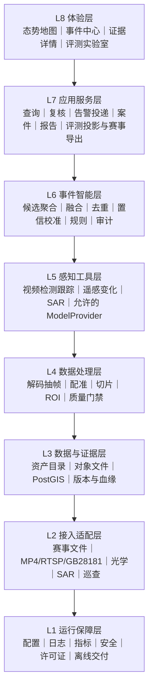
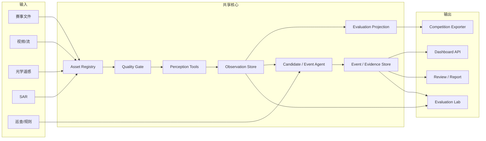
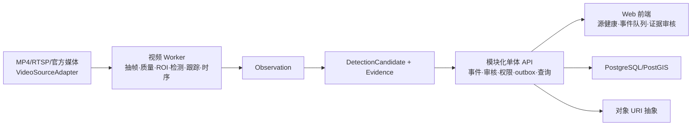

# 总体分层架构

## 1. 架构目标

架构要同时适应四种不确定性：

- 官方数据格式未知；
- “固定官方模型地址”与“允许官方 API 或自部署开放模型”口径冲突；
- 产品展示是否计分未知；
- 决赛“在线云端推理”与“线下路演/演示”口径冲突。

因此不按某个具体模型或平台组织代码，而按稳定领域边界组织，并保留“模型约束 × 决赛形态”四种情景的可验证入口。

## 2. 八层逻辑架构

运行保障是横切能力，图中放在底层只为表达，不代表上层直接依赖基础设施实现细节。

## 3. 各层职责与边界

### L1 运行保障层

职责：

- 配置、密钥引用、日志、指标、追踪；
- 依赖锁定、容器/离线包、环境自检；
- 权限、脱敏、审计和开源许可证清单；
- 任务失败、资源不足和外部 API 异常的统一处理。

边界：不包含业务标签和模型策略。

### L2 接入适配层

职责：

- 将官方文件、图片、视频、流媒体、光学遥感、SAR 和巡查记录转为统一 Asset；
- 隐藏具体协议、路径、认证和供应方差异；
- 提供可测试的本地 Fixture。

关键接口：

- `CompetitionInputAdapter`
- `VideoSourceAdapter`
- `GeospatialAssetAdapter`
- `InspectionRecordAdapter`

边界：只负责接入与元数据，不做业务判定。

### L3 数据与证据层

职责：

- 原始对象与派生对象分区存储；
- 资产清单、时间、空间、CRS、波段、校验和、许可与血缘；
- InferenceTask、PredictionRecord、SubmissionBundle、SubmissionAttempt、Observation、DetectionCandidate、Evidence、EventEvidenceLink、AnomalyEvent、ReviewDecision、AlertDelivery、IncidentCase、ProcessRun、ModelRun 和 DatasetVersion 的事务性元数据；
- 遥感资产采用 STAC 思路，栅格优先支持 COG。

第一版：

- 元数据用 PostgreSQL/PostGIS；
- 大文件使用 URI 抽象，本地可先落文件系统；
- 小规模遥感目录可先静态 STAC，规模证明后再启用 STAC API。

### L4 数据处理层

职责：

- 视频解码、抽帧、分段、相机状态和画质评估；
- 水域/岸线 ROI；
- 遥感重投影、配准、切片、云影和无效像元处理；
- 所有变换生成可追溯的派生 Asset/Evidence。

边界：预处理失败必须返回质量状态，不能悄悄生成“正常”结论。

### L5 感知工具层

职责：

- 视频检测、分割、跟踪和异常候选；
- 光学/SAR 的分割、变化检测、目标检测；
- 正式规则允许的官方固定地址或自部署模型的结构化调用；
- 输出统一 Observation，不直接生成执法结论。

设计原则：

- `ProviderAdapter` 隔离具体大模型；
- `PerceptionTool` 隔离具体 CV 框架；
- 权重、提示词、阈值、预处理和后处理全部版本化。

### L6 事件智能层

职责：

- 编排所需工具；
- 先将 Observation 形成不可变 DetectionCandidate，再按时间窗口、空间关系、类别兼容性和证据质量关联为 AnomalyEvent；
- 去重、持续性判断、置信校准和严重度建议；
- 查询河道边界、许可或规则工具；
- 将所有决策依据写入审计记录；
- 不确定时保持 `under_review` 生命周期，记录 `missing_context`、`quality_flags` 或处理错误码并转人工复核；这些字段不得冒充事件状态。

智能体的价值主要在**工具编排和证据组织**，不是用自然语言替代检测器或规则引擎。

### L7 应用服务层

职责：

- 候选/事件查询、详情、复核和事件状态流转；
- 仅对已确认且同时满足告警规则与调用方权限的事件创建告警 outbox；投递端以稳定幂等键发送并独立记录回执；
- AnomalyEvent 只承载研判生命周期；可选 IncidentCase 独占分派、处置、整改和关闭状态；
- 统计和报告；
- 将 `InferenceTask → PredictionRecord → SubmissionBundle` 映射到官方 JSON，不以业务 Event 作为提交必经对象；
- 提交前执行本地预检、第二人复核和 `SubmissionAttempt`/额度台账；
- 提供只读/受控写入 API 给体验层。

边界：赛事导出逻辑不得散落到感知模型中。

### L8 体验层

职责：

- 一张图态势；
- 事件列表与证据时间线；
- 视频/前后时相/掩膜/轨迹联动；
- 数据源和质量状态；
- 评测、错误切片和版本对比。

第一版默认二维地图；三维只有在高度、地形或无人机航迹成为核心证据时才引入。

## 4. 组件关系

## 5. 五条架构不变量

1. **获准保留期内原始资产不可覆盖；到期/撤权等合法删除走审批、清除与 tombstone 审计。**
2. **Observation、DetectionCandidate、AnomalyEvent、AlertDelivery 与 IncidentCase 分离。**
3. **评测投影与业务事件聚合分离；内部 Schema 与官方 Schema 分离。**
4. **任何结论都可追溯到输入、模型、规则和版本。**
5. **生命周期、数据质量、证据完整性和处理错误使用正交字段，不互相冒充。**

## 6. 为什么不是微服务

报名期和初赛建议采用“模块化单体 + 独立推理 Worker”：

- API/业务模块共享一个代码库和数据库；
- CPU/GPU 推理可作为独立进程；
- 任务通过数据库状态或轻量队列协调；
- 模块之间仍通过清晰接口和 Schema 隔离。

只有当出现以下证据时再拆分：

- 多个独立团队必须独立发布；
- 单一模块需要显著不同的扩缩容策略；
- 数据吞吐已证明数据库队列不足；
- 决赛环境明确提供容器编排和服务发现。

### 高点视频优先纵切的前后端框架

遥感侧保持现有组员负责的技术栈，只要求满足 Asset、Observation、质量与血缘契约；本阶段工程重点是把高点视频纵切交付清楚：

- 前端只通过版本化 API/SSE 访问，不直连摄像机、Worker、模型或文件目录；
- 模块化单体拥有领域状态、权限、追加式审核和事务 outbox；
- Worker 只产出运行、质量、Observation、Candidate 和 Evidence，不直接改 Event 审核或 IncidentCase；
- 首个闭环以一段授权视频完成“源健康 → 候选 → 一个事件 → 人审”为验收，不提前承诺正式精度、吞吐或设备规模。

## 7. 错误处理总则

| 故障 | 状态 | 处理 |
|---|---|---|
| 文件损坏/格式不符 | `invalid_asset` | 隔离样本、记录原因、继续整批 |
| 视频断流/黑屏 | `source_unavailable` | 不产生“正常”结论，写入 SourceHealth 记录 |
| 遥感配准/CRS 缺失 | `spatial_unreliable` | 禁止面积和位置精确结论 |
| 模型超时/限流 | `provider_retryable` | 指数退避、限次重试、幂等缓存 |
| 模型输出不符合 Schema | `invalid_model_output` | 校验失败，进入修复/复核，不静默解析 |
| 证据相互冲突 | `conflicting_evidence` | 保留冲突，降低置信或转人工 |
| 业务规则数据缺失 | `insufficient_context` | 输出疑似事件，不输出违法确认 |
| 赛事导出失败 | `export_blocked` | 阻止生成提交包并给出字段路径 |

这些是不同对象上的状态/错误码：Asset/Observation 记录质量，ProcessRun/ModelRun 记录执行错误，AnomalyEvent 记录研判生命周期，SubmissionBundle/Attempt 记录预检与上传结果。不得把 `provider_retryable` 写成事件状态，也不得用 `rejected` 表示文件损坏。

## 8. 测试边界

- 每个 Adapter 使用固定 Fixture 做契约测试；
- 每个领域对象做 Schema 验证和向后兼容测试；
- 感知模型和事件策略分别评测；
- 官方导出器使用官方样例做 golden test，并证明事件合并、拆分、复核不会改变提交样本 ID、数量和顺序；
- 端到端测试覆盖空结果、坏文件、超时、重复任务和中途恢复；
- 告警链路覆盖事务 outbox、重复投递、幂等消费、越权调用和未确认事件；
- 看板只读取稳定 API，不读取模型临时目录。

“不丢不重”只在稳定 ID、同库事务写入业务对象与 outbox、持久队列、至少一次传输和幂等消费都成立时作为端到端目标；缺少任一条件时只能标注为可检测、可补偿的 best effort。
