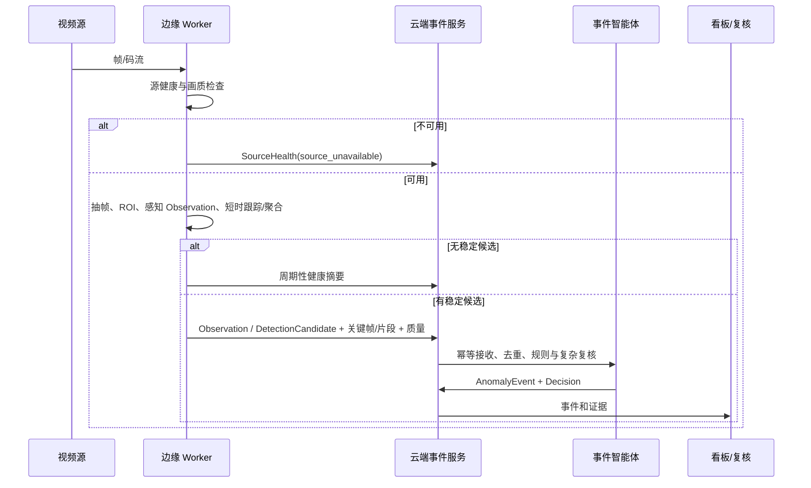
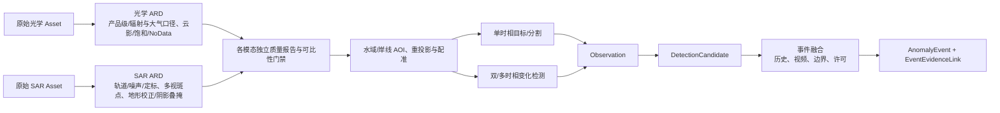

# 边云协同与数据流

## 1. 当前原则

用户提供的赛题详情提出边缘端实时初筛、云端复杂推理与多源融合。由于官方尚未公布边缘硬件、流协议、摄像机数量和时延指标，当前只定义**职责与接口**，不做设备绑定和性能承诺。

## 2. 推荐职责划分

| 能力 | 边缘侧优先 | 云/中心侧优先 | 说明 |
|---|---:|---:|---|
| 视频接入、解码、抽帧 | ✓ | 备选 | 靠近源可减少带宽 |
| 断流、黑屏、模糊、抖动检测 | ✓ | 汇总 | 无效流无需上传 |
| 水域 ROI 与轻量候选检测 | ✓ | 可复核 | 只做初筛，不做复杂业务结论 |
| 短时跟踪和事件片段生成 | ✓ | ✓ | 边缘压缩证据，云端再聚合 |
| 大模型/VLM 复核 | 设备允许才做 | ✓ | 受模型 API、算力和网络影响 |
| 遥感配准、切片、变化检测 | 小型任务可做 | ✓ | 通常需要更大存储与计算 |
| 多源事件融合、规则查询 |  | ✓ | 需要全局数据与台账 |
| 事件库、人工复核、统计 |  | ✓ | 保持统一真相源 |
| 模型与策略下发 | 接收 | 管理 | 必须版本化、可回滚 |

## 3. 视频链路



### 带宽策略

优先上传：

- 候选事件前后短片段；
- 关键帧；
- 框、掩膜和轨迹；
- 源健康与质量摘要；
- 必要时的低码率预览。

不默认上传：

- 所有摄像机全时段原始流；
- 可由边缘重建的中间张量；
- 未脱敏的凭据或连接信息。

具体保留策略必须遵守赛事数据使用条款和真实业务安全要求。“原始资产不可覆盖”只在获准保留期内成立；条款到期、授权撤回、主体权利请求或安全事件要求删除时，应执行审批式清除，保留不含媒体内容的删除 tombstone/审计，并按条款处理派生物、缓存和备份例外。

### 高点视频最小纵切与模块边界

当前组内优先交付给视频/工程成员的框架固定为：

`VideoSourceAdapter → 解码/抽帧 → SourceHealth 与画质门 → WaterROI → Detector/Segmenter → Observation → Tracker → TemporalAggregator → DetectionCandidate → EvidenceClip → EventService`

| 模块 | 输入 | 输出 | 首版边界 |
|---|---|---|---|
| `VideoSourceAdapter` | MP4、RTSP 或官方媒体引用 | 帧流、源时间、源状态 | 不在无真实接口时建设完整 GB28181 平台 |
| `FrameSampler` | 帧流、采样策略 | 带稳定帧 ID 的 FrameRef | 保留源时间与解码序号，不把采样时间当采集时间 |
| `VideoQualityGate` | FrameRef/窗口 | SourceHealth、正交质量字段 | 断流、黑屏、模糊、抖动、强反光显式输出 |
| `WaterROI` | 帧、ROI 版本 | ROI 内图块/掩膜 | ROI 外结果不得进入漂浮物候选 |
| `PerceptionWorker` | 图块/帧、模型配置 | Observation | 后端可替换，不直接建 Event |
| `Tracker` | 连续 Observation | track observation | ID 只表达连续性，不表达类别或事件 |
| `TemporalAggregator` | track、质量、窗口规则 | DetectionCandidate | 持续时长、间断容忍、抑制原因版本化 |
| `EvidenceBuilder` | 候选、原片引用 | 关键帧、短片段、框/掩膜/轨迹 | 派生证据带父资产、哈希和裁剪参数 |
| `EventService` | Candidate、规则/上下文 | AnomalyEvent/Decision | 只研判；处置由 IncidentCase 服务承担 |

首个可验收闭环只需一段可授权视频：能显示源健康，生成 Observation 和 Candidate，聚合为一个待审核 Event，并追加人工复核；在稳定候选 ID、持久状态与唯一约束成立时，同一候选重放不重复建 Event。检测精度与真实时延在正式数据和硬件到位后另行量化。

### 前后端运行框架

- **前端**：单页 Web，仅通过稳定 HTTP API/SSE 读取源健康、事件队列、证据与任务状态；不读取模型临时目录或直接连接摄像机。
- **后端**：模块化单体承载资产目录、候选/事件、复核、查询、提交和权限；同一数据库保存领域对象、审计与事务 outbox。
- **Worker**：视频解码/抽帧/感知、证据转码及遥感处理按资源类型独立进程运行；通过任务表或轻量队列领取工作。
- **媒体**：对象 URI/本地抽象存放原片和派生片段，API 只返回授权后的短期引用与元数据。

接口边界以 `SourceHealth / Observation / DetectionCandidate / Evidence / AnomalyEvent / ReviewDecision` 为准；是否进一步拆服务由吞吐、隔离和独立发布证据决定。

## 4. 遥感链路



光学与 SAR 不共用一条含糊的“通用预处理”捷径；各自完成分析就绪处理、质量报告和产品可比性检查后，才在明确 CRS/尺度/配准误差下进入共同 AOI 与事件层。本方案只固定接口和质量门，具体遥感技术栈由遥感负责人维护，不在此重复扩展选型。

### 必须显式记录的正交质量项

- 原始与目标 CRS；
- 像元大小和重采样方法；
- 配准误差；
- 云、云影、条带、无数据区比例；
- 光学波段/指数或 SAR 极化与处理级别；
- 采集时间差；
- AOI 与河道/岸线边界来源。

这些字段不能压缩成单一 `quality=good/bad`。至少分为文件完整/可解码、授权可用性、空间可靠性、时间可靠性、模态质量、配准/可比性和证据完整度；处理异常另记在 ProcessRun。配准误差过大时，不能输出精确变化面积；云影或水位自然变化与异常的混淆必须进入质量标记或错误类型。

## 5. 多源融合

### 第一阶段：事件级晚融合

融合键：

- AOI 或空间相交/距离；
- 时间窗口；
- 内部类别兼容关系；
- 来源独立性；
- 证据质量；
- 历史事件和规则上下文。

示例：

- 视频持续检测到疑似采砂船；
- 相近时间段遥感显示岸侧新增堆砂区；
- AOI 位于禁采区或许可信息缺失；
- 形成高优先级“疑似采砂活动”事件，并明确“非法性待许可核验”。

### 第二阶段：只在数据支持时进行特征级融合

进入条件：

- 数据集提供对齐的多模态样本；
- 单模态基线稳定；
- 官方指标允许证明融合增益；
- 缺失模态和推理成本有明确处理；
- 消融显示增益不是数据泄漏或场景记忆。

## 6. 路由策略

| 条件 | 路由 |
|---|---|
| 画质不可用 | 只报 SourceHealth，不做异常负结论 |
| 低质量、低置信单帧 | 缓存等待更多帧，不立即上云告警 |
| 稳定小目标轨迹 | 上传关键帧、轨迹和短片段供云端复核 |
| 高置信且规则简单 | 形成 DetectionCandidate，再由产品事件规则决定是否创建 AnomalyEvent；评测轨独立投影 PredictionRecord |
| 证据冲突 | 保留所有 Observation，转复杂复核或人工 |
| 网络中断 | 边缘本地持久化任务清单，恢复后幂等补传 |
| 云端模型限流 | 任务排队、缓存相同请求、按重要度降级 |

## 7. 降级模式

### 模型服务不可用

- 使用规则/本地轻量模型生成候选；
- ModelRun/ProcessRun 记录 `provider_unavailable`，已存在 Event 的研判状态保持原值。只有人工或明确业务规则基于“证据确实不足”追加 ReviewDecision 后，才可转 `needs_more_evidence`；供应方报错本身不能改变事件生命周期；
- 不伪造模型结果；
- 批量赛事任务保留失败清单，按官方允许策略重试。

### 无遥感或无视频

- 允许单模态 Event；
- 显式记录缺失模态；
- 不因另一模态缺失而把事件判断为正常。

### 无业务边界/许可

- 输出视觉“疑似”类别；
- `missing_context` 写明缺失项；
- 禁止输出“已确认违法”。

### 资源不足

- 降低视频采样率或分辨率前先做分层评测；
- 遥感采用 AOI/切片而不是整景加载；
- 按正式规则保留 CPU 最小模型、固定官方地址或自部署模型路径中的适用项；
- 不在运行时自动下载更小/更大权重。

## 8. 数据组织建议

### 原始与派生分区

```text
data/
├── raw/          # 只读原始资产
├── derived/      # 帧、切片、COG、掩膜、片段
├── manifests/    # 数据清单、哈希、许可、split
├── predictions/  # Observation 和模型原始结果引用
├── events/       # Event/Decision/Review 导出
└── submissions/  # 官方提交包，仅由导出器生成
```

这只是后续实施建议，当前调研包不创建数据目录或下载数据。

提交目录中的产物来自 `InferenceTask → PredictionRecord → SubmissionBundle`；`events/` 的合并、拆分和复核不会回写提交记录。

### 遥感目录

- 使用 STAC Item 表达某时空资产及其相关文件；
- COG 用于大栅格的局部读取和快速预览；
- PostGIS 保存 AOI、事件几何、矢量标签和空间查询；
- 原始影像不塞入关系数据库。

参考：

- [STAC Specification](https://stacspec.org/en/about/stac-spec/)
- [OGC Cloud Optimized GeoTIFF 1.0](https://www.ogc.org/standards/ogc-cloud-optimized-geotiff/)
- [OGC API - Features](https://ogcapi.ogc.org/features/)

## 9. 视频协议边界

国内公共安全视频联网可能涉及现行的 [GB/T 28181-2022](https://openstd.samr.gov.cn/bzgk/std/newGbInfo?hcno=8BBC2475624A6C31DC34A28052B3923D)。但“高点视频”不等于必然提供 GB28181 接口，也可能只提供文件、RTSP、平台 API 或抽帧数据。

因此：

- 第一版用 `VideoSourceAdapter` 隔离协议；
- 没有真实接口前，不建设生产级 GB28181 信令平台；
- 选用开源 GB28181 项目时，必须核验对 2022 版标准的兼容，而不是只看“支持 GB28181”字样；
- 摄像机 URL、用户名、口令和设备编码不得进入仓库。

## 10. 部署形态演进

| 阶段 | 推荐形态 |
|---|---|
| 报名期 | 文档、Schema、Fixture 和开源选型 |
| 初赛早期 | 本地模块化单体 + 独立推理进程 + 文件/数据库 |
| 初赛优化 | 按性能证据增加并行 Worker、缓存和批处理 |
| 决赛准备 | 同时保留在线云端与线下演示入口，并分别覆盖固定官方地址/允许自部署模型；正式口径确认后收敛 |
| 真实试点 | 真实视频接入、边缘节点、权限、安全、存储生命周期 |

不要把真实试点的基础设施复杂度提前搬进初赛。

## 11. “不丢不重”的适用条件

- 边缘先以稳定 `source + observation/candidate id` 写入本地持久队列；
- 业务记录与 outbox 在同一事务提交；
- 传输采用至少一次交付，云端以业务 ID/版本唯一约束幂等消费；
- 重试、死信、补偿和对账均有可观测记录；
- 媒体 URI 在消费完成前仍可读取，且时钟/版本冲突有处理规则。

满足这些条件时，可把“已持久化候选最终可补传、重复消息不重复落业务对象”作为验收目标；断电前尚未落盘、存储损坏、保留期删除或外部系统未提供幂等能力不在无条件保证范围内。
