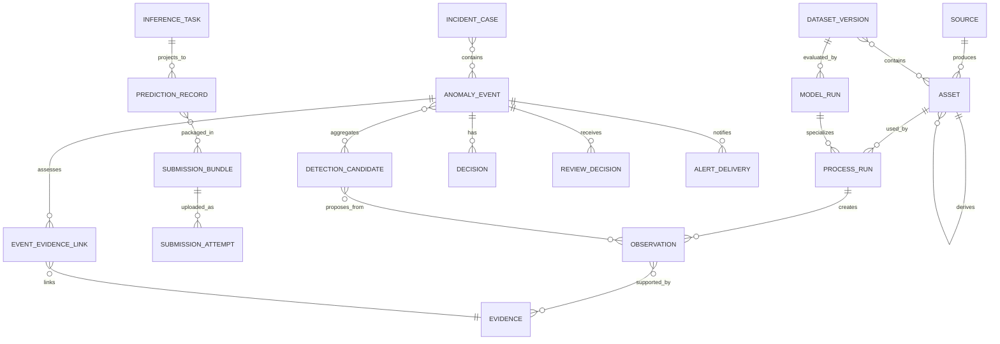
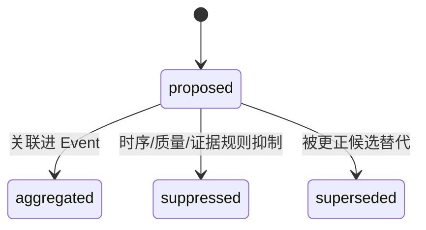
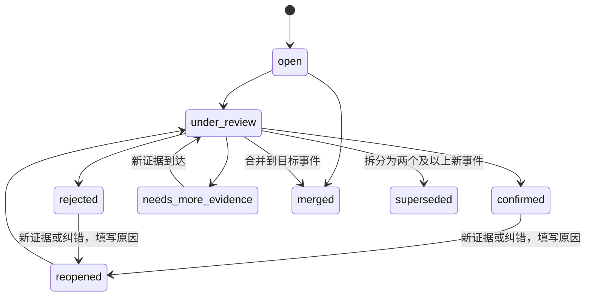
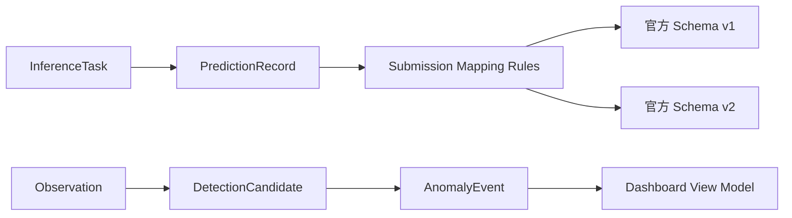

# 领域模型与接口契约

## 1. 为什么先定义领域模型

数据集和官方 JSON 未发布时，最值得提前稳定的是“系统内部如何描述来源、观测、证据和事件”。如果这层清晰，模型、存储、页面和赛事格式都可以替换。

## 2. 核心对象

| 对象 | 含义 | 必须包含 |
|---|---|---|
| `Source` | 摄像机、视频文件、卫星产品、SAR、巡查或规则来源 | 类型、位置/覆盖、时间能力、协议/供应方引用、状态、`data_mode`、`compliance_state` |
| `Asset` | 获准保留期内不可覆盖的原始或派生媒体资产 | URI、媒体类型、时间、几何、CRS/波段、哈希、血缘、许可/保留期、`data_mode`、`compliance_state` |
| `Observation` | 来源或工具在某时空范围内的结构化观测事实 | 观测量/标签、分数、空间/时间范围、质量、处理运行引用 |
| `InferenceTask` | 官方输入适配器产生的稳定评测任务 | 官方样本 ID、任务顺序、输入引用、规则版本、幂等键 |
| `PredictionRecord` | 对一个官方任务的评测投影结果 | 任务引用、预测载荷、空结果语义、模型/运行引用、校验状态 |
| `SubmissionBundle` | 一次候选提交的不可变构建产物 | 预测集合、官方 Schema 版本、文件哈希、预检报告、构建版本 |
| `SubmissionAttempt` | 一次实际平台上传/测评尝试 | Bundle、日期额度序号、二审人、上传时间、回执、平台分数引用 |
| `Evidence` | 支持复核的截图、片段、框、掩膜、轨迹或前后对比 | 资产引用、派生方式、可视化信息、哈希 |
| `EventEvidenceLink` | Event 与 Evidence/缺失来源的带立场关联 | 事件版本、`evidence_ref` 或 `expected_source_ref`、`SUPPORTING/CONTRADICTING/MIXED/UNAVAILABLE`、理由码、时间/空间不确定性 |
| `ProcessRun` | 一次预处理、推理、融合、导出或人工操作活动 | 工具/模型/规则/配置版本、输入输出、状态、环境、耗时 |
| `DetectionCandidate` | 机器或规则基于一个或多个观测提出的不可变假设 | 来源、时空范围、候选类型或 `unknown`、分数、质量、证据 |
| `AnomalyEvent` | 一个或多个候选经关联后形成的待研判业务事件 | 类型、研判状态、时空不确定性、严重度、`candidate_refs`、`version` |
| `Decision` | 规则或模型做出的自动决策步骤 | 决策者类型、输入引用、规则/提示版本、输出和理由码 |
| `ReviewDecision` | 追加式人工确认、驳回、改类、合并、拆分或要求补证 | 结果、原因码、操作者、时间、备注、预期事件版本 |
| `AlertDelivery` | 对已确认且通过规则/权限门禁事件的一次对外投递尝试 | 事件版本、渠道、接收方引用、规则/授权引用、outbox、幂等键、重试、状态和回执 |
| `IncidentCase` | 已确认事件进入处置后的业务案件，可包含多个事件 | 责任、分派、处置状态、动作、整改/结果和关闭原因 |
| `ModelRun` | 一次模型或工具执行 | 提供方、模型/权重、参数、提示、输入输出哈希、延迟 |
| `DatasetVersion` | 一版数据及切分 | manifest 哈希、来源、许可、标签版本、split 策略 |
| `RuleVersion` | 一版聚合、阈值、融合和告警规则 | 适用范围、生效期、内容哈希和审批状态 |

五个概念必须分开：

> `Observation` 观测事实 ≠ `DetectionCandidate` 算法候选 ≠ `AnomalyEvent` 待研判事件 ≠ `AlertDelivery` 告警投递 ≠ `IncidentCase` 处置案件

模型高分不等于事件已确认；告警发送成功也不等于事件已处置。

评测链同样单独成立：

> `InferenceTask → PredictionRecord → SubmissionBundle → SubmissionAttempt`

`AnomalyEvent` 的合并、拆分、复核和去重不得改变官方样本 ID、记录数量、顺序或空结果语义。

## 3. 对象关系



## 4. 内部事件 Schema v0.1

下面是**内部示例**，不是官方提交格式。

```json
{
  "schema_version": "event.v0.1-internal",
  "event_id": "evt_01J...",
  "version": 3,
  "event_type": "suspected_floating_object",
  "status": "under_review",
  "data_mode": "MIXED",
  "data_mode_set": ["PUBLIC", "SIMULATED"],
  "scene": {
    "aoi_id": "aoi_demo_001",
    "geometry": {
      "type": "Point",
      "coordinates": [106.55, 29.56]
    },
    "first_seen": "2026-07-23T02:10:04Z",
    "last_seen": "2026-07-23T02:10:21Z",
    "temporal_uncertainty_ms": 800,
    "spatial_uncertainty_m": 12.0
  },
  "assessment": {
    "confidence": 0.78,
    "severity": "medium",
    "reason_codes": [
      "inside_water_roi",
      "temporal_persistence",
      "multi_frame_consistency"
    ],
    "missing_context": []
  },
  "candidate_refs": ["cand_01J..."],
  "evidence_links": [
    {
      "evidence_ref": "evd_clip_01J...",
      "stance": "SUPPORTING",
      "reason_codes": ["multi_frame_consistency"],
      "temporal_uncertainty_ms": 800,
      "spatial_uncertainty_m": null
    },
    {
      "evidence_ref": "evd_satellite_01J...",
      "stance": "MIXED",
      "reason_codes": ["supports_location", "acquisition_time_gap"],
      "temporal_uncertainty_ms": 86400000,
      "spatial_uncertainty_m": 20.0
    }
  ],
  "provenance": {
    "pipeline_version": "pipeline.v0.1",
    "model_run_refs": ["run_01J..."],
    "policy_version": "policy.v0.1"
  }
}
```

### 约束

- `event_type` 使用内部稳定语义，不提前写官方类别 ID。
- `confidence` 不是跨模型天然可比的概率；必须记录校准方法。
- `reason_codes` 使用枚举，解释文本只能作为补充。
- `geometry` 缺少可靠地理定位时允许为空，但必须写质量原因。
- 面积结论必须有 CRS、像元/尺度和配准质量。
- `missing_context` 用于表达许可、边界或时相不足。
- `candidate_refs` 和 `version` 必填；审核不覆盖 Event 内嵌字段，而是追加 `ReviewDecision`，再以乐观锁生成下一版本。
- Event 的 `data_mode` 与 `data_mode_set` 由候选/证据叶子血缘计算，合并、拆分或补证后重新推导，客户端不能手改；正式提交默认只接受纯 `OFFICIAL` 评测链。
- `data_mode` 不替代许可结论：许可另用 `compliance_state=VERIFIED/RESTRICTED/UNVERIFIED`，模型训练来源另由 ModelVersion/DatasetVersion 追溯。
- `EventEvidenceLink.stance` 允许 `MIXED`，用于同一证据只支持部分时空/类别结论的情形；不能强迫二值化。
- 生命周期 `status`、资产/观测质量、证据完整性与 ProcessRun 错误码分栏保存，不能互相代用。

## 5. Observation 示例

```json
{
  "schema_version": "observation.v0.1-internal",
  "observation_id": "obs_01J...",
  "task_type": "video_object_detection",
  "asset_ref": "asset_video_001",
  "label": "floating_object_visual_cue",
  "score": 0.83,
  "temporal_extent": {
    "start_ms": 12400,
    "end_ms": 28900
  },
  "spatial": {
    "coordinate_space": "pixel",
    "bbox_xyxy": [123, 341, 158, 367],
    "track_id": "trk_17"
  },
  "quality": {
    "integrity": "valid",
    "visibility": "usable_with_flags",
    "spatial_reliability": "pixel_only",
    "temporal_reliability": "source_timestamp",
    "evidence_completeness": "partial",
    "flags": ["glare_moderate"]
  },
  "model_run_ref": "run_01J...",
  "evidence_refs": ["evd_frame_01J..."]
}
```

## 6. 状态机

候选、事件、告警和案件不能共用一套状态机。

### 6.1 DetectionCandidate



候选记录不可原地改写；修正通过新候选与 `supersedes` 关系完成。质量或上下文不足写入正交 `quality_flags/missing_context`，并以 `suppression_reason=insufficient_evidence` 解释 `suppressed`，不新增伪生命周期状态。

### 6.2 AnomalyEvent



- **merge**：源 Event 进入 `merged`，记录 `merged_into_event_id`；目标 Event 追加候选与证据并递增版本，历史不删除。
- **split**：源 Event 进入 `superseded`，创建两个及以上新 `open` Event；新 Event 记录 `split_from_event_id`，候选引用必须可解释且不可凭空复制。
- **reopen**：只重新进入研判，不改变或代替 IncidentCase 的处置状态；必须追加原因和操作者。
- 创建/关联 IncidentCase 不改变 AnomalyEvent 为“处置中”；研判结论与处置流程通过关联分别演进。

### 6.3 AlertDelivery

```text
queued → sent → acknowledged
   └──→ failed → retrying → dead
```

只有 `AnomalyEvent.status=confirmed`、版本未过期、告警规则命中且调用者/接收方授权通过时，应用事务才能写入 outbox。投递 Worker 以 `event_id + event_version + channel + recipient + policy_version` 形成幂等键；Event 重开或重新研判不删除既有投递审计。

### 6.4 IncidentCase

```text
created → assigned → in_progress → resolved → closed
closed → reopened（必须填写原因）
```

比赛批量推理未必启用 Candidate、Event 和案件流；最小评测链只要求 Task、Prediction、Bundle、运行失败与审计，不把平台提交成功写成业务事件已关闭。

### 6.5 生命周期、质量与错误正交

| 维度 | 所属对象 | 示例 |
|---|---|---|
| 研判生命周期 | AnomalyEvent | `open / under_review / needs_more_evidence / confirmed / rejected / merged / superseded / reopened` |
| 处置生命周期 | IncidentCase | `created / assigned / in_progress / resolved / closed` |
| 数据质量 | Asset / Observation / EventEvidenceLink | 完整性、可见性、空间/时间可靠性、NoData、配准残差 |
| 执行错误 | ProcessRun / ModelRun | `provider_retryable / invalid_model_output / spatial_processing_failed` |
| 提交状态 | SubmissionBundle / SubmissionAttempt | `precheck_failed / approved / uploaded / scored / rejected_by_platform` |

## 7. 五类关键接口

### 7.1 输入适配器

```text
CompetitionInputAdapter.parse(manifest_uri)
  -> Iterable[InferenceTask]

VideoSourceAdapter.open(source)
  -> FrameStream + SourceHealth

GeospatialAssetAdapter.inspect(uri)
  -> AssetMetadata + ValidationReport
```

要求：

- 输入适配器不调用模型；
- 每条 Task 有稳定 `task_id`；
- 文件缺失、损坏和字段错误给出机器可读原因。

### 7.2 模型提供方适配器

```text
ModelProvider.infer(request: ProviderRequest)
  -> ProviderResponse
```

`ProviderRequest` 至少包含：

- `request_id` 和幂等键；
- 模型/能力名；
- 媒体引用或符合限制的媒体内容；
- 结构化输出 Schema；
- 提示词/系统策略版本；
- 超时和预算；
- 隐私/日志策略。

`ProviderResponse` 至少包含：

- 原始响应的安全引用；
- 解析后的结构数据；
- 模型与版本；
- 用量、延迟、重试次数；
- 完成原因和错误类别；
- 输入/输出哈希。

### 7.3 感知工具接口

```text
PerceptionTool.run(
  task: PerceptionTask,
  assets: list[AssetRef],
  config: VersionedConfig
) -> list[Observation]
```

不论后端是传统 CV、ONNX Runtime、固定官方地址或规则允许的自部署模型，原始结构结果都必须先进入 Observation，再由时序/规则形成 DetectionCandidate。

### 7.4 赛事导出器

```text
CompetitionExporter.export(
  tasks: list[InferenceTask],
  predictions: list[PredictionRecord],
  official_schema_version
) -> SubmissionBundle
```

同一个 `InferenceTask` 可因不同运行产生多个版本的 `PredictionRecord`；一个 `SubmissionBundle` 必须按官方规则为每个任务选择规定数量的记录，并保留官方样本 ID、原始顺序、空结果和失败语义。业务 Event 不作为输入。`SubmissionBundle` 包含：

- 官方 JSON 文件；
- Schema 校验报告；
- 样本数、空结果数、失败数；
- 输入 manifest、代码、配置和模型版本引用；
- 不进入提交文件的内部审计摘要。

在创建 `SubmissionAttempt` 前必须：

1. 运行本地 Schema、样本覆盖/计数、ID、顺序、坐标、空结果、非法数值和可复现哈希预检；
2. 由非构建者执行第二人复核并签名；
3. 检查当日已用/预留额度。当前嵌入规则写有“每天最多 5 次”，在正式答复前按 5 次上限保守执行，并至少保留 1 次给回滚或截止前最终包；
4. 上传后保存 Bundle 哈希、平台回执和分数引用，不以重复点击验证不确定性。

### 7.5 协同接口标准的采用边界

当边缘、遥感 Worker 和云端确实跨进程传递候选时，可使用 [CloudEvents 1.0.2](https://github.com/cloudevents/spec/blob/v1.0.2/cloudevents/spec.md) 作为轻量信封：

```json
{
  "specversion": "1.0",
  "id": "cam-001-20260723T081503Z-track-18",
  "source": "urn:water:edge:camera:cam-001",
  "type": "org.example.water.detection-candidate.v1",
  "time": "2026-07-23T08:15:03Z",
  "datacontenttype": "application/json",
  "data": {
    "candidate_id": "cand_01J...",
    "schema_version": "candidate.v0.1-internal"
  }
}
```

约束：

- `source + id` 用于传输幂等，业务 `candidate_id` 仍设唯一约束；
- 视频和遥感大文件只传 URI、媒体类型、字节数和摘要；
- 单体进程内部不为“遵循标准”强行引入消息中间件；
- MQTT QoS 1 可能重复，消费端仍必须幂等。

遥感预处理和批量变化检测若需要异步 API，可借鉴 [OGC API - Processes](https://www.ogc.org/standards/ogcapi-processes/) 的 `Process / Job / Result` 形态；比赛 MVP 只实现需要的任务状态，不宣称完整标准符合性。

空间交换使用 [GeoJSON RFC 7946](https://www.rfc-editor.org/rfc/rfc7946)，对外坐标为 WGS84 经度、纬度；栅格资产保留原生 CRS 与投影元数据。

## 8. 赛事 Schema 变更隔离



纯官方字段/封装变化应收敛到 Mapping Rules 和导出测试。若类别定义、样本粒度、评分、允许模型、资源或流程规则变化，仍可能影响任务解析、模型、预测契约和数据策略，不能承诺只改适配器。

## 9. 置信与严重度不能混用

- `score`：单个模型输出，未经校准。
- `confidence`：事件级、经过质量和证据融合后的可信度。
- `severity`：业务影响建议，可能依赖面积、持续时间、敏感区域和规则。
- `priority`：处理顺序，还可能依赖人力和时效。

高模型分数不等于高严重度，也不等于高处理优先级。

## 10. 审计与可复现

每个 AnomalyEvent 至少可追踪：

`AnomalyEvent → DetectionCandidate → Observation → ProcessRun/ModelRun → Asset → Source/DatasetVersion`

每次运行记录：

- 代码 commit 或源包哈希；
- 配置和阈值；
- 提示词模板哈希；
- 依赖锁文件；
- 模型/权重标识与哈希；
- 数据 manifest 与切分；
- 时间、硬件、耗时和错误；
- 后处理和映射版本。

每个 SubmissionAttempt 另可追踪：

`SubmissionAttempt → SubmissionBundle → PredictionRecord → InferenceTask → ProcessRun/ModelRun → Asset/DatasetVersion`

不记录明文密钥、真实口令或无需保存的原始大模型敏感响应。

## 11. 契约测试

在没有赛事数据时即可准备：

- 合法/非法 Asset 元数据；
- 空检测、单检测、多帧跟踪和冲突证据；
- 模型超时、限流、非 JSON、字段越界；
- 无地理定位、错误 CRS、配准质量不足；
- Candidate 抑制/聚合边界和 Event 合并/不合并边界；
- Event merge/split/reopen、追加式审核与 `expected_version` 并发冲突；
- 重复 `source + id`、outbox 告警重试、越权投递和幂等消费；
- PredictionRecord 任务覆盖/顺序/空结果以及 Event 聚合不影响提交的隔离测试；
- SubmissionBundle 本地预检、二审、额度耗尽和 Attempt 回执；
- 官方导出器的占位适配器只验证内部完整性，不伪造官方字段。
