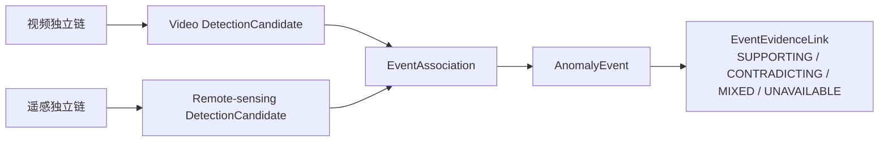

# 固定高点视频感知框架

> 文档状态：赛前方案 v0.1  
> 适用范围：水域漂浮物识别与告警的固定高点视频链路，以及前后端最小闭环  
> 当前结论：先固定接口、证据链、故障语义和实验门禁；官方数据、指标、硬件和模型约束明确后，再选择具体模型与参数  
> 分工边界：本文由视频/工程方向维护；遥感负责人维护各模态的预处理和感知实现，双方只在 `DetectionCandidate / AnomalyEvent` 层晚融合

## 1. 一页结论

视频方向不应从“选一个模型”开始，而应先交付一条可回放、可替换、可复核的纵向链路：

```text
视频源/文件
→ 接入与解码
→ 时间归一化与采样
→ 源健康/画质门
→ 相机档案与水域 ROI
→ 检测或分割 Observation
→ 可选小目标切片
→ 短时跟踪
→ 时序证据
→ DetectionCandidate
→ 证据片段
→ AnomalyEvent（under_review）
→ 人工复核 / ReviewDecision
→ AnomalyEvent 新版本
```

同时保留一条与产品事件链隔离的赛事评测链：

```text
InferenceTask
→ Observation/模型原始结果
→ PredictionRecord
→ SubmissionBundle
```

`AnomalyEvent` 的合并、拆分、人工改类和去重，不能改变官方样本 ID、顺序、数量和空结果语义。只有官方格式明确后，`EvaluationProjection` 才把模型结果投影到官方 JSON。

第一阶段推荐“模块化单体 + 视频 Worker + 可选 MediaMTX”：

- 前端只消费稳定 API、SSE 和授权后的浏览器播放地址；
- 后端管理来源、候选、事件、复核、审计和评测投影；
- 视频 Worker 负责解码、抽帧、画质、ROI、感知、跟踪与证据生成；
- MediaMTX 只作为 RTSP 中继、录制和 WebRTC/HLS 预览候选，不承担业务真相源；
- 模型后端通过 `PerceptionTool`/`ModelProvider` 替换，不提前绑定某个检测器。

## 2. 目标、非目标与成功定义

### 2.1 当前目标

1. 在没有官方数据时，稳定视频来源、帧、质量、观测、候选、证据、复核和评测投影的接口。
2. 对 MP4/官方媒体文件和 RTSP 两种入口提供同一条可回放链路。
3. 对 H.264、H.265、断流、时间戳跳变、坏帧、反光、模糊和相机位姿变化给出显式状态。
4. 支持整帧与小目标切片 A/B、检测与分割 A/B、跟踪与无跟踪 A/B，且所有对比可复现。
5. 在边缘—云端间实现有界队列、幂等补传和可观测降级。
6. 提供一个最小前后端闭环：源健康、候选队列、证据回放、人工确认/驳回、审计。
7. 数据发布后能在 24 小时内跑通官方格式基线，在 72 小时内以错误切片决定后续算法路线。

### 2.2 明确不做

- 不做无人机、无人船或机器人调度；
- 不把参考图中的“无人机集群调度、航线规划、机巢”搬入本赛题；
- 无真实接口和正式需求前，不建设完整 GB/T 28181 信令、设备目录、级联和国标平台；
- 不建设完整河长制、工单流转或执法办案系统；
- 不提前承诺“全天候”“零漏报”“分钟级”或生产级 SLA；
- 不提前指定 YOLO、某个大模型、某个权重或某种跟踪器为最终方案；
- 不在视频与遥感之间做原始像素、特征张量或端到端特征级融合；
- 不让浏览器直接连接摄像机、接触 RTSP 凭据或读取 Worker 临时目录；
- 不用“模型服务失败”“画质不可用”冒充“水面正常”。

### 2.3 报名期成功定义

报名期的成功不是模型精度，而是以下事实成立：

- 同一段合法授权视频重复回放，帧 ID、配置版本、候选幂等键和证据哈希稳定；
- 断流、坏帧、黑屏、相机移动和磁盘压力不会生成虚假的“正常”结论；
- 在输出契约保持兼容时，模型后端可替换，前端和业务 API 不需要跟着重写；若类别语义或粒度改变，则走 Schema 版本迁移；
- 整帧/切片、跟踪/无跟踪、不同采样率能生成一份可比较实验报告；
- 同一候选重复上传不会创建重复事件；
- 人工复核是追加式审计，不覆盖原始观测；
- 模拟、公开和官方数据物理或逻辑隔离，任何图表都能说明数据来源。

## 3. 固定高点视频的特有挑战

| 挑战 | 典型表现 | 架构后果 |
|---|---|---|
| 小目标与强透视 | 远处漂浮物可能只有数个到数十个像素；同类目标近岸与远岸尺度差异巨大 | 保存原始分辨率；按像素尺寸分层评测；把切片作为 A/B 候选，不直接全量启用 |
| 水面非刚性背景 | 波浪、泡沫、倒影、尾流、雨滴会形成持续运动 | 不能只凭运动或单帧框告警；必须结合水域 ROI、跟踪、持续性和质量标记 |
| 强反光与复杂气象 | 日照反光、雾、雨、夜间、曝光漂移、镜头水滴 | 质量门与检测结果正交保存；增强算法必须证明不会放大误报 |
| 压缩与传输异常 | H.264/H.265 块效应、码流缺包、GOP 过长、坏帧、解码重排 | 接入层记录 codec/profile/GOP/transport；保留 PTS/DTS 和解码序号；坏帧不可静默跳过 |
| 相机并非永远固定 | 云台转动、变焦、维护后位姿变化、风致抖动 | `CameraProfile` 和 `ROI` 必须版本化；场景指纹变化后冻结旧 ROI 并要求复核 |
| 时间戳不可靠 | RTSP 时间与本机时间漂移、B 帧重排、文件只有相对时间、重连后 PTS 归零 | 区分源时间、媒体 PTS、接收时间和单调时钟；不得用抽帧时间替代采集时间 |
| 类别边界模糊 | 漂浮垃圾、自然漂木、船只、浮标、水草、泡沫外观接近 | 感知只输出视觉候选；“违法”“应处置”需规则或人工确认 |
| 遮挡和目标聚散 | 桥墩、船体遮挡，垃圾团聚/分裂，轨迹中断 | Track 只表达短时连续性，不等于业务事件 ID；Event 层允许合并、拆分和补证 |
| 像素难以地理定位 | 单相机、无标定或水面高程变化时，框难以可靠落到地图坐标 | 可先保留 `pixel_only` 和相机 AOI；无标定不得伪造经纬度或精确面积 |
| “没有检测到”语义复杂 | 源离线、画质差、ROI 失效、模型超时都可能产生空结果 | 空结果必须携带可用性与执行状态；只有链路完整时才可解释为“本窗口未发现候选” |

## 4. 完整链路与两条输出路径

```mermaid
flowchart LR
    S["MP4 / 官方媒体 / RTSP"] --> A["VideoSourceAdapter"]
    A --> D["解复用与解码"]
    D --> T["时间归一化<br/>FrameSampler"]
    T --> Q["SourceHealth<br/>VideoQualityGate"]
    Q --> R["CameraProfile<br/>WaterROI"]
    R --> P["整帧/切片感知<br/>Detector or Segmenter"]
    P --> O["Observation"]
    O --> TR["Tracker"]
    TR --> TE["TemporalEvidence"]
    TE --> C["DetectionCandidate"]
    C --> EB["EvidenceBuilder"]
    EB --> E["AnomalyEvent<br/>under_review"]
    E --> RV["人工复核<br/>ReviewDecision"]
    RV --> EV["AnomalyEvent 新版本"]

    O --> EP["EvaluationProjection"]
    EP --> PR["PredictionRecord"]
    PR --> SB["SubmissionBundle"]
```



链路遵守四条边界：

1. `SourceHealth/QualityReport` 说明“能否看清”，`Observation` 说明“模型看到了什么”，二者不能互相覆盖。
2. `Track` 说明连续帧关联，`DetectionCandidate` 说明达到机器候选门槛，`AnomalyEvent` 说明业务上可能是同一件事。
3. 人工复核只追加 `ReviewDecision` 并生成 Event 新版本，不删除原始 Observation。
4. 赛事导出器读取 `InferenceTask + PredictionRecord`，不读取人工修改后的 Event 作为唯一输入。

### 4.1 逐步处理语义

1. **接入**：解析来源、授权、codec、分辨率、帧率、容器和流状态，不做类别判断。
2. **解码**：输出有稳定序号和时间字段的 `FrameRef`；保留坏帧和时间异常统计。
3. **采样**：按配置选择固定频率、关键帧、运动触发或自适应策略；第一版必须有固定频率基线。
4. **质量门**：产生正交质量字段。不可用窗口只产生源健康，不产生异常负结论。
5. **相机与 ROI**：按 `camera_profile_version + roi_version` 裁剪水域区域，记录从 ROI/切片回映整帧的仿射关系。
6. **感知**：检测器或分割器输出统一 Observation，不直接创建告警。
7. **切片**：只对指定尺度层或区域启用；切片结果回映后做跨片合并，并保留 tile ID。
8. **跟踪**：关联连续 Observation；类别分数、位置和质量仍逐帧保存。
9. **时序证据**：计算持续帧数、持续时间、间断容忍、位移、尺寸稳定性和质量覆盖。
10. **候选聚合**：达到版本化规则后创建不可变 Candidate；被抑制也记录原因码。
11. **证据生成**：生成关键帧、前后短片、叠加层和机器可读轨迹，全部带父资产与哈希。
12. **事件与复核**：Candidate 先聚合为 `under_review` Event；人工再追加确认、驳回、改类、补证、合并或拆分决策，所有操作带操作者、理由和预期版本。
13. **评测投影**：按官方样本粒度和 Schema 单独生成预测记录，保持官方 ID/顺序/空结果语义。

## 5. 媒体接入、编解码与浏览器预览

### 5.1 入口优先级

| 入口 | 报名期支持 | 实施说明 |
|---|---:|---|
| 官方图片/视频文件 | 必须 | 最适合可复现实验和赛事批处理；原文件只读、记录 SHA-256 |
| 本地授权 MP4/MKV 测试片 | 必须 | 用于 Spike 和回放回归；必须注明真实/公开/模拟来源 |
| RTSP 摄像机或平台流 | 条件支持 | 只有合法授权 URL；凭据放密钥系统，不进配置仓库和日志 |
| 历史回放 API | 适配器预留 | 明确起止时间、时区、倍速、seek 能力后再实现 |
| GB/T 28181 | 只预留 Adapter | 无设备、SIP 参数、级联和 2022 版兼容要求前不建完整平台 |

`VideoSourceAdapter` 应允许“直连 FFmpeg/OpenCV 解码”和“经 MediaMTX 中继后解码”两种模式。单文件赛事批处理不强制经过 MediaMTX；多路 RTSP、录制、重连和浏览器预览有明确需要时才启用。

### 5.2 H.264/H.265 处理原则

- H.264 和 H.265 都必须先做 codec/profile/pixel format/分辨率/FPS/GOP 探测，再进入解码。
- 推理链可以解码摄像机原始 H.265；浏览器预览不能假设所有浏览器都能播放 H.265。
- MediaMTX 官方文档明确提示，浏览器 WebRTC 对 H.265 支持不一致，含 B 帧的 H.264 也可能不适配 WebRTC。因此“推理码流”和“预览码流”应分开：
  - 推理码流：尽量保持原始质量，避免无意义二次编码；
  - 预览码流：浏览器兼容性测试失败时，才生成低码率 H.264 兼容代理流。
- 转码不是默认动作。启用前必须测量 CPU/GPU、额外延迟和画质损失，并完成 FFmpeg 构建与 codec 许可核验。
- 每个来源建立 codec 兼容矩阵：`解码可用 / 推理可用 / WebRTC 预览 / HLS 预览 / 需要转码 / 不支持原因`。

### 5.3 RTSP 与回放

- RTSP 默认先自动协商；在丢包明显时对 UDP 与 TCP 分别跑回放测试，不把 TCP 永久写死为“更优”。
- 重连创建新的 `source_session_id`；不能因 PTS 归零把新会话帧误认为旧帧重放。
- 对文件和历史回放，seek 后必须记录 `seek_request`、实际首帧 PTS 和偏差。
- 录制切片边界不得被当成业务事件边界；跨片轨迹可以在时间连续、配置一致时恢复关联。
- 若用 MediaMTX 录制，fMP4/MPEG-TS 的分段、RPO 和保留期需配置化；磁盘策略由本系统统一监控。

### 5.4 浏览器预览

浏览器不直接播放 RTSP：

```text
RTSP/文件
→ MediaMTX（可选中继/录制）
→ HLS（默认监看/回放）或 WebRTC（已证实需要低时延时）
→ 前端 <video>
```

- 首版监看与事件回放默认 HLS；只有现场操控或经实测证明需要更低时延时才启用 WebRTC。二者都必须通过真实 codec、浏览器、NAT/防火墙和并发测试。
- 前端向后端申请短时播放授权，不能获得摄像机用户名、口令或原始 RTSP URL。
- iframe 可用于最早 Spike；正式复核页应使用可控 `<video>` 集成，以便同步候选时间线与框/掩膜叠加。
- 预览失败不应阻塞后台推理；UI 分别显示“源在线、推理在线、预览可用”三种状态。

## 6. 模块边界与开发分工

| 编号 | 模块 | 主要输入 | 主要输出 | 首版验收 |
|---|---|---|---|---|
| V01 | `SourceRegistry` | 来源登记、密钥引用、授权与保留策略 | `VideoSourceSpec` | 无明文凭据；来源状态、许可和保留期可查询 |
| V02 | `VideoSourceAdapter` | 文件、RTSP、官方媒体引用 | `SourceSession + Packet/FrameStream` | 同一接口支持文件与 RTSP Fixture；重连产生新 Session |
| V03 | `DecoderProbe` | 媒体/码流 | codec、profile、FPS、GOP、坏帧统计 | H.264/H.265 Fixture 有明确兼容报告 |
| V04 | `FrameClock` | PTS/DTS、接收时钟、解码序号 | 规范化 `FrameRef` | B 帧、PTS 跳变、PTS 归零有测试，不倒退覆盖 |
| V05 | `FrameSampler` | FrameStream、采样配置 | 有界 FrameRef 流 | 固定 FPS 基线可复现；积压时按显式策略丢帧 |
| V06 | `VideoQualityGate` | 帧/时间窗口 | `QualityReport + SourceHealth` | 黑屏、模糊、冻结、抖动、曝光/反光标记可回放 |
| V07 | `CameraProfile/WaterROI` | 相机档案、ROI 版本、帧 | ROI 帧/掩膜、坐标回映 | ROI 外候选被显式抑制；相机移动后旧 ROI 失效 |
| V08 | `PerceptionTool` | 帧/切片、模型配置 | `Observation[]` | Mock、整帧模型和官方 Provider 可通过同一契约替换 |
| V09 | `SliceScheduler/Merger` | 原帧、ROI、切片配置 | tile、回映 Observation | 重叠区去重；能完整还原整帧像素坐标 |
| V10 | `Tracker` | 连续 Observation | `TrackObservation[]` | 中断/恢复、重复帧和场景切换不串轨 |
| V11 | `TemporalAggregator` | Track、质量、规则版本 | `DetectionCandidate` 或抑制记录 | N-of-M/持续性规则可配置、可解释、可重放 |
| V12 | `EvidenceBuilder` | Candidate、原片/帧引用 | 关键帧、短片、轨迹、叠加层 | 父资产、裁剪参数、时间范围、哈希完整 |
| V13 | `CandidateIngest/EventService` | Candidate、幂等键 | Event/Decision | 重复补传不重复建 Event；乐观锁冲突可见 |
| V14 | `ReviewService` | ReviewCommand、操作者 | `ReviewDecision`、Event 新版本 | 确认/驳回/改类/补证全为追加式审计 |
| V15 | `EvaluationProjection` | InferenceTask、模型原始结果 | PredictionRecord/SubmissionBundle | 官方 ID、顺序、数量、空结果通过 golden test |
| V16 | `Dashboard API` | 来源、候选、事件、审计查询 | REST/SSE、播放授权 | 前端不读模型目录/数据库；所有媒体 URL 有授权 |
| V17 | `Review Web` | API/SSE、WebRTC/HLS | 源健康、候选队列、证据复核 | 能从候选定位视频时间并提交带理由的复核 |
| V18 | `Observability/Replay Lab` | 指标、日志、运行清单 | 看板、A/B 报告、故障报告 | 每次实验可追溯代码、配置、模型、数据和硬件 |

### 6.1 推荐工作包依赖

```text
WP-A 契约与 Fixture（V01/V04/Schema）
  ├─→ WP-B 媒体接入与预览（V02/V03/MediaMTX）
  ├─→ WP-C 质量与 ROI（V05/V06/V07）
  └─→ WP-D 感知实验框架（V08/V09）
          → WP-E 跟踪与时序（V10/V11）
          → WP-F 证据与事件（V12/V13/V14）
                  → WP-G 前后端闭环（V16/V17）
WP-H 评测投影（V15）独立于 Event 聚合
WP-I 可观测性与回放（V18）从第一天横切所有工作包
```

各工作包可以由不同成员实现，但必须先合并契约和 Fixture。任何模块不得把自身临时字典直接暴露给下一模块。

## 7. 接口、关键字段、时间戳与幂等

### 7.1 核心接口

```text
VideoSourceAdapter.open(source_spec)
  -> SourceSession + FrameStream + SourceHealthStream

FrameProcessor.process(frame_ref, camera_profile, pipeline_config)
  -> QualityReport + list[Observation]

Tracker.update(observations, frame_ref, tracker_config)
  -> list[TrackObservation]

TemporalAggregator.update(track_observations, quality_window, rule_version)
  -> CandidateResult

EvidenceBuilder.build(candidate, source_session, policy)
  -> EvidenceManifest

CandidateIngest.accept(candidate, idempotency_key)
  -> Accepted | Duplicate | Conflict

ReviewService.apply(command, expected_event_version)
  -> ReviewDecision + EventVersion

EvaluationProjection.project(inference_task, raw_predictions, official_schema)
  -> PredictionRecord
```

这些是逻辑契约，不限定语言、Web 框架或消息中间件。

### 7.2 关键对象字段

| 对象 | 最小关键字段 |
|---|---|
| `VideoSourceSpec` | `source_id`、`source_type`、脱敏 URI/密钥引用、授权范围、相机/AOI 引用、期望 codec/分辨率/FPS、时区、保留策略、状态 |
| `SourceSession` | `session_id`、`source_id`、连接开始/结束、探测结果、transport、重连原因、配置版本、`media_origin_pts`、可选 `acquisition_origin_utc`、时钟/映射质量 |
| `FrameRef` | `frame_id`、`session_id`、`decode_sequence`、`pts`、`dts`、`time_base`、`media_time_ms`、`source_time`、`received_at`、`monotonic_ns`、宽高、像素格式、关键帧标志、内容/资产引用 |
| `QualityReport` | 窗口、可解码性、冻结/黑屏/模糊/抖动/曝光/雾雨/反光分项、`usable`、理由码、算法版本 |
| `CameraProfile` | 相机型号/安装点引用、姿态/焦距（如已知）、PTZ 状态、场景指纹、有效期、空间可靠性、版本 |
| `WaterROI` | `roi_id/version`、坐标空间、polygon/mask、适用 profile、生成方式、审核人、有效期 |
| `Observation` | `observation_id`、frame/tile、内部标签、score、bbox/mask、整帧回映、质量、model_run、配置和证据引用 |
| `TrackObservation` | `track_id`、observation refs、首次/末次时间、间断、位置/尺寸统计、tracker 版本；不包含业务确认状态 |
| `DetectionCandidate` | `candidate_id`、时空范围、候选类型、分数/校准、质量摘要、track/observation refs、规则版本、抑制/创建理由、证据引用 |
| `EvidenceManifest` | 原始资产、关键帧/片段 URI、时间范围、裁剪/转码参数、叠加层、SHA-256、许可/保留期、血缘 |
| `ReviewDecision` | `review_id`、event/candidate、预期版本、结果、原因码、操作者、RFC3339 UTC 时间、备注和附件引用 |
| `PredictionRecord` | 官方 task/sample ID、原始顺序、官方预测载荷、空结果/失败语义、model/process run、Schema 校验状态 |

### 7.3 时间规则

1. 所有绝对时间以带 `Z` 或显式偏移的 RFC 3339 保存；内部服务优先 UTC。
2. 媒体相对位置使用整数 `pts + time_base` 或整数毫秒，不能只保存浮点秒。
3. `source_time`、`received_at`、`processed_at` 和 `reviewed_at` 分栏，禁止互相代替。
4. B 帧场景按展示时间排序，仍保留 DTS 和 `decode_sequence` 供排障。
5. 文件无绝对采集时间时，明确 `time_kind=media_relative`；不得用文件修改时间伪装采集时间。
6. RTSP 重连、PTZ 或场景切换创建新 Session；Track 默认不跨不可信边界延续。
7. 与遥感晚融合时携带 `temporal_uncertainty_ms`；没有可靠时间时只能做弱关联。
8. `media_time_ms = (pts - media_origin_pts) × time_base` 是前端播放叠加的主时间轴；只有来源提供可信绝对时钟时，才额外建立 `media_time_ms ↔ acquisition_utc` 映射。
9. 转封装、裁剪证据片段或生成代理流时，`EvidenceManifest` 必须保存原视频起始 PTS、片段首 PTS、播放器零点和时间映射；不能假设片段 `currentTime=0` 等于原视频 `0`。
10. 前端框/掩膜按播放器实际 `currentTime` 匹配 `media_time_ms`，在 `loadedmetadata/seeked/timeupdate` 后重新同步；不能按消息到达时间或 UTC 定时画框。
11. seek 落在临近关键帧时，后端返回“请求 media time、实际首帧 media time、偏差”；前端按实际时间轴渲染，避免回放越久框越漂。

### 7.4 PTZ 预置位与 scene fingerprint 门禁

`source_id` 不能代表一个永久不变的画面。每个可用 ROI 必须绑定：

```text
source_id
+ camera_profile_version
+ preset_id（设备提供时）
+ scene_fingerprint_version
+ roi_version
```

门禁流程：

1. 在画面稳定、无大面积遮挡时，从岸线、桥梁、建筑等相对稳定区域建立 scene fingerprint；算法、参考帧、阈值和审核人版本化。
2. 每次连接、PTZ 命令完成、变焦、重连及周期巡检后，先匹配预置位和 fingerprint。
3. 匹配通过才激活对应 ROI 和空间映射；短时风致抖动使用滞回窗口，不能单帧触发失效。
4. 匹配持续失败时进入 `scene_unverified`：终止旧 Track、冻结 ROI 依赖的感知/地理结论，只保留 SourceHealth 和待校准证据。
5. 若设备报告已切换到已登记预置位，仍需等待画面稳定并通过该预置位 fingerprint，不能只信 PTZ 状态码。
6. 未知预置位或维护后位姿必须创建新 CameraProfile，并由人工重审 ROI；不得自动沿用旧像素—地理映射。

fingerprint 只用于证明“当前画面是否仍适用该配置”，不是异常类别模型，也不能被当作摄像机身份认证。

### 7.5 稳定 ID 与幂等

- `frame_id` 由 `source_id + session_id + normalized_pts + decode_sequence` 的规范串派生；内容哈希用于校验，不单独替代帧位置。
- `model_run_id` 绑定模型/权重哈希、预处理、阈值、ROI、切片、代码和运行环境版本。
- `observation_id` 绑定 Frame/Tile、ModelRun 和规范化输出序号。
- `candidate_id` 绑定来源、候选时间窗、组成 Observation/Track 集合与规则版本。
- 边缘上传使用稳定 `candidate_id + candidate_version` 作为业务幂等键；传输层消息 ID 不能替代业务键。
- 云端对幂等键建唯一约束：同键同哈希返回 `Duplicate`，同键不同哈希返回 `Conflict` 并报警。
- 复核命令使用 `review_command_id` 和 `expected_event_version`；重复提交不重复落审计，并发编辑返回版本冲突。
- 证据 URI 可以变化，证据内容身份由 SHA-256、父资产和变换参数确定。
- 任何重试都复用原幂等键；“重新跑一版配置”必须生成新 ModelRun/Candidate 版本，不能伪装重试。

## 8. 算法路线：只设实验门禁，不提前定模型

### 8.1 统一原则

- 先有最小可复现基线，再增加复杂度；
- 只有在官方/授权验证集上产生稳定收益，并通过性能、误报、许可和部署门禁，候选才进入主链；
- 所有结论按目标像素面积、天气、时段、距离层、质量层分组，不只看一个总分；
- 权重许可、训练数据许可、框架许可和运行时许可分别核验；
- 如果官方要求固定基座模型地址，`ModelProvider` 适配该地址；本地候选模型只做允许范围内的预处理、基线或消融。

### 8.2 三种可切换合规配置

由于当前页面存在“固定官方模型地址”与“允许官方 API 或自部署开放模型”的口径冲突，运行时必须显式选择一种 `inference_profile`，不能把三种结果悄悄混为同一基线：

| 配置 | 允许能力 | 禁止/门禁 | 统一输出 |
|---|---|---|---|
| **A：`official_api_only`** | 本地接入、解码、抽帧、官方允许的裁剪/缩放/质量描述；调用官方固定模型 API；校验和解析结构化响应 | 不加载本地感知权重；非学习时序后处理也需以正式规则允许为前提；API 失败不得由本地模型暗中补结果 | 官方响应先标准化为 Observation，再按允许规则形成 Candidate |
| **B：`local_open_cv`** | 在规则明确允许时，本地开源检测/分割、可选 SAHI、跟踪、时序与 ONNX Runtime | 框架、权重、数据、codec 和部署环境均过许可门；不能调用未声明外部模型；不得宣传任意模型均兼容 | 本地工具统一输出 Observation/Candidate |
| **C：`local_candidate_official_review`** | 本地轻量模型产生 Candidate，再把候选帧/片段及结构化上下文送官方模型复核 | 只有正式规则允许“本地初筛 + 官方复核”才启用；官方复核作为 Decision/Evidence 追加，不能覆盖本地原始 Observation | 本地与官方结果都通过同一 Observation/Candidate/Decision 契约串联 |

三种配置共享：

- `VideoSourceAdapter / FrameRef / QualityReport / CameraProfile / ROI`；
- `Observation / DetectionCandidate / Evidence / ProcessRun / PredictionRecord` Schema；
- 时间、幂等、数据隔离、审计和评测投影；
- 前端页面与后端查询接口。

每条 Observation/Candidate 必填 `inference_profile`、`provider_kind`、`rule_version` 和 `model_run_ref`。同一评测 Run 只能使用一个已冻结 Profile；切换 Profile 必须创建新 Run 和新提交包。最终采用哪一种只由组委会书面规则和实际环境决定。

### 8.3 候选实验矩阵

| 实验 | A 基线 | B 候选 | 进入 B 的条件 | B 进入主链的门禁 |
|---|---|---|---|---|
| 水域 ROI | 人工审核静态 polygon/mask | 水体分割或动态水线 | 官方画面存在显著水位/视角变化 | ROI 漏纳目标不增加，且 ROI 外误报显著下降；位姿变化可检测 |
| 感知任务 | 官方标签支持的整帧检测基线 | 实例/语义分割 | 标签形态和官方指标支持 mask | 官方主指标有稳定收益；边界误差和计算成本可接受 |
| 小目标 | 原图等比缩放整帧 | SAHI 思路的重叠切片 | 错误分析证明小像素目标是主要漏检来源 | 小目标召回提升；跨片重复/截断误报受控；端到端时延与显存未越预算 |
| 采样率 | 固定低频采样 | 质量/运动/候选驱动自适应 | 固定采样漏掉短时有效目标 | 在相同算力下提高事件召回，且无不可解释采样偏差 |
| 跟踪 | 无跟踪或简单 IoU 关联 | ByteTrack 候选 | 单帧闪烁和重复告警成为主要误差 | 事件级精度/假告警每小时改善；短轨、遮挡和波浪场景不恶化 |
| 时序规则 | N-of-M、最短持续时长 | 更复杂的时序分类/状态模型 | 规则基线已稳定且错误有可学习规律 | 跨场景验证有效；理由仍可追溯；不以训练泄漏换收益 |
| 画质增强 | 原图 | 去雾、低照、超分、反光抑制 | 特定质量分层确有显著漏检 | 目标分层指标提升，且伪影/误报不增加；增强资产与原图同时留存 |
| 动态背景 | 不使用 | 背景建模/光流候选 | 固定机位且运动信息确有增益 | 对波浪、尾流、相机抖动不过拟合；只作为 Observation，不直接告警 |
| 模型复核 | 视觉模型原始结果 + 规则 | 官方允许的 VLM/基座模型复核 | 规则允许、预算允许、结构化输出可校验 | 在盲测切片上减少误报；超时/限流可降级；不输出无证据执法结论 |
| 推理运行时 | 框架原生基线 | ONNX Runtime + 硬件 EP | 模型可稳定导出且算子覆盖 | 数值差异在阈值内；延迟/内存有收益；CPU 回退可用 |

### 8.4 SAHI 切片 A/B 的特别约束

SAHI 是“切片推理方法/工具候选”，不是模型：

- A 组：整帧等比缩放，保持原模型、阈值和后处理。
- B 组：相同模型和阈值，增加固定切片尺寸、重叠和跨片合并。
- 两组使用完全相同的数据 split 和官方评测投影。
- 报告至少包含：目标像素面积分桶、召回、精度、跨片重复、边缘截断、每帧 tile 数、P50/P95 延迟、峰值显存/内存。
- 若只提高图像级指标但造成事件级重复告警，B 不进入主链。
- 切片参数是 ModelRun 的一部分；不得在测试集逐样本手工调参。

### 8.5 跟踪的特别约束

ByteTrack 可作为候选，因为其接口能消费通用检测框；但公开基准性能不能直接外推到水面小目标。至少与“无跟踪 + N-of-M”以及简单 IoU 关联比较：

- Track ID 只在单个 SourceSession/场景版本内有效；
- 类别、框、分数仍来自逐帧 Observation；
- 低分框用于关联时要单独统计其带来的误接；
- PTZ、相机移动、PTS 大跳、长断流和场景指纹变化必须结束或冻结轨迹；
- 业务 Event 去重不能只依赖 Track ID。

## 9. 边缘—云端分工与降级

### 9.1 职责划分

| 能力 | 边缘优先 | 云端优先 | 说明 |
|---|---:|---:|---|
| RTSP 接入、解码、固定采样 | ✓ | 回放备选 | 靠近源减少原始码流上传 |
| 源健康、画质、相机位姿变化 | ✓ | 汇总 | 无效流尽早阻断负结论 |
| ROI、轻量感知、短时跟踪 | 条件允许 | ✓ | 按真实硬件和规则决定 |
| 关键帧/短片段生成 | ✓ | 补生成 | 减少带宽，保留父资产引用 |
| 官方固定模型/VLM 复核 | 能力允许才做 | ✓ | 受网络、规则、算力和限流约束 |
| Candidate 幂等接收与事件聚合 | 只缓存 | ✓ | 云端维护统一事件真相源 |
| 人工复核、权限、审计 |  | ✓ | 不把边缘节点当业务数据库 |
| 配置/模型版本管理 | 接收、校验、回滚 | ✓ | 签名、灰度、可撤回 |

### 9.2 边缘本地存储分区

```text
durable-spool/
  candidate-metadata/    # 已接受生成、待补传的不可重建业务元数据
  evidence-manifests/    # 证据清单和哈希
  evidence-clips/        # 按授权与保留期保存

rebuildable-cache/
  decoded-frames/
  tiles/
  preview-segments/
  model-temporary/
```

`durable-spool` 与可重建缓存必须分目录、分配额并分别监控。磁盘压力时先删除或停止生成可重建缓存，不能无审计地删除已接受 Candidate 的唯一证据。

### 9.3 断网与补传

1. Candidate 先以稳定 ID 写入本地 durable spool，再视为边缘“已接受”。
2. 上传采用至少一次交付；云端以业务幂等键去重。
3. 断网期间继续能力由磁盘和算力决定；UI 显示 `edge_active/cloud_disconnected`，不显示“云端已收到”。
4. 恢复后先上传 Candidate 元数据和 manifest，再按优先级补关键帧、短片和低优先预览。
5. 云端确认须包含 candidate ID、版本和内容哈希；边缘收到确认后按保留策略清理。
6. 时钟漂移、重连和积压时长写入质量，不把补传时间当采集时间。

### 9.4 Backpressure

队列必须有界，且每次丢弃都有 `drop_reason`：

| 优先级 | 内容 | 积压时策略 |
|---|---|---|
| P0 | SourceHealth、Candidate 元数据、审计、幂等确认 | 持久化、限速上游；不能静默丢弃 |
| P1 | 关键帧、证据 manifest | 延迟上传；空间不足时进入人工可见的 `evidence_at_risk` |
| P2 | 短片段 | 缩短前后窗口或延后；不得改变原 Candidate 时间 |
| P3 | 常规抽样帧、切片、预览片段 | 可丢弃/重建；记录数量与原因 |
| P4 | 全时原始流副本 | 默认不上传；仅在授权和明确保留策略下启用 |

处理顺序：

1. 限制新任务领取和并发；
2. 降低预览和非候选抽样；
3. 关闭 B 组切片或高成本复核，回退到已验证 A 基线；
4. 停止可重建缓存和连续录制；
5. 若 P0/P1 仍无法持久化，进入 `ingest_degraded`，停止生成无法留证的新 Candidate，并报警。

任何降级都要在 ModelRun/ProcessRun 中记录，不能把不同配置结果混在同一实验。

### 9.5 磁盘水位

绝对阈值在目标设备和保留期确定后配置，Spike 至少实现四级语义：

| 水位 | 行为 |
|---|---|
| `normal` | 正常缓存、证据和预览 |
| `pressure` | 清理过期/可重建缓存，暂停低优先批任务 |
| `critical` | 停止连续录制和预览缓存，缩短后续证据片段，保留 P0/P1 配额 |
| `exhausted` | 不再接受无法持久化的证据任务；上报故障，禁止伪称链路正常 |

每个节点预留只供 P0 元数据、审计和健康事件使用的保底空间。删除必须遵守数据条款、保留期和证据状态；原始官方数据不可由压力清理器自动删除。

## 10. 前后端框架

### 10.1 后端

首版采用模块化单体，数据库保存稳定领域对象和审计，视频/推理为独立 Worker：

```text
API
├── Source Query / Health
├── Candidate Query
├── Event / Evidence Query
├── Review Command
├── Playback Authorization
├── Evaluation Projection
└── SSE Task/Event Updates

Workers
├── Video Ingest / Decode
├── Quality / ROI
├── Perception / Tracking
├── Evidence Transcode
└── Retry / Reconciliation
```

概念 API：

- `GET /api/v1/sources`、`GET /api/v1/sources/{id}`（含最近健康摘要）
- `GET /api/v1/candidates?status=&source_id=&from=&to=`
- `GET /api/v1/events/{id}`（含 EvidenceLink）；单项证据走 `GET /api/v1/evidence/{id}`
- `POST /api/v1/events/{id}/reviews`，请求必须包含 `Idempotency-Key`、`expected_version` 和 `reason_codes`
- `POST /api/v1/sources/{id}/playback-authorizations`
- `GET /api/v1/updates`（SSE；首版不要求双向 WebSocket）
- `POST /api/v1/runs`（`run_type=evaluation`）、`GET /api/v1/runs/{id}`

媒体大文件不经过普通 JSON API；API 返回受控 URI、时间范围、哈希和授权。事务写入 Event/Review 与 outbox，异步通知消费必须幂等。

### 10.2 前端

首版五个页面足够：

1. **来源健康**：在线/断流、codec、分辨率、实际 FPS、质量、积压、磁盘和最后健康时间。
2. **候选队列**：来源、候选类型、持续时间、质量、证据完整度、待复核优先级。
3. **证据复核**：浏览器视频、关键帧、框/掩膜/轨迹、时间线、原始与增强对照、确认/驳回/改类/补证。
4. **事件详情**：Candidate、Evidence、Decision、Review 的追加式时间线；遥感证据只作为带不确定性的晚融合链接。
5. **评测实验室**：数据版本、A/B 配置、模型运行、错误切片、延迟/资源、官方提交包预检状态。

前端状态不得自行推断业务结论。按钮可用性由后端返回权限和允许状态转换；复核冲突必须提示刷新而不是覆盖他人结论。

前端采用 React Feature 模块化：`sources/review/video/map/operations/evaluation` 分别拥有公开组件、Query/Command Adapter 和测试，页面只负责编排。共享展示组件不直接请求 API；Feature 内部通过类型化客户端访问 `/api/v1` 领域接口，因此播放器、地图或审核 UI 可以独立替换，而不要求后端拆成与组件一一对应的微服务。

### 10.3 安全底线

- 摄像机/平台凭据只保存密钥引用；日志、错误堆栈和浏览器网络请求中脱敏；
- MediaMTX Control API、metrics 和原始流端口不直接暴露公网；
- CORS 使用允许列表，不使用生产 `*`；
- 播放链接短时有效、绑定用户/来源/用途，并记录访问审计；
- 开发演示使用脱敏/授权视频，界面明确数据类型；
- 配置和模型包校验哈希；边缘更新可回滚；
- 真实试点前另做网络分区、TLS/VPN、最小权限和数据保留评审。

## 11. 性能预算与容量模型

### 11.1 先算预算，不写空泛“实时”

每路计算需求近似为：

```text
inference_load
= sampled_fps
 × average_tiles_per_frame
 × inference_time_per_tile
 × active_streams
```

当单设备长期利用率超过可持续预算时，先降低 tile 数、非候选采样或并发，不通过无界积压掩盖问题。

候选可见延迟分解为：

```text
T_candidate
= T_decode
 + T_sample_wait
 + T_quality
 + T_infer
 + T_tracking/persistence_window
 + T_evidence
 + T_queue/upload
```

必须同时报告“模型计算延迟”和“满足持续性证据所需时间”；不能把 5 秒持续性窗口包装成模型慢，也不能从总时延中删掉。

### 11.2 Spike 暂定工程剖面

以下只用于报名期压测，不是赛事或生产承诺：

| 项 | Spike 默认剖面/预算 |
|---|---|
| 单路基准输入 | 1920×1080、25 FPS 的合法 H.264 文件回放；另加同分辨率 H.265 兼容 Fixture |
| A 基线采样 | 2 FPS，可配置；原始 FPS、实际解码 FPS、采样 FPS 分别记录 |
| A 基线切片 | 不切片，完整 ROI 等比输入 |
| 持续计算余量 | 在声明硬件上稳定运行时，CPU/GPU/内存不长期高于 70% 目标线；越线即触发容量复核 |
| 文件处理 | A 基线至少达到 1× 实时回放速度；否则先优化接入/预处理，再增加模型复杂度 |
| 边缘队列 | 全部有界；稳态 queue age 不持续增长，压力测试可恢复到零 |
| Candidate 延迟 | 从“满足最短持续性门槛”时刻起，到边缘 Candidate 持久化 P95 暂定 ≤2 秒 |
| 云端可见 | 良好局域网下，从边缘持久化到云端幂等接受 P95 暂定 ≤3 秒 |
| API | 不含媒体传输的查询 P95 暂定 ≤500 ms，且分页/时间范围有限制 |
| 预览 | 局域网 WebRTC 目标 P95 ≤2 秒；HLS 只记录实测，不与 WebRTC 用同一阈值 |
| 恢复 | 10 分钟断网重连后，P0 元数据最终补齐且不重复；恢复耗时形成报告 |

数据、目标设备、码率和官方时延口径明确后，团队必须重新批准这些数值。任何演示材料都应标注测试硬件、流数、codec、分辨率、采样、切片和模型。

### 11.3 存储与带宽

证据存储粗算：

```text
daily_evidence_bytes
= candidates_per_day
 × (pre_seconds + post_seconds)
 × evidence_bitrate_bits_per_second / 8
 × replication_factor
```

还需单列原片、关键帧、切片缓存、预览、数据库、日志和安全余量。容量报告至少包含：

- 每路原始码率和全天录制成本；
- 每个 Candidate 平均/95 分位证据大小；
- 候选率上升 10 倍时的磁盘与上行；
- 断网可承受时长；
- 数据保留期和到期删除；
- P0/P1 保底配额。

## 12. 可观测性

### 12.1 指标

| 维度 | 核心指标 |
|---|---|
| 来源 | `source_up`、重连次数、session 时长、codec/profile、实际 FPS、码率、GOP、PTS 跳变/漂移 |
| 解码/采样 | 解码 FPS、坏帧、丢包/错误、采样 FPS、按原因丢帧、queue depth/age |
| 质量 | 黑屏/冻结/模糊/抖动/曝光/反光窗口比例、`usable` 比例、场景指纹变化 |
| 感知 | 各分桶候选数、模型 P50/P95、tile 数、显存/内存、错误/超时/OOM、空结果原因 |
| 跟踪/时序 | 新轨/断轨/误接抽样、轨迹长度、候选转化率、抑制原因、事件重复率 |
| 证据 | 构建耗时、缺失率、哈希失败、片段大小、保留期、URI 过期 |
| 边云 | spool 大小、最老消息年龄、上传/重试/冲突、云端 429/5xx、补传滞后 |
| 产品 | 待复核数、复核耗时、确认率、驳回理由、假告警每小时、事件首次发现时间 |
| 系统 | CPU/GPU/内存、磁盘水位、FD、网络吞吐、Worker 存活、API 延迟/错误 |

### 12.2 日志、追踪与实验清单

- 日志使用 `trace_id/process_run_id/source_id/session_id/frame_id/candidate_id/event_id` 串联，但不写原始凭据。
- 每次模型运行记录代码 commit、容器/环境、依赖锁、模型与权重哈希、Provider、预处理、ROI、切片、阈值、硬件。
- 每次 A/B 实验保存 DatasetVersion、split manifest、随机种子、配置差异、输出哈希和报告。
- 从 Event 页面可以反查 Candidate、Track、Observation、Frame、SourceSession 和原始 Asset。
- 看板对缺失指标显示 `unknown`，不补零。

## 13. 模拟、公开与官方数据隔离

| 数据区 | 对应 `data_mode` | 用途 | 允许结论 | 禁止事项 |
|---|---|---|---|---|
| `mock/synthetic` | `SIMULATED` | 契约、异常注入、前后端、幂等和故障测试 | “流程可运行/故障可检测” | 不能宣称真实精度和泛化 |
| `public` | `PUBLIC` | 预训练、方法探索、公开基准（许可允许时） | 明确数据集范围内的实验结果 | 不能冒充重庆/官方数据；不得忽略数据和权重许可 |
| `official-train` | `OFFICIAL` | 正式训练/验证和赛事格式 | 按规则允许的内部实验 | 不得与外部公开发布、跨赛复用或商用假设混用 |
| `official-test/final` | `OFFICIAL` | 平台/封闭环境测评 | 仅官方得分和允许日志 | 不得下载、探查标签、人工逐样本调参或泄露 |
| `authorized-real` | `AUTHORIZED_REAL` | 真实接入验证 | 限于授权来源/时间/用途 | 不得进公共仓库或公开演示，除非有书面许可 |

每个数据区单独维护：

- manifest、SHA-256、来源 URL/授权凭证引用；
- 许可、用途、保留期和删除要求；
- 原始/派生边界；
- train/validation/test 划分和防泄漏规则；
- 时间、相机和场景去重策略；
- 可用于演示的脱敏状态。

禁止把模拟视频截图放进“真实案例”板块；看板和报告必须显示 `data_mode`。官方数据发布后先完整镜像和哈希，再创建只读 DatasetVersion，任何转换产生派生版本，不覆盖原始文件。

数据区描述物理/权限隔离，`data_mode` 描述单个资产或派生产物的输入血缘；跨数据区产物自动标为 `MIXED`，不得靠改字段降回 `OFFICIAL`。许可状态仍由独立 `compliance_state` 表达。

## 14. 故障矩阵

| 故障 | 检测信号 | 系统动作 | 不得出现的行为 |
|---|---|---|---|
| RTSP 认证失败/凭据过期 | 401/连接错误、连续重试 | 停止指数重试至上限，告警并等待凭据更新 | 在日志输出完整 URL/口令 |
| 断流/摄像机离线 | 无包、超时、心跳丢失 | `source_unavailable`，新 Session 重连 | 输出“未发现异常” |
| 码流损坏/坏帧 | 解码错误、错误率升高 | 记录坏帧与窗口质量；可恢复则继续 | 静默把时间轴压缩 |
| H.265 可推理但浏览器不可播 | 解码成功、预览协商失败 | 保持推理；启用经门禁的兼容代理或 HLS 回退 | 因预览失败停止推理 |
| PTS 倒退/归零 | 时间检查失败 | 新时间段/Session，冻结跨界 Track | 覆盖已有帧或把补传时间当采集时间 |
| 同一片段重复回放 | 同幂等键/内容哈希 | 返回 Duplicate，保留一次业务对象 | 重复建 Candidate/Event |
| 相机转动/变焦/维护移位 | 场景指纹、特征匹配或 PTZ 状态变化 | 关闭旧 ROI/Track，要求新 profile/ROI 审核 | 沿用旧 ROI 产生精确地理结论 |
| 黑屏/冻结/严重模糊 | 质量门分项 | 只报 SourceHealth，暂缓感知负结论 | 把空结果计为正常 |
| 反光/雨雾/夜间 | 质量分项、错误切片 | 降低证据质量或路由复核 | 自动增强后隐藏原图 |
| 船、浮标、泡沫反复误报 | 复核理由分布 | 进入错误切片和类别/时序 A/B | 直接加硬编码黑名单且不版本化 |
| 模型超时/Provider 429 | 运行错误、队列年龄 | 有界重试、缓存同请求、降级到已验证基线 | 伪造模型输出 |
| GPU OOM | Worker/运行时错误 | 降并发/批量/切片，重启隔离 Worker | 无界重启风暴或丢失 P0 元数据 |
| Tracker 漂移/串轨 | 突变、场景切换、人工抽样 | 结束轨迹或降级无跟踪规则 | 把 Track ID 当永久 Event ID |
| 网络中断 | 上传失败、心跳断 | 本地 spool、恢复后幂等补传 | 把“边缘已生成”显示为“云端已接收” |
| 队列持续积压 | queue age/depth 趋势 | 按 P4→P0 降级并限流 | 只增加内存队列 |
| 磁盘压力/耗尽 | 水位和写入失败 | 清缓存/停预览录制/保护保底区/报警 | 自动删除官方原始数据或唯一证据 |
| 证据 URI 过期/哈希不符 | 读取/校验失败 | `evidence_unavailable`，补传或人工处理 | 仍允许无证据确认 |
| 人工复核并发冲突 | expected version 不符 | 返回冲突，刷新后重做 | 后写覆盖先写 |
| 官方 Schema 变化 | 导出校验失败 | 阻止 SubmissionBundle，更新 Adapter | 修改模型内部对象来硬凑 JSON |
| 遥感证据冲突 | 时空/类别/质量不一致 | 保留 `CONTRADICTING/MIXED`，转人工 | 强行平均成单一高置信度 |

## 15. 测试与验收

### 15.1 测试层次

1. **Schema/契约测试**：每个对象合法、非法、缺失和向后兼容样例。
2. **媒体 Fixture 测试**：H.264/H.265、变帧率、B 帧、坏帧、PTS 跳变、无绝对时间、RTSP 断流。
3. **确定性回放**：同数据、代码、配置、模型和硬件条件下，ID、数量和输出哈希可解释一致。
4. **质量/ROI 测试**：黑屏、冻结、模糊、抖动、强反光、相机移动和 ROI 越界。
5. **感知 A/B**：整帧/切片、检测/分割、采样率、模型运行时，按尺度与场景分桶。
6. **跟踪/时序测试**：短轨、遮挡、目标进入/离开、断流、场景切换、同一目标重复框。
7. **幂等/状态测试**：重复 Candidate、乱序补传、同键异内容、Review 重试和版本冲突。
8. **故障注入**：断网、云端 429/5xx、Worker 崩溃、GPU OOM、磁盘水位、证据 URI 过期。
9. **端到端回放**：来源健康 → Candidate → Evidence → Event（under_review）→ ReviewDecision/Event 新版本；另一条路径 → PredictionRecord → SubmissionBundle。
10. **安全测试**：凭据泄露扫描、未授权播放、CORS、越权复核、过期 token 和路径穿越。

### 15.2 报名期可验收清单

| 验收项 | 通过条件 |
|---|---|
| 文件基线 | 一段授权视频可完整处理；坏帧/空结果/质量状态有统计 |
| RTSP Spike | 可连接、断开、重连；每次重连 Session 清晰，前端状态正确 |
| codec 矩阵 | H.264/H.265 分别给出解码、推理、WebRTC/HLS 和转码结论 |
| 时间完整性 | Frame、Candidate、Evidence 能回到原视频正确时间；PTS 异常不串轨 |
| ROI | ROI 版本、场景版本和回映可追溯；相机移动触发失效 |
| 模型替换 | Mock 与至少一个合法模型后端互换，Observation Schema 不变 |
| 小目标 A/B | 产生整帧 vs 切片的同 split 报告，未达到门禁时默认 A |
| 时序 | 单帧闪烁不直接建告警；持续规则有理由码和版本 |
| 幂等 | 同 Candidate 连续提交 10 次只保留一个业务对象和可审计重试 |
| 断网 | 10 分钟断网后 P0 元数据补齐、不重复，积压与恢复可见 |
| 磁盘 | 人工触发各水位，先降可重建缓存，不删除官方原始数据/唯一证据 |
| 复核 | 确认/驳回/改类可审计；并发修改不互相覆盖 |
| 评测投影 | golden 输入保持官方 task ID、顺序、样本数和空结果；Event 变化不影响 |
| 数据隔离 | 每个输出能追溯 `data_mode + dataset_version + manifest_hash` |
| 可观测性 | 从一个 Event 可追溯到输入、Frame、Observation、Track、规则、证据和复核 |

正式数据发布后，精度验收以官方指标为主，并增加事件级假告警/小时、候选确认率和时延/资源作为工程指标。任何自建指标都不能替代官方得分。

## 16. 数据发布前 7 日 Spike

目标是用最小代码证明风险，不是提前做完整产品。

| 日 | 工作 | 当日产物 | 门禁 |
|---|---|---|---|
| D1 | 冻结对象 Schema、ID、时间规则和 Fixture 清单 | 契约 v0.1、3 类模拟 Fixture、决策日志 | 全员确认 Observation/Candidate/Event/PredictionRecord 分离 |
| D2 | 文件/RTSP 接入、H.264/H.265 探测与解码 | codec 矩阵、重连与时间轴报告 | 坏帧/重连可见；无明文凭据 |
| D3 | 固定采样、质量门、CameraProfile/ROI | 质量报告、ROI 版本和场景移动演示 | 画质不可用不生成正常结论 |
| D4 | `PerceptionTool` Mock + 一个许可可用基线 | Observation、ModelRun、替换演示 | 前后端不依赖具体模型返回 |
| D5 | 整帧 A vs SAHI 切片 B；无跟踪 vs ByteTrack 候选 | 同 split A/B 报告 | 未达到门禁不进入默认链 |
| D6 | Candidate、证据片段、幂等接收、复核 API/页面 | 最小前后端闭环 | 重复不重建、复核有审计 |
| D7 | 断网/backpressure/磁盘故障注入与性能基线 | Spike 总报告、风险清单、Go/No-Go | 关键故障均有明确状态和恢复路径 |

D7 只保留通过门禁的默认路径；其他实验作为 Adapter/配置保留，不把所有候选一起塞进主链。

## 17. 官方数据发布后的 24/72 小时切换

### 17.1 0–4 小时：只做核验

- 只读镜像官方数据，计算 SHA-256；
- 读取数据说明、标签、官方 JSON、指标、许可和模型调用约束；
- 统计文件数量、codec、分辨率、时长、FPS、场景/相机、损坏与缺失；
- 建立 `InferenceTask`，核对官方样本 ID、顺序、空结果和提交粒度；
- 不在看完标签前修改 Event Schema 去硬套官方格式。

### 17.2 4–12 小时：跑通最小基线

- 为官方输入实现 `CompetitionInputAdapter`；
- 先用最低复杂度整帧/官方 Provider 基线跑通小样本；
- 形成 PredictionRecord 和本地预检；
- 抽查坐标、时间、类别和空结果；
- 分离 train/validation，锁定 manifest 和随机种子。

### 17.3 12–24 小时：产生首个可提交包

- 跑完一版可复现基线；
- 生成 SubmissionBundle、Schema/覆盖率/ID/顺序/非法数值报告；
- 第二人复核后才考虑使用平台测评额度；
- 同时生成错误切片，不以一次平台分数盲目调参。

24 小时目标是“格式正确、链路可复现、首个基线可比较”，不是追求最终成绩。

### 17.4 24–48 小时：错误分层

- 按目标像素面积、天气/光照、codec/清晰度、距离层和类别统计；
- 区分感知错误、切片合并错误、时序错误、导出错误和数据质量问题；
- 判断主要瓶颈是否真的是小目标、单帧误报、ROI、水面背景或官方 Provider。

### 17.5 48–72 小时：只启动有证据的 A/B

- 小目标主导漏检才启动 SAHI B；
- 单帧闪烁/重复告警主导才启动跟踪和时序 B；
- 标签支持 mask 且边界指标重要才启动分割；
- 特定低照/雾雨分层有足够样本才启动增强；
- 每次只改变一组主要变量并冻结其余配置；
- 72 小时形成“保留、继续实验、淘汰”清单和下一周算力预算。

## 18. 与遥感链的协同边界

### 18.1 只在 Candidate/Event 层晚融合



双方共同契约只需要：

- `candidate_id/source_type`
- 内部候选类型与类别兼容表版本
- 时间范围与 `temporal_uncertainty_ms`
- 几何/AOI 与 `spatial_uncertainty_m`
- 质量与可比性摘要
- Observation/Evidence 引用
- ModelRun/ProcessRun 和数据血缘

### 18.2 关联规则

1. 空间：可靠地理几何相交/距离；视频只有像素坐标时，只能使用相机覆盖 AOI 做弱关联。
2. 时间：使用可配置窗口并考虑遥感采集时差，补传时间不参与事件发生时间。
3. 类别：使用版本化兼容表，如“视频疑似采砂船”与“遥感岸侧新增堆砂”只能共同提高研判优先级，不能自动证明非法。
4. 来源：两个模态是否独立、质量如何、是否存在共同外部原因要显式记录。
5. 冲突：保留 SUPPORTING、CONTRADICTING、MIXED 和 UNAVAILABLE，不强行平均一个分数。
6. 缺失：允许单模态 Event；另一模态缺失不能解释为反证。

### 18.3 禁止耦合

- 视频 Worker 不导入遥感栅格处理库；
- 遥感 Worker 不依赖视频 Track ID；
- 不交换原始特征张量；
- 不为“多模态”展示而伪造时空对齐；
- 不让一方的质量 `unknown` 被另一方高分覆盖；
- 双方模型可独立升级，只要 Candidate 契约保持兼容。

## 19. 开源候选、适用条件与许可证

| 候选 | 本方案用途 | 已核验许可 | 适用条件/风险 |
|---|---|---|---|
| [MediaMTX](https://github.com/bluenviron/mediamtx) | RTSP 中继、录制、WebRTC/HLS 浏览器预览、metrics | MIT | 可选基础设施，不是业务事件库或完整 VMS；固定版本、关闭默认宽权限、验证 codec/NAT/保留策略 |
| [FFmpeg](https://ffmpeg.org/) | 探测、解复用、H.264/H.265 解码、必要时转封装/转码 | LGPL 2.1+ 为主；启用部分组件后整体适用 GPL | 必须保存实际 build config 和依赖清单；官方法律页明确 `--enable-gpl`、`--enable-nonfree` 和 libx264 等会影响义务；H.264/H.265 还可能涉及专利/分发问题，应单独法务核验 |
| [OpenCV](https://opencv.org/license/) 4.5+ | 画质、ROI、几何、可视化和简单关联基线 | Apache-2.0 | `VideoCapture` 后端可能仍调用 FFmpeg/GStreamer，分发时继续核验传递依赖与构建 |
| [ONNX Runtime](https://github.com/microsoft/onnxruntime) | 可替换推理运行时与 CPU/GPU/边缘 Execution Provider | MIT | 只在模型稳定导出、算子覆盖和数值一致性通过门禁后启用；EP 自身及硬件库另核验 |
| [SAHI](https://github.com/obss/sahi) | 小目标重叠切片与合并 A/B | MIT | 它不提供最终模型；后端框架、权重和数据各自有许可；仅在小目标收益超过重复框与算力成本时启用 |
| [ByteTrack](https://github.com/FoundationVision/ByteTrack) | 多目标关联 A/B 候选 | MIT | MOT 基准不能外推水域；依赖/衍生代码、模型权重和训练数据另核验；与无跟踪和简单 IoU 基线比较 |

采用开源项前执行：

1. 锁定 commit/tag 和制品哈希；
2. 保存 LICENSE、NOTICE、依赖 SBOM 与实际构建参数；
3. 区分“调用独立进程”“动态链接”“静态链接”和“复制源码”的义务；
4. 核验模型权重、训练数据、示例媒体和 codec 专利，不以框架许可代替；
5. 对 GPL/AGPL 或条款不明实现采取 clean-room 接口参考，不直接复制代码；
6. 对比赛官方环境是否允许外部二进制、网络服务和动态下载做单独门禁。

### 19.1 一手资料

- [MediaMTX：项目、功能与 MIT License](https://github.com/bluenviron/mediamtx)
- [MediaMTX：浏览器使用 WebRTC/HLS](https://mediamtx.org/docs/read/web-browsers)
- [MediaMTX：WebRTC codec 与浏览器兼容限制](https://mediamtx.org/docs/features/webrtc-specific-features)
- [MediaMTX：录制与 fMP4/MPEG-TS 分段](https://mediamtx.org/docs/features/record)
- [FFmpeg：RTSP 协议选项](https://ffmpeg.org/ffmpeg-protocols.html#rtsp)
- [FFmpeg：License 与合规检查表](https://ffmpeg.org/legal.html)
- [OpenCV：官方 License](https://opencv.org/license/)
- [OpenCV：构建与 Video I/O 后端说明](https://docs.opencv.org/master/db/d05/tutorial_config_reference.html)
- [ONNX Runtime：Execution Providers](https://onnxruntime.ai/docs/execution-providers/)
- [ONNX Runtime：官方仓库与 MIT License](https://github.com/microsoft/onnxruntime)
- [SAHI：切片推理、后端与 MIT License](https://github.com/obss/sahi)
- [ByteTrack：官方仓库、通用检测框接口与 MIT License](https://github.com/FoundationVision/ByteTrack)

## 20. 团队立即需要确认的决策

| 决策 | 建议默认值 | 最晚确认点 |
|---|---|---|
| 首个合法视频 Fixture | 一段可授权 MP4 + 合成故障 Fixture | D1 |
| 是否已有真实 RTSP | 没有则只做本地模拟 RTSP，不索取生产凭据 | D1 |
| 前端框架 | React + TypeScript + Vite；React Router 管路由、TanStack Query 管服务器状态、Zustand 仅管本地 UI/会话状态 | 已确认 |
| 后端框架 | Python/FastAPI 模块化单体 + 独立 Worker，与现有仓库对齐 | D2 |
| MediaMTX | 只有 RTSP 中继/浏览器预览需要时启用 | D2 |
| 默认采样 | Spike 暂定 2 FPS，正式数据后重估 | D3 |
| 默认 ROI | 人工审核静态 ROI | D3 |
| 默认感知 | 最低复杂度合法基线/Mock，官方数据前不宣传精度 | D4 |
| SAHI/ByteTrack | 只开 A/B 分支，不进入默认链 | D5 |
| 证据窗口/保留期 | 用模拟值跑通，真实值须按官方条款和授权确认 | D6 |
| 评测映射 | 官方 Schema 发布后单独实现 | 数据发布后 12 小时 |
| 遥感对接 | 只冻结 Candidate/Event 契约与不确定性字段 | D3 |

这份框架可以直接拆成开发任务，但在官方数据、官方指标、正式模型限制、真实流接口和目标硬件到位前，所有具体算法名称、阈值、吞吐和精度都只是待验证假设。
