本文转载自商汤泰坦公开课。

**摘要 · 看点**

在NeurIPS 2020上，商汤新加坡团队提出的Balanced-Meta Softmax (BALMS)， 针对真实世界中常见的长尾数据分布提出了新的视觉识别方案。在优化目标方面，BALMS 提出一种新的损失函数，Balanced Softmax，来修正长尾设定下因训练与测试标签分布不同而导致的偏差。在优化过程方面，BALMS提出 Meta Sampler来自动学习最优采样率以配合Balanced Softmax，避免过平衡问题。BALMS在长尾图像分类与长尾实例分割的共四个数据集上取得SOTA表现。这项研究也被收录为ECCV LVIS workshop的spotlight。

论文名称: Balanced Meta-Softmax for Long-Tailed Visual Recognition

**Part 1**/**问题和挑战**

真实世界中的数据分布大多符合长尾分布：常见类比占据了数据集中的主要样本，而大量的罕见类别只在数据集中少量出现。例如一个动物图片数据集中，宠物猫的图片数量可能远远超过熊猫的图片数量。

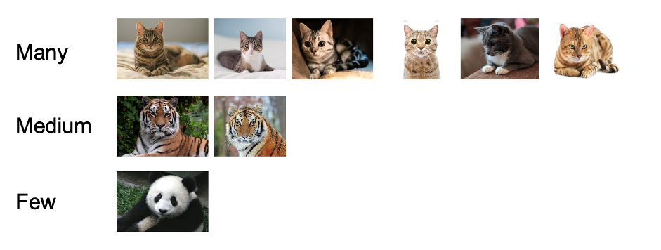

由于长尾现象对算法落地造成了很大的挑战，视觉社区对这一问题的关注日渐增加，近年陆续推出了一些长尾数据集，例如大规模实例分割数据集LVIS。我们发现长尾问题的难点主要存在于以下两个方面：

**1. 优化目标。**根据长尾问题的设定，训练集是类别不均衡的。然而主流的指标，如mean AP (mAP)，衡量全部类别上的平均精度，因此鼓励算法在类别平衡的测试集上取得较好的表现。这导致了训练与测试时标签分布不同的问题，我们称之为标签分布迁移。

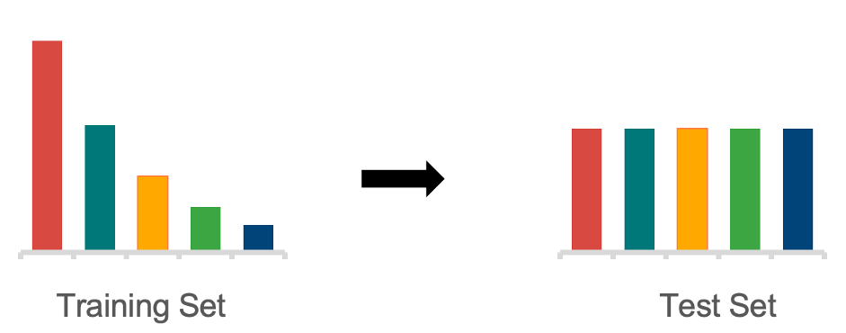

**2. 优化过程。**罕见类别在模型训练过程中很少出现，因此无法在优化过程中提供足够的梯度。这使得即使我们有了一个较好的优化目标，也很难使模型收敛到对应的全局最优。

**Part 2**/**方法介绍**

**1. Balanced Softmax**

Softmax函数常常被用来将模型输出转化为物体属于每个类别的条件概率。

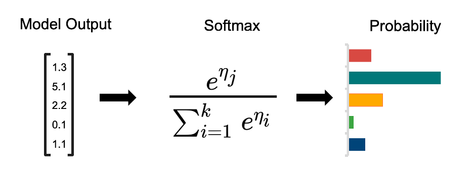

应用贝叶斯定理可以发现常规的Softmax回归会受到标签分布迁移的影响，并作出带偏差的估计。这个偏差导致Softmax回归出的分类器更倾向于认为样本属于常见类别。

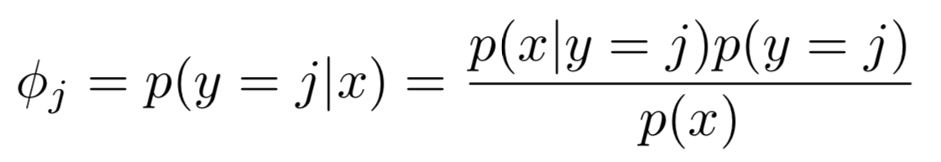

举一个简单的例子，考虑这样一个任务：通过性别来分类猫和狗。这个任务看起来是无法完成的，因为我们知道性别在猫和狗上是均匀分布的。无论猫还是狗，都有50%的可能性是雌性和50%的可能性是雄性，因此只靠性别我们无法区别猫和狗。有趣的是，当我们的训练数据是类别不平衡的时，比如有90%的猫和10%的狗，我们的估计就会出现偏差：这时无论是雄性还是雌性，我们都会倾向于认为它是一只猫。在这样的训练数据上学习到的分类器就会天然带有对常见类别的偏爱。

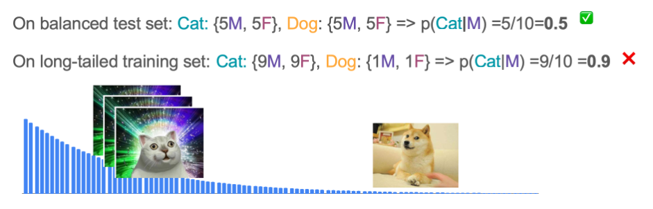

为了避免这个偏差，我们从多项分布的Exponential Family形式出发重新对Softmax进行了推导并显式考虑了标签分布迁移，得到了适合长尾问题的Balanced Softmax。同时，我们发现Balanced Softmax可以近似地最小化长尾设定下的泛化错误上界。

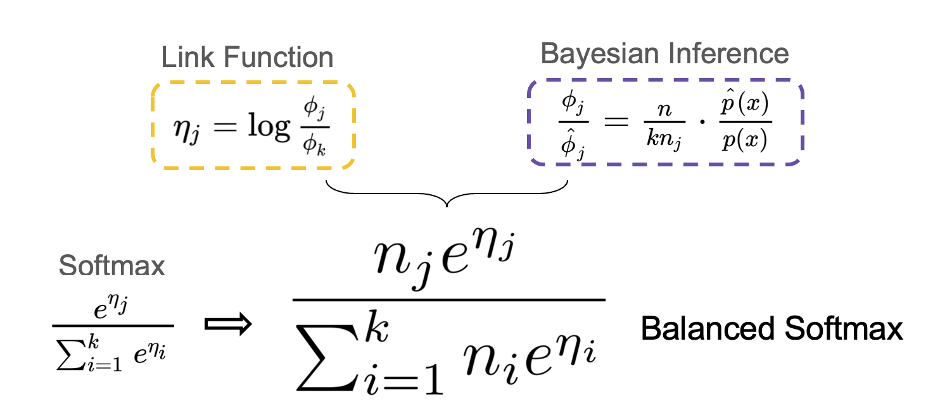

为了分析Balanced Softmax的效果，我们将模型在测试集上预测的分数在每个类别上累加，用来计算模型预测的标签分布。理想情况下，模型在测试集上预测出的标签分布应该是平衡的。在下图中我们对不同模型的预测类别进行了可视化，类别按照出现频率降序排列，第0类为出现次数最多的类。我们发现蓝色线代表的常规Softmax明显地偏向于常见类别，橙色线代表的Equalization Loss [1] 通过去除某阈值以下罕见类别的负样本梯度缓解了这一问题，而红色线代表的Balanced Softmax则进一步达到了最平衡的预测类别分布。

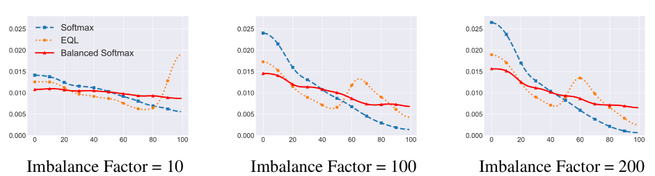

**2. 元采样器Meta Sampler**

虽然我们得到了一个适合长尾问题的理想的优化目标，优化过程本身依然充满挑战：罕见类别只能在训练中出现极少次数，因此无法很好地贡献到训练梯度。解决这一问题的最常见的方法是类别均衡采样 (CBS)[2]，也就是对每个类别采样同样数量的样本来组成训练批次。然而，实验表明直接将Balanced Softmax与CBS一起使用会导致模型表现下降，于是我们对两者一起使用时的梯度进行了分析。在假设接近收敛时，我们有：

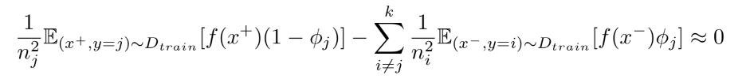

理想情况下每个类别的梯度的权重应和类别内样本数量成反比，但上式中的权重为和类别内样本数量成平方反比。我们将这个现象称为过平衡问题。

下图展示了一个对过平衡问题的可视化。这是一个类别不平衡的二维数据三分类问题，三个类别分别为红、黄、蓝，样本数量分别为10000、100和1。可以发现Balanced Softmax和CBS一起使用时，优化过程会被蓝色的罕见类别主导。

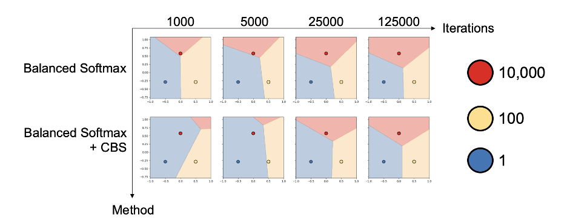

为了解决过平衡问题，我们提出了Meta Sampler（元采样器），一种可学习版本的CBS。Meta Sampler使用元学习的方法，显式地学习当前最佳的采样率，从而更好地配合Balanced Softmax的使用。

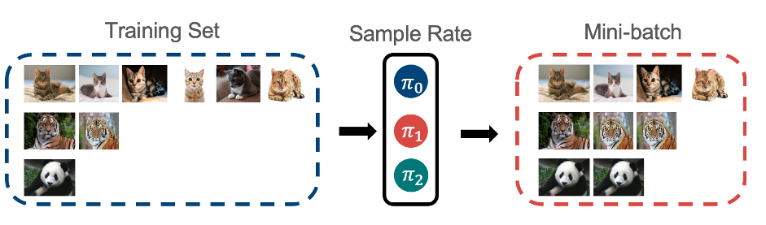

下图展示了我们对不同模型预测的标签分布进行的可视化。其中，紫色线代表的Balanced Softmax与CBS的组合由于过平衡问题，明显地偏向于尾部类别。而红色线代表的Balanced Softmax与Meta Sampler的组合则很好地解决了这一问题，最终取得了最为均衡的标签分布。

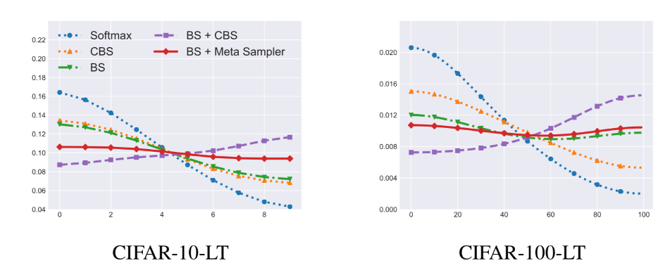

**Part 3**/**实验结果**

我们在图像分类（CIFAR-10/100-LT，ImageNet-LT，Places-LT）与实例分割（LVIS-v0.5）两个任务上分别进行了实验验证。实验结果显示了Balanced Softmax和Meta Sampler对模型表现都有明显的贡献。两者的组合，Balanced Meta-Softmax （BALMS），在这两个任务上都达到或超过了SOTA结果，尤其在最具挑战性的LVIS数据集上大幅超过了之前的SOTA结果。这项研究也被收录为ECCV LVIS workshop的Spotlight，关于LVSI-v1.0的相关实验结果可以在LVSI workshop主页上找到（Team Innova）。

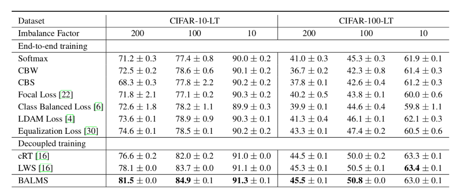

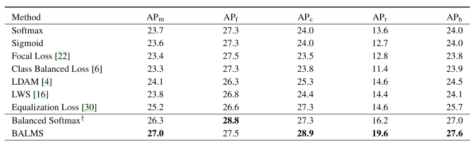

**Part 4**/**结语**

BALMS对长尾问题下的概率建模以及采样策略进行了探讨。我们发现常用的Softmax回归在存在标签分布迁移时会出现估计偏差，并提出了Balanced Softmax来避免这个偏差。另一方面，我们发现类别均衡采样器在与Balanced Softmax一起使用时会导致过平衡问题，于是提出元采样器来显式学习最优采样策略。我们的解决方案在长尾图像分类与长尾实例分割任务上均得到了验证。欢迎关注我们的开源代码库，希望BALMS可以成为未来长尾学习的良好基线。

**论文链接**

https://papers.nips.cc/paper/2020/file/2ba61cc3a8f44143e1f2f13b2b729ab3-Paper.pdf

**代码链接**

https://github.com/jiawei-ren/BalancedMetaSoftmax

**References**

[1] Jingru Tan, Changbao Wang, Buyu Li, Quanquan Li, Wanli Ouyang, Changqing Yin, and Junjie Yan. Equalization loss for long-tailed object recognition. In Proceedings of the IEEE/CVF Conference on Computer Vision and Pattern Recognition (CVPR), June 2020.

[2] Bingyi Kang, Saining Xie, Marcus Rohrbach, Zhicheng Yan, Albert Gordo, Jiashi Feng, and Yannis Kalantidis. Decoupling representation and classifier for long-tailed recognition. International Conference on Learning Representations, abs/1910.09217, 2020.

**招聘信息**

Innova是商汤新加坡的一支研究团队，团队目前有多篇顶会发表，并与新加坡南洋理工大学MMLab有密切的学术合作。Innova团队目前正在招收算法实习生，研究方向包括并不限于3D点云、3D人体模型、图像检测分割等，欢迎对深度学习与计算机视觉感兴趣的同学们投递简历到

zhaohaiyu@sensetime.com.

END

**备注：分类**

**图像分类交流群**

扫码备注拉你入群。

OpenCV中文网

微信号 : iopencv

QQ群：805388940

微博/知乎：@我爱计算机视觉

投稿：amos@52cv.net

网站：www.52cv.net

在看，让更多人看到  

