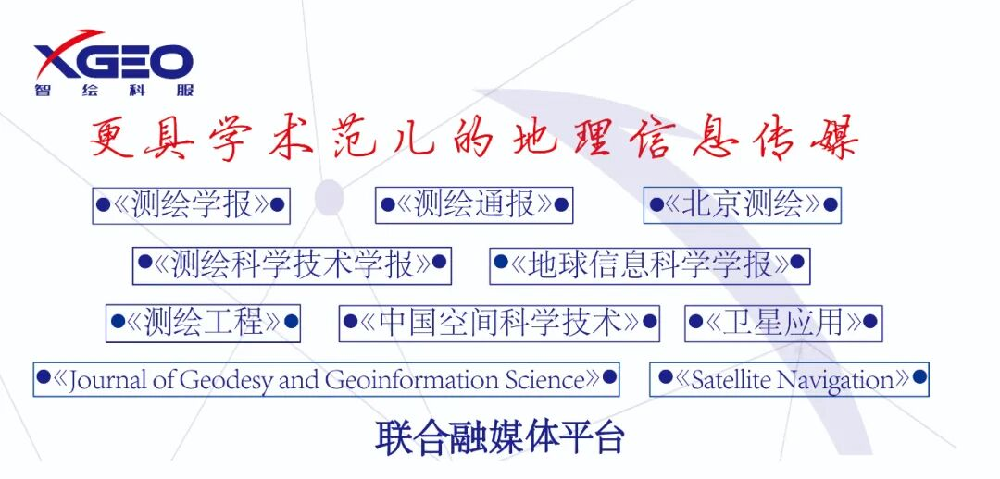

## 本文内容来源于《测绘学报》2021年第7期（审图号GS（2021）4830号）

**高分影像场景分类的半监督深度卷积神经网络学习方法**

**杨秋莲**

, **刘艳飞**

, **丁乐乐**, **孟凡效**

天津市勘察设计院集团有限公司, 天津 300000

**基金项目：**天津市重点研发计划科技支撑重点项目（18YFZCSF00620）；天津市重点研发计划院市合作项目（18YFYSZC00120）

**摘要**：传统基于深度卷积神经网络的场景分类方法往往需要大量标记样本用于模型的参数训练，在标记训练集数量有限的情况下，学习得到的特征泛化能力降低。针对这一问题，本文提出了高分影像分类的半监督深度卷积神经网络学习方法（3sCNN），采用自学习半监督策略，训练阶段不断增加训练样本：首先，通过有限的标记数据对深度网络进行初步训练；然后，利用经过初步训练的网络对未标记数据进行预测，得到未标记样本的预测标签及其对应的置信度；最后，将具有高置信度的未标记样本作为真实标记数据加入到训练集中，继续对网络进行训练并重复上述过程。为验证算法的有效性，本文在3个常用数据集上进行试验，试验结果证明本文算法可以有效提高有限样本下高分影像场景分类精度。

**关键词：**卷积神经网络    高分影像    半监督    分类

引文格式：杨秋莲, 刘艳飞, 丁乐乐, 等. 高分影像场景分类的半监督深度卷积神经网络学习方法[J]. 测绘学报，2021，50(7)：930-938. DOI: 10.11947/j.AGCS.2021.20200017

YANG Qiulian, LIU Yanfei, DING Lele, et al. High spatial resolution imagery scene classification based on semi-supervised CNNs[J]. Acta Geodaetica et Cartographica Sinica, 2021, 50(7): 930-938. DOI: 10.11947/j.AGCS.2021.20200017

**阅读全文**：http://xb.sinomaps.com/article/2021/1001-1595/2021-7-930.htm

**引 言**

随着IKONOS、Worldview系列、高分系列、高景一号等高分辨率遥感卫星的成功发射，高分辨率遥感数据已经成为对地精细观测的重要数据来源[1-3]。相较于中低分辨率遥感影像，高分影像呈现出了更丰富的空间细节信息，使得地物目标的精确解译成为可能。目前高分影像的分类基本实现了从基于像素的分类到面向对象的分类转变，极大地提高了分类精度[4-6]。遥感场景是由语义目标以某种空间分布构成的具有高层语义的复杂影像区域。因此即使获得如建筑、道路等精细地物目标识别结果，在获取如工业区、居民区等高层语义方面仍无能为力。为获取高层场景语义信息，如何跨越底层特征与高层场景语义之间存在的“语义鸿沟”，实现高分影像到高层场景语义之间的映射，是当前高分影像分类的一个热点问题[7-10]。

为克服“语义鸿沟”问题，国内外研究学者相继展开了面向高分辨率遥感影像场景分类的方法的研究，目前已经发展出了基于语义目标的场景分类方法[11-12]，基于中层特征的场景分类方法[13-15]和基于深度特征的场景分类方法[16-20]。基于语义目标的场景分类方法构建了一种“自底向上”的场景分类框架，首先对遥感影像进行语义目标提取，然后对语义目标的空间关系进行建模获得最终的场景表达特征，如文献[11]利用弹力直方图统计目标之间的位置关系作为场景表达特征用于分类。然而这种方法依赖于语义目标的提取精度和空间关系构建。不同于基于语义目标的场景分类方法，基于中层特征的方法不需要场景中目标的先验信息，直接对场景表达特征进行建模，典型的方法包括词袋模型[21-22]、主题模型[13-14]等。

然而以上两类方法都需要手工设计特征，依赖专家先验。深度学习作为一种数据驱动的学习框架，可以自动地从数据中学习本质特征，已经被成功应用于目标检测、人脸识别等领域，由于其强大的特征学习能力，已经被应用于高分影像场景分类。其中按照网络类型主要可以分为自编码模型[23-24]和深度卷积神经网络模型[25-27]。在基于自编码模型的场景分类方法中，采用编码—解码的3层结构逐层对深度网络每一层进行预训练以获得良好的参数初始化。然而这类方法由于编码—解码结构的存在，训练深度网络时往往需要大量时间。相较于基于自编码的场景分类方法，基于卷积神经网络的方法不需要编码—解码结构，直接对整个网络模型进行训练，获得广泛研究。如文献[28]为了提高深度卷积网络特征的辨别性，通过构建正负样本对并引入度量学习使得正样本对在特征空间彼此接近，负样本对彼此远离。文献[29]提出LPCNN，从数据中进行切片来增加训练数据的个数和多样性，提高场景分类精度。

基于深度卷积神经网络的方法往往需要大量的标注数据用于网络模型的训练，当标注样本有限时，其学习到的特征表达泛化能力有限。针对标注数据有限条件下的遥感场景分类任务，目前已经发展出了基于无监督深度学习方法[23-24, 30]、基于领域自适应的方法[31-33]、基于半监督深度学习方法[34-37]。在这3大类方法中，无监督深度学习方法和领域自适应方法往往不需要标记数据，然而这两类方法学习得到特征表达能力有限，场景分类精度较低。相较于基于无监督深度学习方法和领域自适应方法，基于半监督深度学习方法可以同时利用有限标注样本和大量未标记样本训练模型，有效提高模型泛化能力，具有较高分类精度。目前国内外学者已经对基于半监督深度学习场景分类方法开展了系列研究。文献[34]基于度量学习框架将未标记样本纳入到深度网络的训练过程中，根据标记样本在深度特征空间计算类别中心，并利用类别中心有效距离范围内的未标记样本参与类别中心的校正，使得同类样本向其对应类别中心靠拢。文献[35]为提高模型的辨别性，利用标注数据和未标注数据训练对抗网络，并用对抗网络中的辨别网络用于最终的场景分类任务。文献[37]将协同训练引入到半监督卷积神经网络场景分类中，利用标记训练样本分别训练两个不同的网络，同时利用验证集训练一个辨别网络，随后使用3个网络同时对未标记数据做预测，当3个网络对同一样本的预测一致时将其加入到训练集中，用于模型的训练。然而以上方法训练过程较为复杂，涉及多个网络的训练。

针对有限标注数据下模型泛化能力下降问题，本文将自学习半监督算法(self-training)应用到网络模型的训练，提出了一种端到端的半监督深度卷积高分影像场景分类方法(3sCNN)。相较于已有方法，本文提出的方法仅需训练单个网络，训练过程简单，便于实现：首先，利用标记样本对卷积神经网络进行训练；然后，利用得到的网络对未标记样本进行预测得到未标记样本的预测标签和对应的置信度，将置信度高的样本作为真实标签数据加入标记样本数据中进行模型训练。

## **1 基于卷积神经网络的高分辨率影像场景分类**

基于卷积神经网络的高分影像场景分类基本流程包括数据预处理、深度特征提取和特征分类3个部分。

在数据预处理阶段，主要对输入原始影像进行归一化操作，在本文中采用简单的除以255操作，将影像像素值落在[0, 1]区间。同时为了增加数据的多样性，在训练阶段随机地对数据进行平移、旋转等操作。

深度特征提取阶段利用卷积神经网络对经过数据预处理的影像逐层的进行特征提取。其中卷积神经网络的主要包含卷积层、池化层、全连接层和分类器层等。在特征提取过程中，对于第*i*层网络lay*i*，其前一层的输出*z**i*-1作为本层的输入得到本层输出特征*zi*，随后输出到下一层作为输入，重复特征提取过程

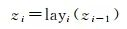

 (1)

式中，lay*i*可以是卷积层、池化层或者是全连接层等。

在深度特征提取阶段，利用多元分类器SoftMax对得到的深度特征进行分类，输出待分类样本的类别分布概率。

虽然基于卷积神经网络的场景分类方法已经被成功应用于遥感影像场景分类，并获得广泛关注，然而作为一种数据驱动的监督学习模型，其训练过程往往需要大量的标注数据。当训练样本有限时其深度特征泛化能力衰减，分类精度降低。针对这个问题，本文提出了半监督深度卷积神经网络用于高分辨率遥感影像场景分类。

## **2 高分影像场景分类的半监督深度卷积神经网络学习方法**

本文提出的方法流程如图 1所示，其过程主要包括数据预处理、深度特征提取和分类，标记数据集更新。

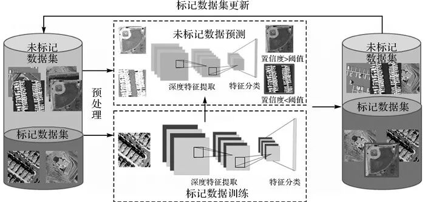

图 1 基于自学习半监督深度卷积神经网络的高分影像场景分类流程

Fig. 1 Framework of high spatial resolution imagery scene classification based on semi-supervised CNNs

为增加数据的多样性，在数据预处理阶段对输入的每一张影像进行随机切块作为样本输入，并且对得到的影像快进行随机旋转。

本文采用残差网ResNet-50[38]用于特征提取和分类。在残差网中，其通过在低层网络和高层网络之间建立跨越连接(skip connection)来保证低层网络向高层网络的信息流通和避免梯度弥散导致的深度网络训练收敛困难问题，如图  2(a)所示为含有跨越连接的ResNet Block，构成了残差网络的基本逻辑单元。残差网络通过堆叠多个ResNet Block构建深度网络，如图 2(b)所示为ResNet-50的网络结构图，其中*nX*表示将*n*个ResNet Block堆叠在一起。

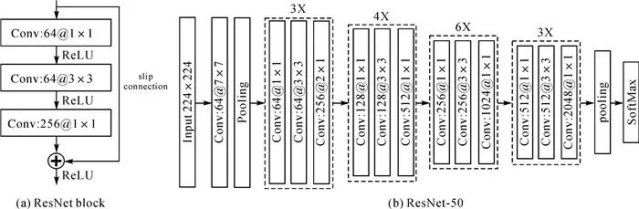

 

图 2 ResNet-50

Fig. 2 ResNet-50

对于给定的输入影像，ResNet-50通过逐层特征提取得到对应的特征向量，并将特征输入到分类器SoftMax进行深度特征分类，得到一个样本的类别概率分布

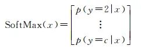

 (2)

式中，*p*(*y*=*i*|*x*)代表输入图像*x*属于类别*i*的预测概率；*c*代表场景分类中类别个数。在训练阶段，通过最大化样本被正确分类的概率来为网络参数更新提供监督信息，目标损失函数为式(3)

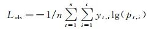

 (3)

式中，*n*为参与训练的样本个数; *y**t*, *i*为样本*t*的类别编码，当且仅当样本*t*属于类别*i*时*y**t*, *i*取1，否则取0。

传统卷积神经网络通过最小化式(3)来训练网络参数，然而当高分辨率遥感标记数据有限时，模型的泛化能力受到限制。针对这一问题，本文采用自学习机制在卷积神经网络训练过程中加入标记数据集更新操作，增加可用于训练的标记图像数量。

首先在有限标注数据集上进行iter_thrd次迭代预训练，使得深度网络具有初步的场景识别能力。在标记数据更新阶段，利用预训练的网络对未标记数据集进行推断预测，得到每一个未标记样本属于某一类的最大概率，并将其作为置信度。对于未标记数据，如果其置信度大于阈值con_thrd，则将其加入到训练集中作为标记数据集进行网络参数的训练。对于未标记数据，将其用于模型训练时，其对应得目标函数为

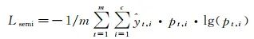

 (4)

式中，*m*为未标记数据个数；*ŷ**t*, *i*为预测得到的未标记数据标签，在式(4)中在将高置信度未标记样本用于训练的同时对其进行加权，以其置信度*p**t*, *i*作为权重。因此本文最终采用的目标函数为

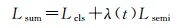

 (5)

式中，*L*sum为总的目标函数；*λ*(*t*)为未标记数据样本参与训练的权重，其定义如式(6)

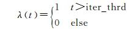

 (6)

在本文方法具体实现中，在每一次网络参数更新迭代时，从标记数据和未标记数据同时随机采样一批数据输入卷积神经网络，计算标记数据和未标记数据的类别概率分布，然后根据式(3)、式(4)、式(5)计算目标函数。具体的伪代码如下。

算法1 3sCNN算法

输入：卷积网络Net，学习率*lr*, 未标记数据集*Ud*，标记数据集*Ld*，最大迭代次数iter

输出：训练得到的网络net

for *i*=1:iter do:

sample batch of labeled data *L*_batch from *Ld*

sample batch of unlabeled data *U*_batch from *Ud*

Feed *L*_batch and *U*_batch to net

Compute the loss according to the equation (3)—(5)

Update the parameters of net

end

本文方法相较于传统卷积神经网络训练过程，仅是增加了一个未标记数据读取分支和一个阈值筛选步骤。相较于已有的半监督卷积神经网络场景分类方法，本文算法是一个端到端的半监督训练过程，简单易行，便于实现。

## **3 试验与分析**

3.1 试验设置

为验证本文算法的有效性，本文采用UCM[39]、Google of SIRI-WHU[14]和NWPU-RESISC45[19]3个场景分类数据集进行试验测试。其中UCM数据集包含21个场景类别，每个类别具有100张场景影像，每张影像大小为256×256，空间分辨率为0.3048m(1ft)。Google of SIRI-WHU数据集包含12个场景类别，每个类别具有200张影像，每张影像大小200×200，空间分辨率为2m。NWPU-RESISC45具有45个场景类别，每类具有700张影像，大小为256×256，空间分辨率为30~0.2m。图 3、图 4、图 5分别给出了3个数据集的代表样本。为验证本文方法在标记样本有限的情况下的提升卷积神经网络泛化能力的有效性，在每一个数据集试验中，仅从该数据集抽取3%的影像数据作为标记数据集，抽取70%的影像数据作为未标记数据集，剩余的数据作为测试样本。每次试验重复5次，记录5次试验的平均分类精度作为最终的分类精度。试验中利用经过在ImageNet数据集上经过预训练的ResNet-50进行网络的初始化并在3个数据集上微调，其中不采用本文提出的半监督训练方法进行微调的ResNet-50作为对比方法，记为Baseline-ResNet50。在本文试验中，训练迭代次数设置为2000，学习率为0.0001。

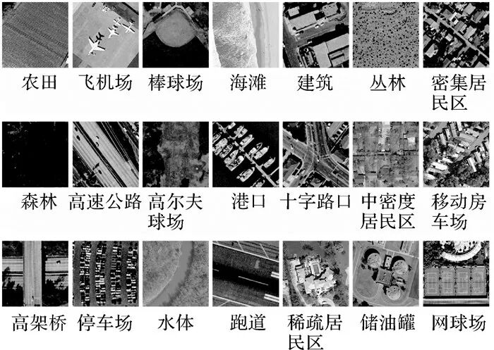

 

图 3 UCM数据集

Fig. 3 UCM data set

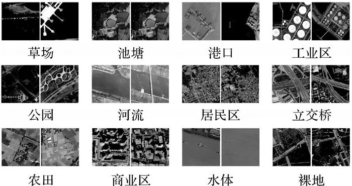

图 4 Google of SIRI-WHU数据集

Fig. 4 Google of SIRI-WHU data set

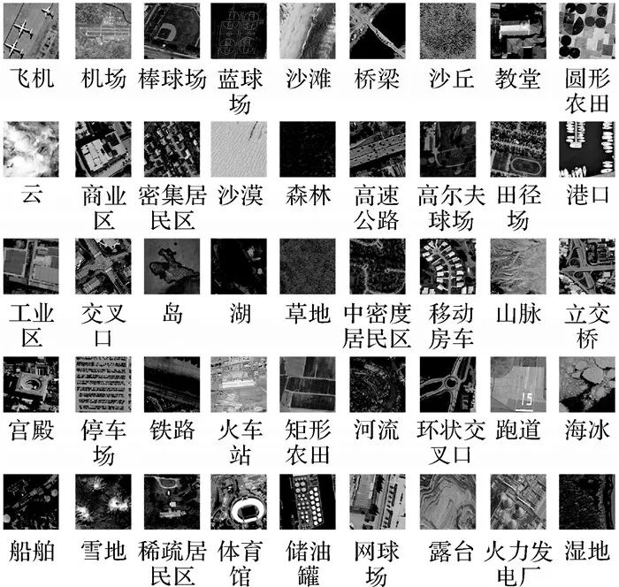

图 5 NWPU-RESISC45数据集

Fig. 5 NWPU-RESISC45 data set

3.2 试验结果与分析

表 1给出了在置信度阈值con_thrd为0.2，迭代训练阈值iter_thrd为300的条件下，本文提出的半监督算法3sCNN与对比方法在3个数据集上的分类结果。从表 1可以看出，本文半监督算法可以有效地提高高分辨率场景分类精度，在3%标记数据集和70%未标记数据集参与训练的情况下，相比于Baseline-ResNet50，提出的3sCNN在3个数据集上的分类精度分别提高了7.4%、4.7%和3.2%，有效地证明了所提算法的有效性。

表 1 场景分类精度对比情况

Tab. 1 The scene classification accuracy comparison

数据Baseline-ResNet503sCNNUCM75.0±3.382.4±6.3Google of SIRI-WHU77.3±4.582.0±3.3NWPU-RESISC4581.1±1.084.3±0.8

表 2、表 3分别给出了提出的3sCNN与已有半监督的方法在UCM和NWPU-RESISC45数据集上的对比情况，其中*x*%~*y*%代表参与训练的标记数据的占数据集整体的*x*%，未标记数据集占比*y*%。本文按照与对比方法相同的数据配置进行试验，其中在5%~95%和80%~20%的设置中，测试数据也作为未标记数据参与训练。从表 2、表 3可以看出本文提出的方法在同样配置下可以取得最优的分类结果。相较于文献[37]、文献[35]中的方法需要训练多个网络，本文提出的方法可以获得更优的分类精度，且仅需要训练一个网络，训练简单，便于实现。

表 2 与已有方法在UCM上对比情况

Tab. 2 Compared with published results with UCM

方法5%~95%10%~50%30%~50%80%~20%文献[36]85.14———文献[34]—91.19±0.24——文献[37]——94.52±1.38—文献[35]———94.05±0.603sCNN89.92±3.5194.04±1.9496.67±0.8798.80±0.63

表 3 与已有方法在NWPU-RESISC45上对比情况

Tab. 3 Compared with published results with NWPU-RESISC45

方法20%~80%30%~50%文献[35]83.12±0.26—文献[37]—88.6±0.313sCNN90.76±0.4891.09±0.19

为了进一步验证未标记数据集在深度神经网络训练中的作用，本文通过控制参与训练的未标记数据样本个数，对比不同未标记样本个数下3个数据集的场景分类精度，对比情况如表 4所示，其中分别对比了当参与训练的未标记个数占总样本数0%(即等价于Baseline-ResNet50)、20%、50%和70%下的场景分类精度。从表 4可以看出在未标记数据集的样本个数逐渐从0%升至70%时，场景分类精度也随之逐步提升，证明了提出的半监督场景算法3sCNN可以有效利用未标记样本参与模型训练，提高模型的泛化能力。图 6比较了Baseline-ResNet50和3sCNN在Google of SIRI-WHU测试数据集上的混淆矩阵。如图 6所示，所提出的3sCNN在7类上取得了最好的分类效果，减少了港口、公园、裸地等类别的误分类。对于池塘这一类别，相比于对比方法Baseline-ResNet50，本文方法的3sCNN精度由0.975衰减至0.775，造成这一现象的原因主要是在提出的半监督方法中，会对未标记数据进行预测，然后将高置信度未标记样本作为标记数据加入到训练集中用于模型的训练，因此未标记数据的预测质量会影响到训练数据的准确度，当有错误的高置信度样本被作为标记数据用于训练网络模型时，会降低网络的预测准确度。如图 7所示，本文测试了Baseline-ResNet50和3sCNN在未标记数据集上的分类情况，可以看出Baseline-ResNet50在池塘这一类别上的精度(0.96)高于3sCNN(0.91)，这也说明了3sCNN在池塘这一类别上选用了错误的高置信度未标记样本参与模型训练，降低了模型对该类别样本的识别能力。

表 4 不同未标记样本下场景分类精度对比情况

Tab. 4 Scene classification accuracy with different training sample ratio

数据0%20%50%70%UCM75.0±3.378.9±3.781.1±4.182.4±6.3Google of SIRI-WHU77.3±4.581.6±1.582.9±2.182.0±3.3NWPU-RESISC4581.1±1.082.5±0.583.7±0.684.5±0.7

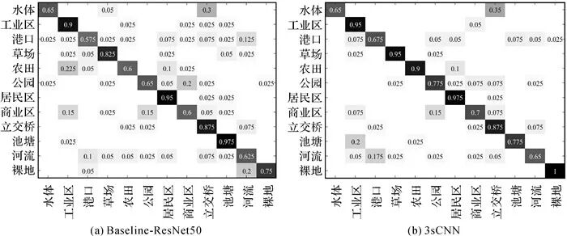

图 6 Baseline-ResNet50和3sCNN对Google of SIRI-WHU测试数据的混淆矩阵

Fig. 6 The confusion matrix of Baseline-ResNet50 and 3sCNN with Google of SIRI-WHU

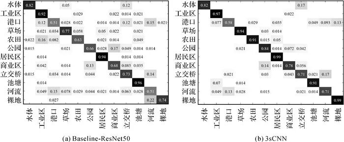

图 7 Baseline-ResNet50和3sCNN对Google of SIRI-WHU中未标记数据的混淆矩阵

Fig. 7 The confusion matrix of Baseline-ResNet50 and 3sCNN computed on the unlabeled dataset from Google of SIRI-WHU

**3.3 参数分析**

在本文提出的方法中，存在迭代阈值iter_thrd和置信度阈值con_thrd需要指定。为研究迭代阈值iter_thrd和置信度阈值con_thrd对分类精度的影响，本文分别令iter_thrd={0, 300, 600, 900, 1200, 1500, 1800}，con_thrd={0, 0.2, 0.4, 0.6, 0.8}进行试验，试验结果如图 8、图 9所示。从图 8中可知，对于UCM和NWPU-RESISC45数据，当置信度取值为0.2时获得最优分类精度，对于Google of SIRI-WHU数据集，当置信度阈值取值为0.4时获得最优精度。对于3个数据集来说当置信度阈值大于0时，场景分类精度有所提升，并在0.2和0.4取得最优结果，说明通过设置阈值可以有效控制选入未标记样本的质量，避免预测错误的样本参与到模型的训练中。继续增加置信度阈值精度开始出现下降，造成这一现象的原因可能是置信度非常高的样本其与原本的训练集样本具有较高的相似性，将其加入训练集用于模型训练时，其带来的信息量较为有限。图 9给出了迭代阈值iter_thrd对场景分类精度的影响，从图 9可以看出，当迭代阈值从0增加至300时，分类精度提升，当该阈值继续增加时，分类精度出现下降，造成这一现象的原因可能是标记数据本身数据量少，过多的迭代次数造成了过拟合现象。当迭代阈值取值300时，本文提出的方法在3个数据集上获得最佳分类精度。

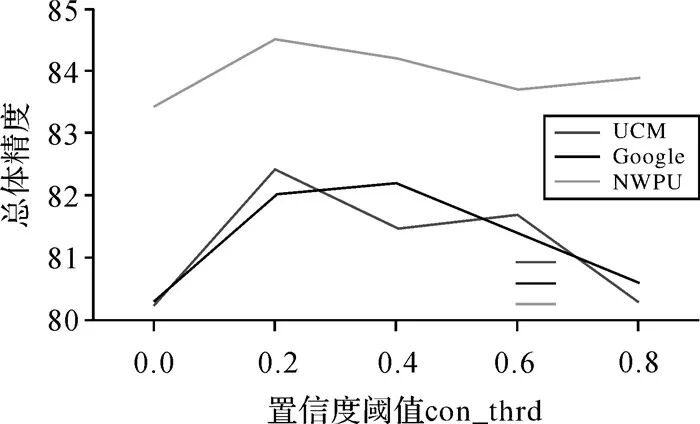

图 8 置信度阈值对场景分类的影响

Fig. 8 The influence of con_thrd on scene classification accuracy

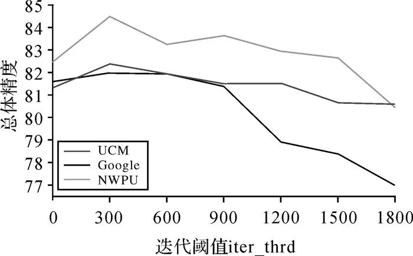

图 9 迭代阈值对场景分类的影响

Fig. 9 The influence of iter_thrd on scene classification accuracy

##

## **4 结束语**

在基于卷积神经网络用于高分辨率遥感影像场景分类时，针对标记数据有限情况下卷积神经网络训练困难，特征泛化能力衰减问题，本文将自学习半监督算法应用到网络模型的训练，提出了一种端到端的自学习半监督深度卷积高分影像场景分类方法，在利用有限标记数据训练的同时，对未标记数据进行标记预测并将高置信度样本作为标记数据加入到训练集中进行模型的训练。试验表明本文算法可以有效提升分类精度本文方法在训练过程中需要加入高置信度未标记样本参与模型训练，通过设置置信度阈值来保证加入样本预测标签的正确性。然而过高的阈值会导致选用的样本所携带的有效信息较为有限，影响分类精度的进一步提升，在未来的工作中，将在保证未标记样本标签正确率的同时考虑待基于差异性衡量样本信息量，选用携带更多有效信息的高置信度样本参与模型的训练，进一步提升场景分类精度。

## **作者简介**

**第一作者简介：**杨秋莲(1975-), 女, 硕士, 高级工程师, 研究方向为工程测量, 遥感影像智能解译。E-mail: 971760979@qq.com

**通信作者：**刘艳飞, E-mail：yanfeiliu@whu.edu.cn

## 初审：张艳玲

复审：宋启凡

终审：金   君

**往期推荐**

**资讯**

[深圳市市政设计研究院有限公司2022届校园招聘（含地信、测绘、遥感专业）](http://mp.weixin.qq.com/s?__biz=MzA5ODA1MjkxOQ==&mid=2649922828&idx=5&sn=5912aa63fe25f2e3b4c03517f00a3bd1&chksm=88914354bfe6ca426f9f5939478ce93ba7df83725bb40f378a1f7dedee692f413560994daaa8&scene=21#wechat_redirect)

[高光谱观测卫星成功发射](https://mp.weixin.qq.com/s?__biz=MzA5ODA1MjkxOQ==&mid=2649920863&idx=5&sn=01014cd162a8719288b229ea3cd47b1e&chksm=88914b07bfe6c2119eed896a28cb2492e2c0cee2b0ba563ef3a8b9a1b43067cec14d8f10f0ed&token=1189878926&lang=zh_CN&scene=21#wechat_redirect)

[关于开展2021年度注册测绘师资格考试工作的通知](https://mp.weixin.qq.com/s?__biz=MzA5ODA1MjkxOQ==&mid=2649919620&idx=3&sn=1390b2598903050c2b7fa3d109918dd7&chksm=88914edcbfe6c7ca9772c7e51ad404915c4aecc12036f5c8393bc405f2e48e03aea4f0a4ffea&token=1189878926&lang=zh_CN&scene=21#wechat_redirect)

[9个省份公布2021注册测绘师报名时间](https://mp.weixin.qq.com/s?__biz=MzA5ODA1MjkxOQ==&mid=2649920536&idx=5&sn=f89c5ee22cf801a204391ec5be9df8f5&chksm=88914a40bfe6c356c7ce28d7ac197a80934af65e64d351839d3a2eff8e761bc2f887300655f6&token=1189878926&lang=zh_CN&scene=21#wechat_redirect)

**会议**

[第十届全国地图学与地理信息系统学术大会（第一轮）](https://mp.weixin.qq.com/s?__biz=MzA5ODA1MjkxOQ==&mid=2649917634&idx=4&sn=e503049b91f6dc106e57aaed709ccc36&chksm=8891569abfe6df8ce60fd8e0f40c832928e2c265489faead28c0a8eff3b7369cf846da4e1d99&scene=21#wechat_redirect)

[第三届中国空间数据智能学术会议SpatialDI 2022 （一号通知）](https://mp.weixin.qq.com/s?__biz=MzA5ODA1MjkxOQ==&mid=2649920172&idx=3&sn=60bfd094129dc398473d9ba37d8f4706&chksm=88914cf4bfe6c5e2ca6085f1ffd1859600c7afc1c1ecdfcda69ec340a15ff7f8799dc372b83e&scene=21#wechat_redirect)

[关于召开“2021空间规划与实景三维高峰论坛”的通知](https://mp.weixin.qq.com/s?__biz=MzA5ODA1MjkxOQ==&mid=2649920536&idx=6&sn=2064eb14219b3015d6f8901f74447d06&chksm=88914a40bfe6c356d220bbafe36c44eae5e175b5e2deaae9b1a7828efbf93ffd531d91862e02&scene=21#wechat_redirect)

[会议通知 | 2021中国地理信息科学理论与方法学术年会（第二号通知）](https://mp.weixin.qq.com/s?__biz=MzA5ODA1MjkxOQ==&mid=2649914755&idx=2&sn=27b5a679ea592b43b3b3a64c3d1f99f2&chksm=8891a3dbbfe62acd48d84c5145072ae90dd96d755ee2a58708fea4a945b6090f16fc53b0747d&scene=21#wechat_redirect)

**《测绘学报》**

[智能化测绘专刊 | 李志林：时空数据地图表达的基本问题与研究进展](http://mp.weixin.qq.com/s?__biz=MzA5ODA1MjkxOQ==&mid=2649922828&idx=1&sn=b04d486023748225c12c40055dbd639a&chksm=88914354bfe6ca42003cd1f87b5cfebc857e9f948a347566be48296cc80c7443be670cafcdab&scene=21#wechat_redirect)

[《测绘学报》智能化测绘专刊 | 陈军院士：智能化测绘的基本问题与发展方向](https://mp.weixin.qq.com/s?__biz=MzA5ODA1MjkxOQ==&mid=2649919144&idx=1&sn=9c0366693d5e9e73b06d2505208aa353&chksm=889150f0bfe6d9e6f36f8d9d22fd8eb75c3b5d88040a71f998f7c3188d9803a9f5cb5b53073c&token=697812022&lang=zh_CN&scene=21#wechat_redirect)

[《测绘学报》2021年第8期：智能化测绘专刊，客座主编陈军院士](https://mp.weixin.qq.com/s?__biz=MzA5ODA1MjkxOQ==&mid=2649918830&idx=2&sn=6cf1a0cd74c13b18741f463e1349a1ab&chksm=88915336bfe6da20d78092d0a01218322558dfa86fe7b7aad13becaa9a67a2d863e5ea890a50&token=697812022&lang=zh_CN&scene=21#wechat_redirect)

[测绘学报 | 宋依娜：干雪深度反演的同极化相位差模型](http://mp.weixin.qq.com/s?__biz=MzA5ODA1MjkxOQ==&mid=2649922142&idx=2&sn=96a7a363cd3f2d748b88a6fc549b5091&chksm=88914406bfe6cd10d3da392345b34e6a011bde78952eb25756ba530a0d794440aa3381948134&scene=21#wechat_redirect)

**《测绘通报》**

[利用遥感生态指数新方案评价矿区生态环境](https://mp.weixin.qq.com/s?__biz=MzA5ODA1MjkxOQ==&mid=2649919837&idx=3&sn=9c606eea1cf9f0b7bbd7650365e4fdbf&scene=21#wechat_redirect)

[基于星载SAR的滑坡灾害形变特征分析](https://mp.weixin.qq.com/s?__biz=MzA5ODA1MjkxOQ==&mid=2649916285&idx=5&sn=8fad6a69a50d20e1d4d04b9e9e0545de&chksm=88915d25bfe6d4330b3ed92dcde6baf1f0c453f4b06836bf98fc7d5e6b1d7e3eb8358ea6679c&token=1233990536&lang=zh_CN&scene=21#wechat_redirect)

[图像全站仪及图像测量发展与展望](https://mp.weixin.qq.com/s?__biz=MzA5ODA1MjkxOQ==&mid=2649916058&idx=3&sn=838800dba249b74b2115875262d6657e&chksm=88915cc2bfe6d5d4eaabcf67dc591ff5e9fce5a52b5e69940b8c14ad7d1935745ba73c3d1467&token=1233990536&lang=zh_CN&scene=21#wechat_redirect)

[《测绘通报》2021年第7期目录](https://mp.weixin.qq.com/s?__biz=MzA5ODA1MjkxOQ==&mid=2649916285&idx=1&sn=a63221462a990a50a8de6f002d92d0c2&scene=21#wechat_redirect)

**《北京测绘》**

[《北京测绘》2021年第6期摘要推荐（下）](https://mp.weixin.qq.com/s?__biz=MzA5ODA1MjkxOQ==&mid=2649917634&idx=2&sn=8d438b2f75d359d58783542cedd3b9ea&chksm=8891569abfe6df8c3eef6e19fc7557b08d59206eda203c645ca1113eabedcf5f5233a6e32548&token=697812022&lang=zh_CN&scene=21#wechat_redirect)

[《北京测绘》2021年第6期摘要推荐（下）](https://mp.weixin.qq.com/s?__biz=MzA5ODA1MjkxOQ==&mid=2649917570&idx=1&sn=cc7407f150dfdbbcf8c6df0586f054eb&chksm=889156dabfe6dfcc3661ee98ea5fe05174d6d042169c292a215216ee19207e0d1995d261e1e8&token=697812022&lang=zh_CN&scene=21#wechat_redirect)

[《北京测绘》2021年第5期摘要推荐（下）](https://mp.weixin.qq.com/s?__biz=MzA5ODA1MjkxOQ==&mid=2649916845&idx=3&sn=cb3484b50af6af83bf17e4925134333a&chksm=88915bf5bfe6d2e3e03f795f5ea265c86f5e936cf7761033f59f10cff0c871509e54d569472f&token=697812022&lang=zh_CN&scene=21#wechat_redirect)

[《北京测绘》2021年第5期摘要推荐（上）](https://mp.weixin.qq.com/s?__biz=MzA5ODA1MjkxOQ==&mid=2649916643&idx=2&sn=c7627b266755cbd8c12e22b33a1deb20&chksm=88915abbbfe6d3adddff73c1736afe0a76f80d855231e7a749fba755c94cacd7a2ca5dae860c&token=697812022&lang=zh_CN&scene=21#wechat_redirect)

**《测绘科学技术学报》**

摘要 |《测绘科学技术学报》2021年第3期摘要推荐

摘要 |《测绘科学技术学报》2021年第2期摘要推荐

摘要 |《测绘科学技术学报》2021年第1期摘要推荐

[《测绘科学技术学报》2021年第1期重点论文推荐](https://mp.weixin.qq.com/s?__biz=MzA5ODA1MjkxOQ==&mid=2649894758&idx=2&sn=03a898582bbad92ef792445124369ddd&chksm=8891f13ebfe67828ce85bed9b5ea3782560291412073d8332f651dc504c59fd960b662945682&token=1189878926&lang=zh_CN&scene=21#wechat_redirect)

**《地球信息科学学报》**

[《地球信息科学学报》2021年第8期佳文推介](http://mp.weixin.qq.com/s?__biz=MzA5ODA1MjkxOQ==&mid=2649921548&idx=2&sn=9d51136231d3433b1f439673c4f355bd&chksm=88914654bfe6cf42a05c3766f2943cc33c279dc84ee8cf166398f39727cf2d2a16c10c47a07f&scene=21#wechat_redirect)

**《测绘工程》**

[摘要 |《测绘工程》2021年第4期摘要推荐](https://mp.weixin.qq.com/s?__biz=MzA5ODA1MjkxOQ==&mid=2649912784&idx=1&sn=b0e4b3a17f85885a0dadd5f858c53686&scene=21#wechat_redirect)

[摘要 |《测绘工程》2021年第3期摘要推荐](https://mp.weixin.qq.com/s?__biz=MzA5ODA1MjkxOQ==&mid=2649901351&idx=2&sn=b6bf2c2932c1bdaf9ef03e9b9ada35aa&scene=21#wechat_redirect)

[摘要 |《测绘工程》2021年第2期摘要推荐](https://mp.weixin.qq.com/s?__biz=MzA5ODA1MjkxOQ==&mid=2649891028&idx=2&sn=3011919aa37595397c5fcf04f13ea199&scene=21#wechat_redirect)

[摘要 |《测绘工程》2021年第1期摘要推荐](https://mp.weixin.qq.com/s?__biz=MzA5ODA1MjkxOQ==&mid=2649889726&idx=1&sn=86bae0e6323420e781e77d0801ecd13f&scene=21#wechat_redirect)

**《中国空间科学技术》**

[《中国空间科学技术》“空间可展开结构” 专栏征文通知](http://mp.weixin.qq.com/s?__biz=MzA5ODA1MjkxOQ==&mid=2649920863&idx=2&sn=21ddb6c6f586f2ad9f523c4e7fbdc9af&chksm=88914b07bfe6c2116df93e414b35e21c5a9d8d13addab063d5d5845e862f85a4a6f95913cebc&scene=21#wechat_redirect)

[《中国空间科学技术》入驻“智绘科服”融媒体平台！](https://mp.weixin.qq.com/s?__biz=MzA5ODA1MjkxOQ==&mid=2649918511&idx=1&sn=8f0338105b8036cdc332ebdbabcb7202&chksm=88915277bfe6db6134a5429084576d39936e36e00ecb8c8387634c5fa7b554f4eccad44faa6d&scene=21#wechat_redirect)

[摘要 |《中国空间科学技术》2021年第4期摘要推荐](http://mp.weixin.qq.com/s?__biz=MzA5ODA1MjkxOQ==&mid=2649922142&idx=1&sn=45d2b51cd6e0ec0510e37ee77b85ac54&chksm=88914406bfe6cd10d7f96715ca5eb3e79752ccef2350b58aa66c21155a5410516a3b638642e5&scene=21#wechat_redirect)

[中国空间学科技术 | 潘晓：连续小推力非开普勒悬浮轨道研究综述](http://mp.weixin.qq.com/s?__biz=MzA5ODA1MjkxOQ==&mid=2649922142&idx=3&sn=6aeefada2bf082d257f19ff852a843ac&chksm=88914406bfe6cd10849205144648816179de572960ba7c2fd46ab55fc98752b1f5f707c55eae&scene=21#wechat_redirect)

**《卫星应用》**

[摘要 |《卫星应用》2021年第7期摘要推荐](http://mp.weixin.qq.com/s?__biz=MzA5ODA1MjkxOQ==&mid=2649922142&idx=4&sn=4258b944c5130c399aac0fb7e1ba56c1&chksm=88914406bfe6cd10f94418cdcef87b83ce5721573b52d62e424354eff20b00d222fa0239e922&scene=21#wechat_redirect)

**《Journal of Geodesy and Geoinformation Science》**

[精选论文 |《测绘学报（英文版）》“GNSS和LBS”专刊](https://mp.weixin.qq.com/s?__biz=MzA5ODA1MjkxOQ==&mid=2649919706&idx=4&sn=e5cc0c200704854de6ef8b0d68ecc1fc&chksm=88914e82bfe6c794dfac76bd59e5bc0e61a791b77dd2b73bcc9a0a2cd12e7a47a729891a2fad&scene=21#wechat_redirect)

[精选论文 |《测绘学报（英文版）》“GNSS和LBS”专刊](https://mp.weixin.qq.com/s?__biz=MzA5ODA1MjkxOQ==&mid=2649918408&idx=3&sn=620ef76d1b05c425fdf322ceb902f56a&chksm=88915590bfe6dc86785b06ed134b85b12f35963804d4159a80a7ebbd11556ccde7e7ff7675c2&scene=21#wechat_redirect)

[Yaoming MA et al. |《测绘学报（英文版）》（JGGS）精选论文](https://mp.weixin.qq.com/s?__biz=MzA5ODA1MjkxOQ==&mid=2649917197&idx=2&sn=fecc6838ebca8a0cad47aaee1529e654&chksm=88915955bfe6d04340b49ed51aa2f119341ad6eea9ae4dd4ed45452f42030906972a55bc43af&scene=21#wechat_redirect)

[Bing HAN et al. |《测绘学报（英文版）》（JGGS）精选论文](https://mp.weixin.qq.com/s?__biz=MzA5ODA1MjkxOQ==&mid=2649914521&idx=1&sn=1e746513f4ffe213b0ecba0f85444dd2&chksm=8891a2c1bfe62bd793d2020b34d7b59b1ff47c484a74dee78a9a65adc767a4b8b9afa45a9a54&scene=21#wechat_redirect)

**《Satellite Navigation》**

[《卫星导航（英文）》科学编辑招聘启事](https://mp.weixin.qq.com/s?__biz=MzA5ODA1MjkxOQ==&mid=2649919706&idx=3&sn=be19ea85455ba9cc2facf9386113d0d2&chksm=88914e82bfe6c794487ebefd645aac6afede79b5354931e1643ce2d9fc3bbe7283d8dae52a94&scene=21#wechat_redirect)

[多源导航(一) | 《Satellite Navigation》重点论文推荐](https://mp.weixin.qq.com/s?__biz=MzA5ODA1MjkxOQ==&mid=2649917197&idx=3&sn=554a55837eed39a87365cd8d6962abb1&chksm=88915955bfe6d043ea0aac23b95dd88ecf2913725f3b3fc3283f36a576c12f69bf26aa5c06a7&token=1189878926&lang=zh_CN&scene=21#wechat_redirect)

[导航定位应用| Satellite Navigation文章精选](https://mp.weixin.qq.com/s?__biz=MzA5ODA1MjkxOQ==&mid=2649919706&idx=5&sn=fcf8ecd09353a4c62744e95e2728df88&chksm=88914e82bfe6c7947ebc42d6736211a781e5e99f679ea5e452d56c1355db9ce9c476d7075151&scene=21#wechat_redirect)

[《Satellite Navigation 》| “智绘科服” 迎来新伙伴加入！](https://mp.weixin.qq.com/s?__biz=MzA5ODA1MjkxOQ==&mid=2649917197&idx=1&sn=4a541f41fde3a76fc207f29f578c1b8a&chksm=88915955bfe6d0439a12b9b1224ea877a8866358cab4ef16aa7f739940e0f8e8ff1a4f2b7dd7&token=1189878926&lang=zh_CN&scene=21#wechat_redirect)

