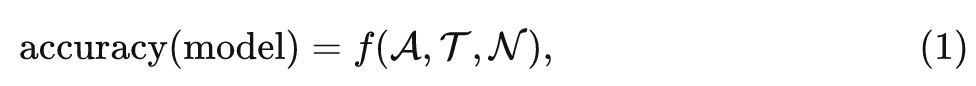
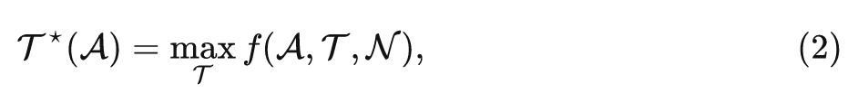
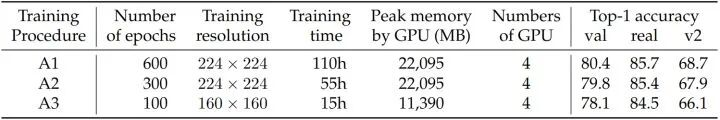
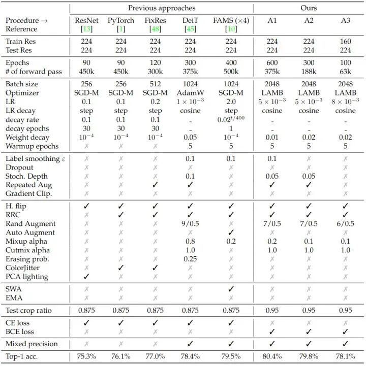
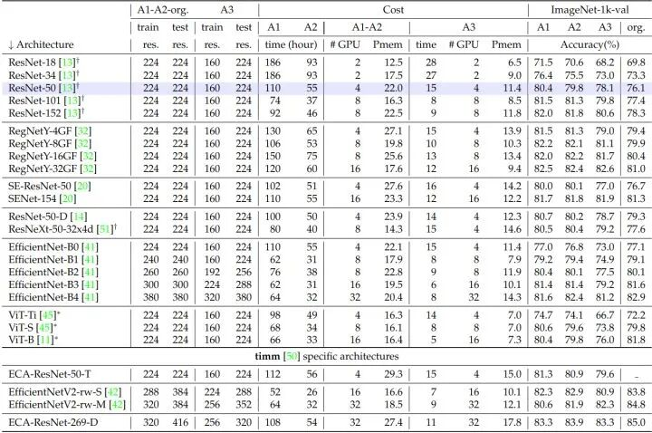
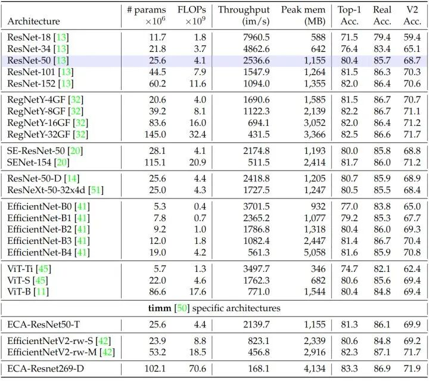
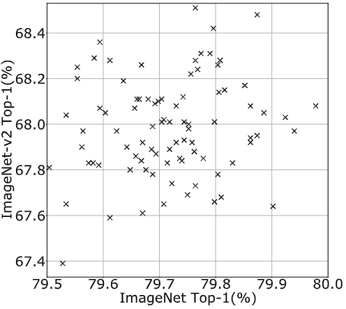
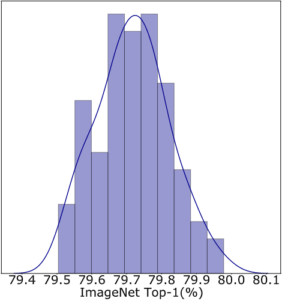
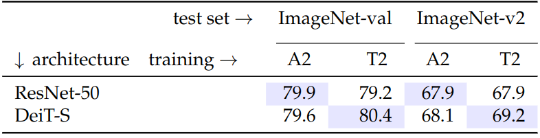
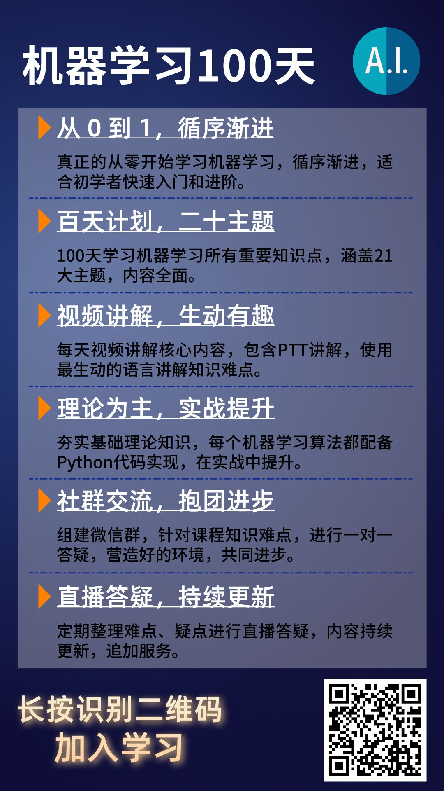

****

作者丨科技猛兽

编辑丨极市平台

在本文中，作者重新评估了原始 ResNet-50 的性能，发现在需求更高的训练策略下，原始 ResNet-50 在分辨率224×224 上的 ImageNet 验证集上可以达到 80.4% 的 top-1 精度，而无需额外的数据或蒸馏策略。

## 本文目录

> **1 ResNet 的反击：全新训练策略带来强悍 ResNet 性能**
> (来自 timm 作者，DeiT 一作)
> 1 RSB ResNet 论文解读
> 1.1 背景和动机
> 1.2 三种训练策略
> 1.3 目标函数：多标签分类目标
> 1.4 数据增强
> 1.5 正则化策略
> 1.6 优化器
> 1.7 实验结果

## 1 ResNet 的反击：全新训练策略带来强悍 ResNet 性能

**论文名称：** ResNet strikes back: An improved training procedure in timm

**论文地址：**

https://arxiv.org/pdf/2110.00476.pdf

# **1.1 背景和动机**

残差网络 ResNet[1]，自2016年获得 **CVPR Best Paper Award** 以来，一直都认为是计算机视觉领域黄金标准体系结构。同时也通常作为研究中的默认架构和常用的 Baseline。从 ResNet 2015年被提出以来，神经网络的训练策略同时也取得了重大进展，新的优化和数据增强策略也极大地丰富了模型训练的方法。

在本文中，作者重新评估了原始 ResNet-50 的性能，发现在需求更高的训练策略下，原始 ResNet-50 在分辨率224×224 上的 ImageNet 验证集上可以达到 80.4% 的 top-1 精度，而无需额外的数据或蒸馏策略。

在过去的十年中，我们见证了图像分类领域的重大进步。简单地说，性能的提高求解下面这个优化问题：

其中  是架构的设计,  是训练设置及其超参数,  是测量噪声, 其中还包括过拟合, 这通常发生在从大量超参数集或方法选择中选择最大值时。一般来说有几个很好的做法可以减轻 , 比如用不同的种子测量标准差或评估模型的迁移学习性能等。抛开  不谈, 在过去的十年中,  和  都在随着时间的推移而发展。当对  进行联合优化时, 不能保证给定架构  的最佳选择  对于另一个模型设计  仍然是最佳的。

在没有资源和时间限制的理想情况下，也许可以对每个架构采用最佳的训练策略，如下式所示：

但很明显这是不可能的。在比较架构时，大多数论文都会将其结果与旧论文所提出的架构的结果进行比较，但是这些架构的训练方法可能较弱。

所以，目前尚不清楚对于 ResNet-50 架构这个经典基线，其优化策略是否已经达到相对较优的水准。本文作者对其训练策略进行优化，以使该模型在原始测试分辨率为 224×224 的情况下性能最大化。因为只考虑训练策略，所以作者们排除了 ResNet-50 的所有变体，如 SE-ResNet-50 或 ResNet-50-D 等。作者提出了三种训练策略，用于分辨率为 224×224 的 ResNet50 的训练，其对应的 Epoch 数分别为100，300，600。作者还测量了在使用不同种子的大量运行中精度的稳定性，并通过比较 ImageNet-val 上的性能与 ImageNet-V2 中获得的性能来讨论过拟合问题。

本文所有实验基于 **timm**(https://github.com/rwightman/pytorch-image-models) (PyTorch Image Models) **库**，解读如下：

# **1.2 三种训练策略**

为了覆盖不同的应用场景，作者提供了**三种不同的训练策略**。它们的训练成本不同，得到的性能也不同。各种配置下的资源使用情况和精度如下图1所示。目标是在分辨率为 224×224 的情况下测试 ResNet-50 的最佳性能，并且专注于三个不同的操作要点:

- **Procedure A1：** 专注于为 ResNet-50 提供最佳性能。因此，它训练时间最长 (600 Epochs，4.6天，在一个 node 上使用4个 V100 32GB GPU)。
- **Procedure A2：** 专注于与一些现代的训练策略作对比。因此，它训练时间为 300 Epochs。
- **Procedure A3：** 专注于超越原来的 ResNet-50 训练策略，它训练时间为 100 Epochs，在4个 V100 16GB GPU 上训练15小时，可以作为探索性实验的设置。

图1：不同训练策略的精度和训练成本

# **1.3 目标函数：多标签分类目标**

作者将分类视为**多标签分类问题**。因此采用**二元交叉熵 (Binary Cross Entropy) 损失**代替典型的**交叉熵 (Cross Entropy) 损失**。这种损失与 Mixup 和 CutMix 的数据增强策略是可以一起使用的。由 Mixup 或 CutMix 选择的类的目标定义为 11 (或平滑的 1-)。二元交叉熵 (BCE) 损失在作者探索的训练配置中略优于交叉熵损失。

Cross Entropy Loss 主要用于多类别分类，二分类也可以做。

Binary Cross Entropy Loss 用于二分类。

**BCE Loss (reduction='mean')：**

式中，  是 Batch Size。因为用于二分类，所以模型输出只有1个神经元，而 CE Loss 中，模型输出一般为分类的类别数。

举个例子，设二分类任务的 Batch Size 为4，**BCE Loss** 中的 B 这里指的是 Binary，是把预测值和标签的损失函数计算当做是4个二分类问题。

比如标签是 [0], [1], [0], [0]，预测值经过 Sigmoid 函数变为 [0.16], [0.83], [0.12], [0.23]，则 BCE Loss 计算为：

所以，这也就意味着使用 **nn.BCELoss()** 时，网络的输出一般会跟一个 **nn.Sigmoid()** ，如下面的示例所示。

m = nn.Sigmoid()
loss = nn.BCELoss()
input = torch.randn(3, requires_grad=True)
target = torch.empty(3).random_(2)
output = loss(m(input), target)
output.backward()

nn.BCEWithLogitsLoss() 和 nn.BCELoss() 的区别是：前者已经自带了一个 Sigmoid 层，不需要再定义了。

# **1.4 数据增强**

作者采用以下数据增强的组合：Random Resized Crop (RRC)，Horizontal Flip，RandAugment，Mixup，CutMix。

# **1.5 正则化策略**

三种不同的训练策略中，正则化的区别最大。除了默认的权重衰减之外，作者还使用了 Label Smoothing, Repeated Augmentation (RA) 和 Stochastic-Depth。对于更长的训练策略，作者使用了更多的正则化方法。

**A1：Label Smoothing，Repeated Augmentation 和 Stochastic-Depth。**

**A2：Repeated Augmentation 和 Stochastic-Depth。**

**A3：无。**

Repeated Augmentation 和 Stochastic-Depth 虽然可以改善收敛时的结果，但会减缓早期阶段的训练，对于较少的 Epoch，它们的效率较低，甚至是有害的，因此 A3 不使用他们。

# **1.6 优化器**

自 AlexNet 以来，训练卷积神经网络最常用的优化器是 SGD。相比之下，视觉 Transformer 和 MLP 类架构一版使用 AdamW 或 LAMB 优化器。作者使用了更大的 Batch Size 2048。当结合 **repeated augmentation** 和 **binary cross entropy loss** 时，发现 LAMB 更容易获得良好的结果。当同时使用 SGD 和 BCE 时，作者发现很难实现收敛。因此，作者倾向于使用 LAMB 和余弦学习率衰减策略作为 ResNet-50 训练的默认优化器。

在下图2中，作者比较了用于训练 ResNet-50 的不同策略及其精度，本文不考虑使用高级训练设置的方法，如知识蒸馏，或自监督模型预训练方法。

图2：训练 ResNet-50 的不同策略

# **1.7 实验结果**

### ResNet50 架构结果

如上图1所示是本文给出的3种训练策略，Procedure A1在分辨率 224×224 的 ResNet-50 架构上超越了当前技术水平。Procedure A2 和 A3 用更少的资源实现了更低但仍然很高的精度。

### 为 ResNet50 设计的训练策略应用于其他架构结果

如下图3所示是用本文为 ResNet50 设计的训练策略 A1，A2，A3 训练不同架构时的性能。对于 EfficientNet-B4 这样的模型，可以观察到 A2 比 A1 更好，这表明为了 ResNet50 设计的超参数不适应更长的训练 Epochs。

如下图4所示是用本文的训练策略 A1 训练不同架构时的性能和其他细节的补充，包括了 ImageNet-1K、ImageNet-V2 和 ImageNet-Real 上的性能和效率。

图3：在没有任何超参数自适应的情况下，使用 ResNet-50 策略训练的其他架构之间 ImageNet 精度的比较

图4：A1 训练策略训练模型的精度。测量一个 32GB 的 GPU V100 的峰值内存和吞吐量，Batch Size 为128

### Seed Experiments

对于一组固定的选择和超参数，权重初始化和优化过程本身都会给精度带来影响。比如，图像分批馈送到网络的顺序取决于随机生成器。因此作者改变随机生成器选择时测量性能分布，这可以通过改变种子来方便地完成。如下图5所示是使用100个不同的种子 (从1到100，注意在所有其他实验中都使用 seed=0) 时，A2 训练过程的性能统计数据，且只关注训练结束时达到的性能 (不是 Max Accuracy Epoch)。在 ImageNet-val 上，标准差通常在0.1左右。ImageNet-V2 (std=0.23) 上的方差更高，它相对于 ImageNet-1K 的验证集更小 (10000 vs 50000)。如图6所示是使用 A2 策略在 ImageNet-val 上的性能分布，也是用100种不同的种子来测量的。此外，作者观察到在 ImageNet-val 和 ImageNet-V2 上的性能之间的相关性是有限的。值得注意的是，两个数据集上的同一种子并没有达到最佳性能。

图5：100个随机种子的 ImageNet-1K 和 ImageNet-V2 性能

图6：A2 策略在 ImageNet-val 上的性能分布

### 迁移学习性能

如下图7所示，作者提供了7个细粒度数据集上不同预训练模型的迁移学习性能，并与默认的PyTorch预训练进行了比较。对于每个预训练，使用完全相同的微调过程。总的来说，A1 策略在下游任务上的性能最好，但是 Pytorch 默认和 A2 的性能趋于相似，而在 Imagenet-val 和 Imagenet-V2 上 A2 的性能明显更好。A3 在下游任务上明显劣势，这可能与 160×160 的训练分辨率较低有关。

图7：迁移学习性能

### 对比架构和训练策略：一个矛盾的案例

在这一节中，作者想说明即使使用相同的训练策略，比较两个模型架构是很困难的。或者反过来，即使使用相同的模型架构，比较两个训练策略是很困难的。

如下图8所示，A2 为上文介绍的训练策略，T2 是在相同的 300 Epochs 和相同的批处理大小下最大化目标数据集性能的，为 DeiT 模型精心设计的训练策略。

可以看到，对于 Imagenet-val 来讲：

- 使用 A2 策略训练时，ResNet50 精度 > DeiT-S 精度。
- 使用 T2 策略训练时，ResNet50 精度 < DeiT-S 精度。

所以单单从这个角度看，你很难觉得说 ResNet50 和 DeiT-S 这两个模型哪个更好，因为这取决于你使用的训练策略是为谁定制的。

图8：对比架构和训练策略的案例

## 总结

本文作者提出了3个新的训练策略来针对原始的 ResNet-50，着力探索不同资源条件下的多样化流程。训练策略 A1 的训练过程最长，将经典的 **R50** 性能提升到了新高度。训练策略 A2 专注于与一些现代的训练策略作对比，训练策略 A3 专注于节约训练成本。然而：

这些训练策略 A1，A2，A3 **绝不是通用的！恰恰相反，不同的模型架构适合不同的训练策略，二者应该联合优化。** 本文的 A1，A2，A3 训练策略对于训练其他模型并不理想。虽然在一些模型上，A1，A2，A3 训练策略会得到比文献中报道的结果更好的结果，但它们在其他模型上表现出次优的性能，通常用于更深层次的架构，而且需要更多的正则手段。

**参考文献**

1.BCE、CE、MSE损失函数(https://blog.csdn.net/qq_42251157/article/details/124758137)

2.https://pytorch.org/docs/stable/generated/torch.nn.BCELoss.html

3.https://medium.com/dejunhuang/learning-day-57-practical-5-loss-function-crossentropyloss-vs-bceloss-in-pytorch-softmax-vs-bd866c8a0d23

参考

- Deep Residual Learning for Image Recognition

**机器学习100天计划！**

**视频讲解 + 实战代码 + 社群交流 + 直播答疑**

《机器学习100天》总共包含 100 个机器学习知识点视频讲解！我会提供所有的**教学视频、实战代码**，并提供社群一对一交流和直播答疑！

**扫描下方二维码，加入学习！**

点击**「****阅读原文****」**即刻报名，一顿午饭钱，值了。
