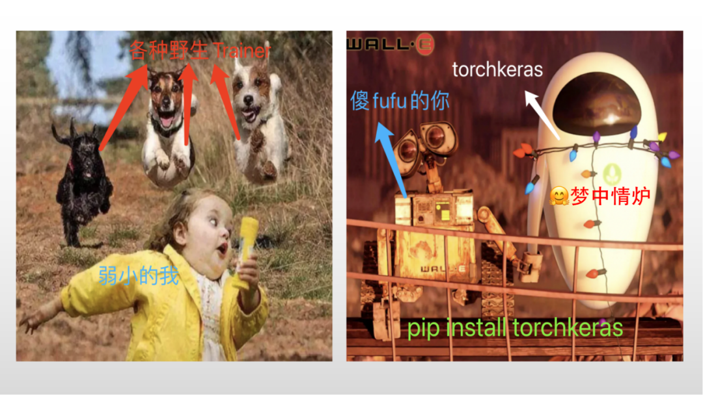
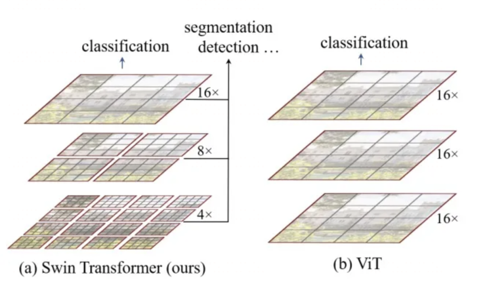
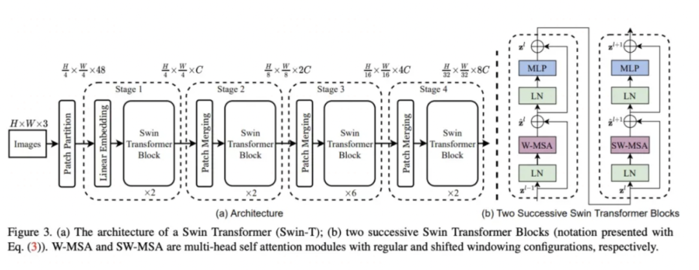
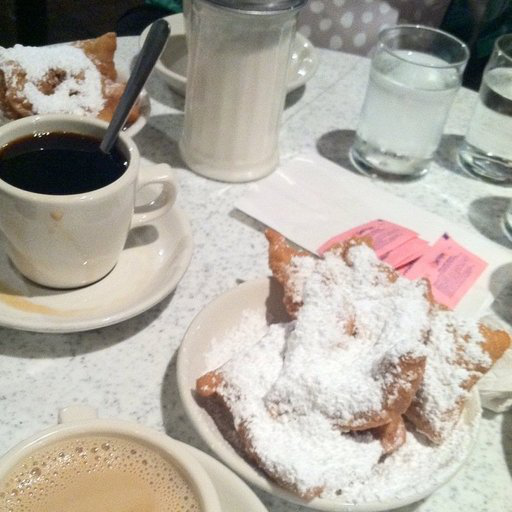
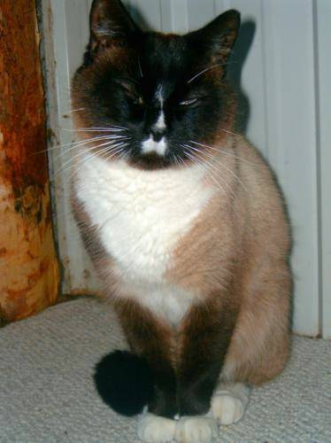
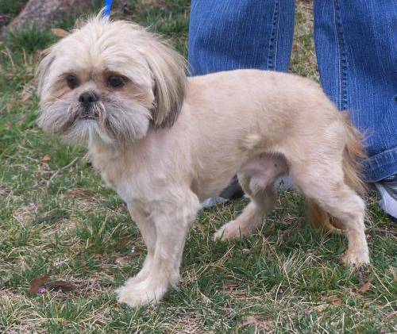
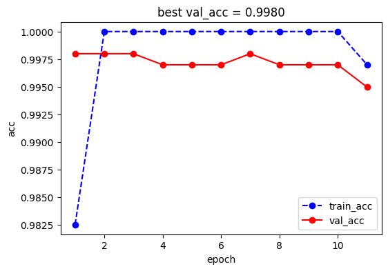
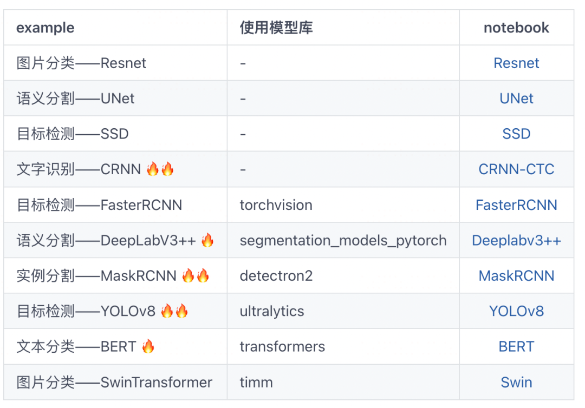
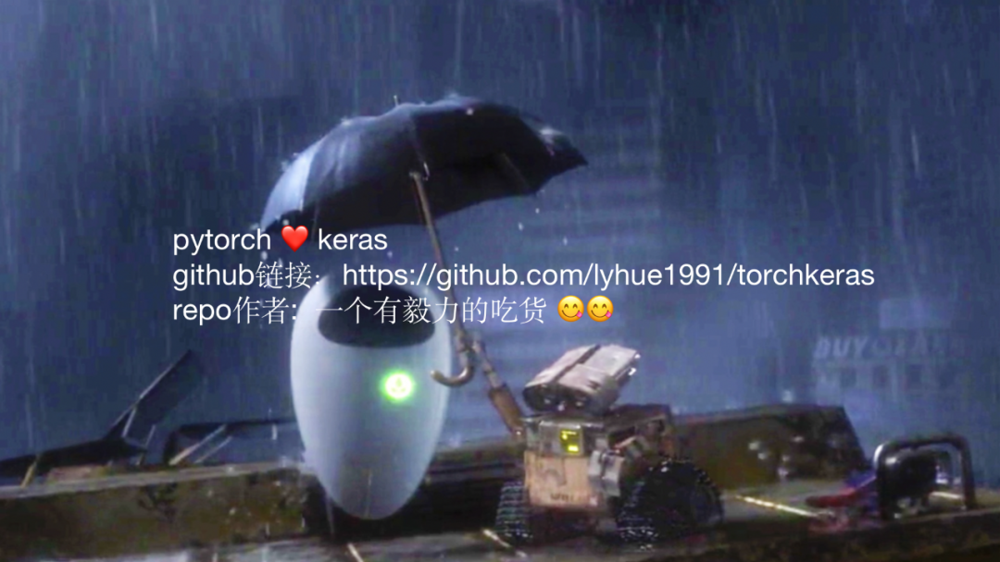

****

SwinTransformer 是微软亚洲研究院在2021年提出的适用于CV领域的一种基于Tranformer的backbone结构。

它是 **Shift Window Transformer**的缩写，主要创新点如下。

- 1，**分Window进行Transformer计算**，将自注意力计算量从输入尺寸的平方量级降低为线性量级。
- 2，**使用Shift Window 即窗格偏移技术 来 融合不同窗格之间的信息**。(SW-MSA)
- 3，使用类似七巧板拼图技巧 和Mask 技巧 来对 Window偏移后不同大小的窗格进行注意力计算以提升计算效率。
- 4，在经典的QKV注意力公式中引入 Relative Position Bias 项来非常自然地表达位置信息的影响。
- 5，使用Patch Merging技巧来 实现特征图的下采样，作用类似池化操作但不易丢失信息。
- 6，使用不同大小的Window提取不同层次的特征并进行融合。

SwinTransformer虽然采用了Transformer的实现方法，但在整体设计上借鉴了非常多卷积的设计特点。

如：局域性，平移不变性，特征图逐渐减小，通道数逐渐增加，多尺度特征融合等。

同时它还应用了非常多的trick来弥补Transformer的不足，如效率问题，位置信息表达不充分等。

**B站上有UP主说SwinTransformer是披着Transformer皮的CNN。但毕竟它的主要内在计算是Transformer，所以我感觉它更像是****叠加了卷积Buff的Transformer****。**

SwinTransformer这个backbone结构表达能力非常强，同时适用性广泛，可适用于图片分类，分割，检测等多种任务，而且结构设计和实验工作都做得比较touch，所以被评为了2021年的ICCV best paper.

下面的范例我们微调 timm库中的 SwinTransformer模型来 做一个猫狗图片分类任务。

**公众号算法美食屋后台回复关键词：****torchkeras****，获取本文notebook源码和数据集下载链接。**

#!pip install -U  timm, torchkeras 

###

## 〇，预训练模型

import timm 
from urllib.request import urlopen
from PIL import Image
import timm
import torch 

img = Image.open(urlopen(
    'https://huggingface.co/datasets/huggingface/documentation-images/resolve/main/beignets-task-guide.png'
))
img 

model = timm.create_model("swin_base_patch4_window7_224.ms_in22k_ft_in1k", pretrained=True)
model = model.eval()

# get model specific transforms (normalization, resize)
data_config = timm.data.resolve_model_data_config(model)
transforms = timm.data.create_transform(**data_config, is_training=False)

output = model(transforms(img).unsqueeze(0))  # unsqueeze single image into batch of 1

top5_probabilities, top5_class_indices = torch.topk(output.softmax(dim=1), k=5)

info = timm.data.ImageNetInfo()
class_codes = info.__dict__['_synsets']
class_names = [info.__dict__['_lemmas'][x] for x in class_codes]

{class_names[i]:v for i,v in zip(top5_class_indices.tolist()[0],
                                top5_probabilities.tolist()[0])}
{'espresso': 0.1655443161725998,
 'cup': 0.12100766599178314,
 'chocolate sauce, chocolate syrup': 0.11809349805116653,
 'eggnog': 0.06144588068127632,
 'tray': 0.03965265676379204}
识别出来的主要是 espresso(蒸馏咖啡)，cup 啥的，跟图片差不多，么得问题。

## 一，准备数据

import torch
import os 

data_path = './datasets/cats_vs_dogs'

train_cats = os.listdir(os.path.join(data_path,"train","cats"))
img = Image.open(os.path.join(os.path.join(data_path,"train","cats",train_cats[0])))
img 

train_dogs = os.listdir(os.path.join(data_path,"train","dogs"))
img = Image.open(os.path.join(os.path.join(data_path,"train","dogs",train_dogs[0])))
img 

from torchvision.datasets import ImageFolder

ds_train = ImageFolder(os.path.join(data_path,"train"),transforms)

ds_val = ImageFolder(os.path.join(data_path,"val"),transforms)

dl_train = torch.utils.data.DataLoader(ds_train, batch_size=4 ,
                                             shuffle=True)
dl_val = torch.utils.data.DataLoader(ds_val, batch_size=2,
                                             shuffle=True)

class_names = ds_train.classes

print(len(ds_train))
print(len(ds_val))

2000
995
for batch in dl_val:
    break 
    
batch[1]
tensor([0, 1])

## 二，定义模型

model.reset_classifier(num_classes=2)

model(batch[0])
tensor([[ 0.1698, -0.3366],
        [ 0.4805,  0.1415]], grad_fn=<AddmmBackward0>)
model.cuda();

## 三，训练模型

from torchkeras import KerasModel 
from torchmetrics import Accuracy

loss_fn = torch.nn.CrossEntropyLoss()
metrics_dict = {"acc":Accuracy(task='multiclass',num_classes=2)}

optimizer = torch.optim.Adam(model.parameters(),
                            lr=1e-5)

keras_model = KerasModel(model,
                   loss_fn = loss_fn,
                   metrics_dict= metrics_dict,
                   optimizer = optimizer
                  )     

features,labels = batch 
loss_fn(model(features.cuda()),labels.cuda())
tensor(0.6743, device='cuda:0', grad_fn=<NllLossBackward0>)
dfhistory= keras_model.fit(train_data=dl_train, 
                    val_data=dl_val, 
                    epochs=100, 
                    ckpt_path='checkpoint.pt',
                    patience=10, 
                    monitor="val_acc",
                    mode="max",
                    mixed_precision='no',
                    plot = True,
                    quiet=True
                   )

**可以看到SwinTransformer的拟合能力非常逆天，在这个简单的数据集上，finetune两个Epoch就直接把训练集上的Acc打到了100%，最后的验证集结果也是高达99.8%，非常强大~**

## 四，评估模型

keras_model.evaluate(dl_val)

## 五，使用模型

from PIL import Image 
img = Image.open('./datasets/cats_vs_dogs/val/dogs/dog.2005.jpg')
model.eval();
model(transforms(img)[None,...].cuda()).softmax(axis=1)
tensor([[1.1537e-04, 9.9988e-01]], device='cuda:0', grad_fn=<SoftmaxBackward0>)

## 六，保存模型

torch.save(model.state_dict(),'swin_transformer.pt')

**更多有趣范例，公众号算法美食屋后台回复关键词：****torchkeras****，可在tochkeras仓库获取范例源码。**

