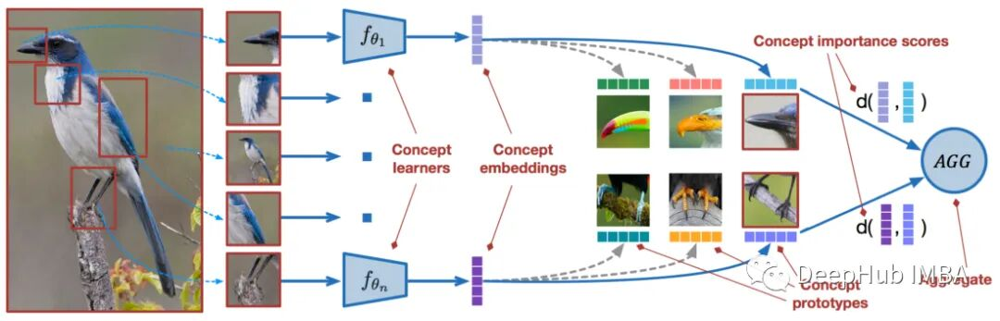
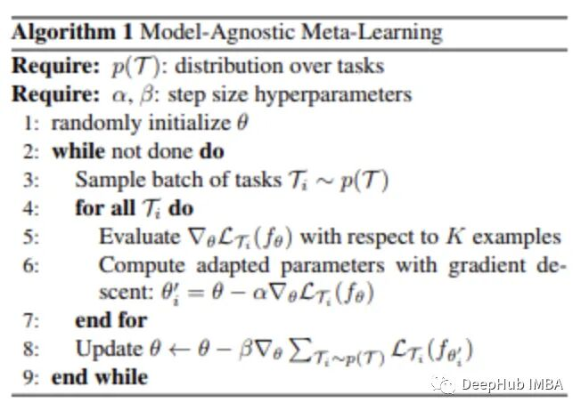
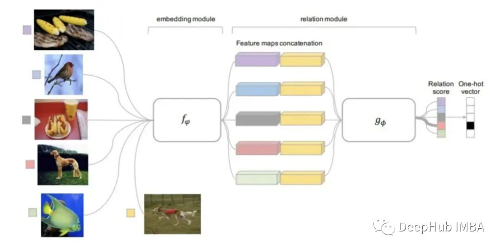
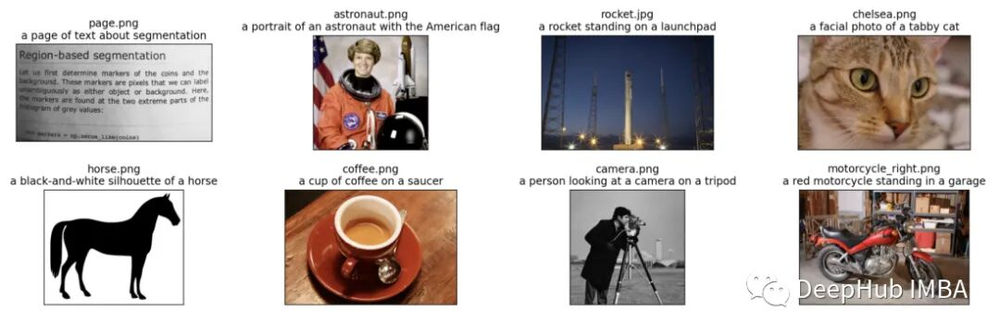
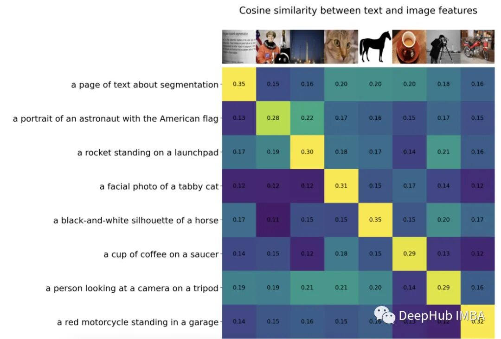
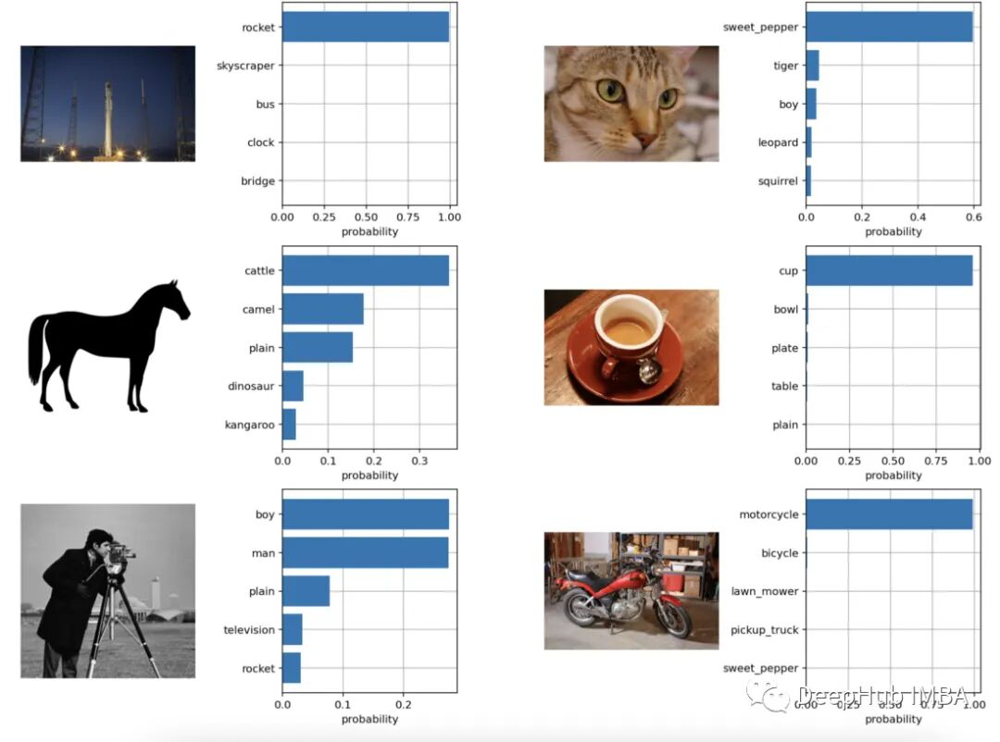
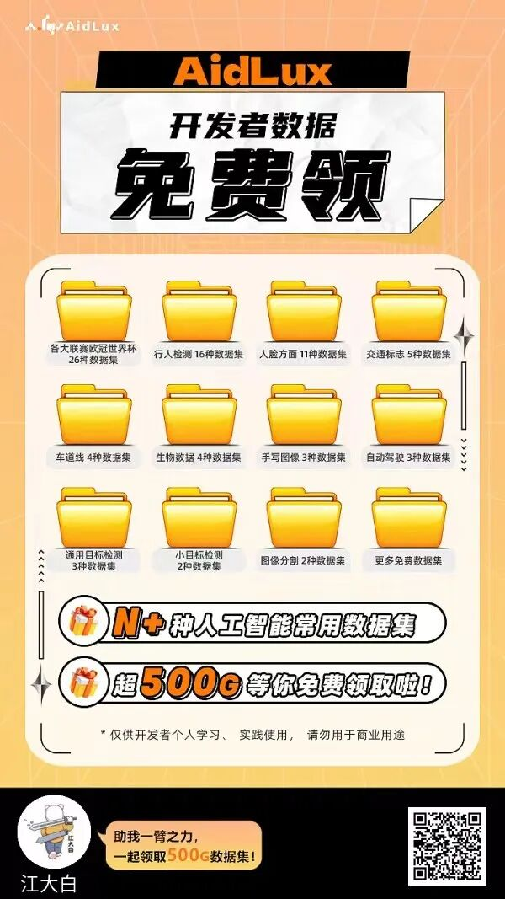
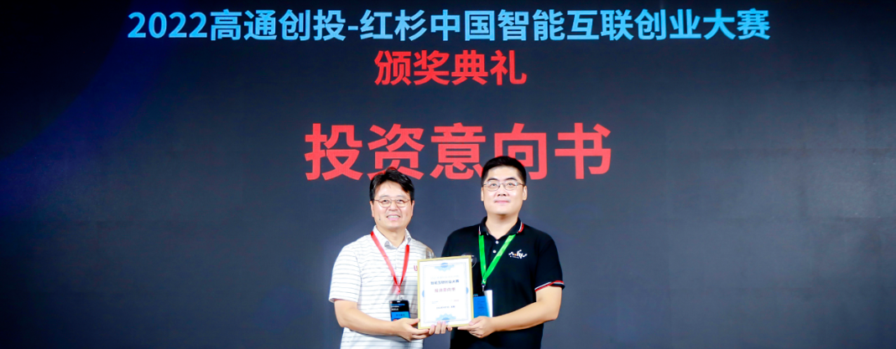
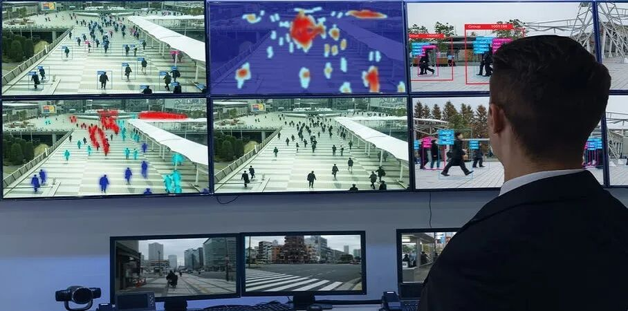
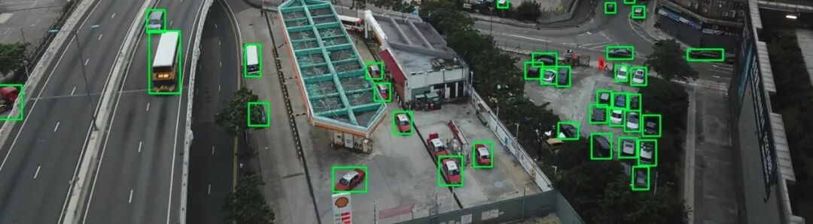

以下文章来源于微信公众号：DeepHub IMBA

链接：https://mp.weixin.qq.com/s/i4QnMY9fVX-9UkZeCqAVNw

本文仅用于学术分享，如有侵权，请联系后台作删文处理

**导读**

图像分类是除了目标检测以外，CV领域非常重要的算法，本文简要总结了四种小样本学习图像分类算法的方法，并使用pytorch实现了一个简单的分类模型，附有操作代码。

近年来，基于深度学习的模型在目标检测和图像识别等任务中表现出色。像ImageNet这样具有挑战性的图像分类数据集，包含1000种不同的对象分类，现在一些模型已经超过了人类水平上。但是这些模型依赖于监督训练流程，标记训练数据的可用性对它们有重大影响，并且模型能够检测到的类别也仅限于它们接受训练的类。

由于在训练过程中没有足够的标记图像用于所有类，这些模型在现实环境中可能不太有用。并且我们希望的模型能够识别它在训练期间没有见到过的类，因为几乎不可能在所有潜在对象的图像上进行训练。我们将从几个样本中学习的问题被称为“少样本学习 Few-Shot learning”。

## 什么是小样本学习?

少样本学习是机器学习的一个子领域。它涉及到在只有少数训练样本和监督数据的情况下对新数据进行分类。只需少量的训练样本，我们创建的模型就可以相当好地执行。

考虑以下场景:在医疗领域，对于一些不常见的疾病，可能没有足够的x光图像用于训练。对于这样的场景，构建一个小样本学习分类器是完美的解决方案。

### 小样本的变化

一般来说，研究人员确定了四种类型:

- N-Shot Learning (NSL)
- Few-Shot Learning ( FSL )
- One-Shot Learning (OSL)
- Zero-Shot Learning (ZSL)

当我们谈论 FSL 时，我们通常指的是 N-way-K-Shot 分类。N 代表类别数，K 代表每个类中要训练的样本数。所以N-Shot Learning 被视为比所有其他概念更广泛的概念。可以说 Few-Shot、One-Shot 和 Zero-Shot是 NSL 的子领域。而零样本学习旨在在没有任何训练示例的情况下对看不见的类进行分类。

在 One-Shot Learning 中，每个类只有一个样本。Few-Shot 每个类有 2 到 5 个样本，也就是说 Few-Shot 是更灵活的 One-Shot Learning 版本。

## 小样本学习方法

通常，在解决 Few Shot Learning 问题时应考虑两种方法：

### 数据级方法 (DLA)

这个策略非常简单，如果没有足够的数据来创建实体模型并防止欠拟合和过拟合，那么就应该添加更多数据。正因为如此，许多 FSL 问题都可以通过利用来更大大的基础数据集的更多数据来解决。基本数据集的显着特征是它缺少构成我们对 Few-Shot 挑战的支持集的类。例如，如果我们想要对某种鸟类进行分类，则基础数据集可能包含许多其他鸟类的图片。

### 参数级方法 (PLA)

从参数级别的角度来看，Few-Shot Learning 样本相对容易过拟合，因为它们通常具有大的高维空间。限制参数空间、使用正则化和使用适当的损失函数将有助于解决这个问题。少量的训练样本将被模型泛化。

通过将模型引导到广阔的参数空间可以提高性能。由于缺乏训练数据，正常的优化方法可能无法产生准确的结果。

因为上面的原因，训练我们的模型以发现通过参数空间的最佳路径，产生最佳的预测结果。这种方法被称为元学习。

## 小样本学习图像分类算法

有4种比较常见的小样本学习的方法：

### 与模型无关的元学习 Model-Agnostic Meta-Learning

基于梯度的元学习 (GBML) 原则是 MAML 的基础。在 GBML 中，元学习者通过基础模型训练和学习所有任务表示的共享特征来获得先前的经验。每次有新任务要学习时，元学习器都会利用其现有经验和新任务提供的最少量的新训练数据进行微调训练。

一般情况下，如果我们随机初始化参数经过几次更新算法将不会收敛到良好的性能。MAML 试图解决这个问题。MAML 只需几个梯度步骤并且保证没有过度拟合的前提下，为元参数学习器提供了可靠的初始化，这样可以对新任务进行最佳快速学习。

步骤如下：

元学习者在每个分集（episode）开始时创建自己的副本C，

C 在这一分集上进行训练（在 base-model 的帮助下），

C 对查询集进行预测，

从这些预测中计算出的损失用于更新 C，

这种情况一直持续到完成所有分集的训练。

- 元学习者在每个分集（episode）开始时创建自己的副本C，
- C 在这一分集上进行训练（在 base-model 的帮助下），
- C 对查询集进行预测，
- 从这些预测中计算出的损失用于更新 C，
- 这种情况一直持续到完成所有分集的训练。

这种技术的最大优势在于，它被认为与元学习算法的选择无关。因此MAML 方法被广泛用于许多需要快速适应的机器学习算法，尤其是深度神经网。

### 匹配网络 Matching Networks

为解决 FSL 问题而创建的第一个度量学习方法是匹配网络 (MN)。

当使用匹配网络方法解决 Few-Shot Learning 问题时需要一个大的基础数据集。。

将该数据集分为几个分集之后，对于每一分集，匹配网络进行以下操作：

- 来自支持集和查询集的每个图像都被馈送到一个 CNN，该 CNN 为它们输出特征的嵌入
- 查询图像使用支持集训练的模型得到嵌入特征的余弦距离，通过 softmax 进行分类
- 分类结果的交叉熵损失通过 CNN 反向传播更新特征嵌入模型

匹配网络可以通过这种方式学习构建图像嵌入。MN 能够使用这种方法对照片进行分类，并且无需任何特殊的类别先验知识。他只要简单地比较类的几个实例就可以了。

由于类别因分集而异，因此匹配网络会计算对类别区分很重要的图片属性（特征）。而当使用标准分类时，算法会选择每个类别独有的特征。

### 原型网络 Prototypical Networks

与匹配网络类似的是原型网络（PN）。它通过一些细微的变化来提高算法的性能。PN 比 MN 取得了更好的结果，但它们训练过程本质上是相同的，只是比较了来自支持集的一些查询图片嵌入，但是 原型网络提供了不同的策略。

我们需要在 PN 中创建类的原型：通过对类中图像的嵌入进行平均而创建的类的嵌入。然后仅使用这些类原型来比较查询图像嵌入。当用于单样本学习问题时，它可与匹配网络相媲美。

### 关系网络 Relation Network

关系网络可以说继承了所有上面提到方法的研究的结果。RN是基于PN思想的但包含了显著的算法改进。

该方法使用的距离函数是可学习的，而不是像以前研究的事先定义它。关系模块位于嵌入模块之上，嵌入模块是从输入图像计算嵌入和类原型的部分。

可训练的关系模块（距离函数）输入是查询图像的嵌入与每个类的原型，输出为每个分类匹配的关系分数。关系分数通过 Softmax 得到一个预测。

## 使用 Open-AI Clip 进行零样本学习

CLIP（Contrastive Language-Image Pre-Training）是一个在各种（图像、文本）对上训练的神经网络。它无需直接针对任务进行优化，就可以为给定的图像来预测最相关的文本片段（类似于 GPT-2 和 3 的零样本的功能）。

CLIP 在 ImageNet“零样本”上可以达到原始 ResNet50 的性能，而且需要不使用任何标记示例，它克服了计算机视觉中的几个主要挑战，下面我们使用Pytorch来实现一个简单的分类模型。

### 引入包

! pip install ftfy regex tqdm
! pip install git+https://github.com/openai/CLIP.gitimport numpy as np
import torch
from pkg_resources import packaging
 
print("Torch version:", torch.__version__)

### 加载模型

import clipclip.available\_models\(\) # it will list the names of available CLIP modelsmodel, preprocess = clip.load\("ViT-B/32"\)  
 model.cuda\(\).eval\(\)  
 input\_resolution = model.visual.input\_resolution  
 context\_length = model.context\_length  
 vocab\_size = model.vocab\_size  

 print\("Model parameters:", f"\{np.sum\(\[int\(np.prod\(p.shape\)\) for p in model.parameters\(\)\]\):,\}"\)  
 print\("Input resolution:", input\_resolution\)  
 print\("Context length:", context\_length\)  
 print\("Vocab size:", vocab\_size\)

### 图像预处理

我们将向模型输入8个示例图像及其文本描述，并比较对应特征之间的相似性。

分词器不区分大小写，我们可以自由地给出任何合适的文本描述。

import os  
 import skimage  
 import IPython.display  
 import matplotlib.pyplot as plt  
 from PIL import Image  
 import numpy as np  

 from collections import OrderedDict  
 import torch  

 \%matplotlib inline  
 \%config InlineBackend.figure\_format = 'retina'  

 \# images in skimage to use and their textual descriptions  
 descriptions = \{  
    "page": "a page of text about segmentation",  
    "chelsea": "a facial photo of a tabby cat",  
    "astronaut": "a portrait of an astronaut with the American flag",  
    "rocket": "a rocket standing on a launchpad",  
    "motorcycle\_right": "a red motorcycle standing in a garage",  
    "camera": "a person looking at a camera on a tripod",  
    "horse": "a black-and-white silhouette of a horse",  
    "coffee": "a cup of coffee on a saucer"  
 \}original\_images = \[\]  
 images = \[\]  
 texts = \[\]  
 plt.figure\(figsize=\(16, 5\)\)  

 for filename in \[filename for filename in os.listdir\(skimage.data\_dir\) if filename.endswith\(".png"\) or filename.endswith\(".jpg"\)\]:  
    name = os.path.splitext\(filename\)\[0\]  
    if name not in descriptions:  
        continue  

    image = Image.open\(os.path.join\(skimage.data\_dir, filename\)\).convert\("RGB"\)  
       
    plt.subplot\(2, 4, len\(images\) + 1\)  
    plt.imshow\(image\)  
    plt.title\(f"\{filename\}\\n\{descriptions\[name\]\}"\)  
    plt.xticks\(\[\]\)  
    plt.yticks\(\[\]\)  
       
    original\_images.append\(image\)  
    images.append\(preprocess\(image\)\)  
    texts.append\(descriptions\[name\]\)  

 plt.tight\_layout\(\)

### 结果的可视化如下：

我们对图像进行规范化，对每个文本输入进行标记，并运行模型的正传播获得图像和文本的特征。

image\_input = torch.tensor\(np.stack\(images\)\).cuda\(\)  
 text\_tokens = clip.tokenize\(\["This is " + desc for desc in texts\]\).cuda\(\)  

 with torch.no\_grad\(\):  
    image\_features = model.encode\_image\(image\_input\).float\(\)  
    text\_features = model.encode\_text\(text\_tokens\).float\(\)

我们将特征归一化，并计算每一对的点积，进行余弦相似度计算

image\_features /= image\_features.norm\(dim=-1, keepdim=True\)  
 text\_features /= text\_features.norm\(dim=-1, keepdim=True\)  
 similarity = text\_features.cpu\(\).numpy\(\) \@ image\_features.cpu\(\).numpy\(\).T  

 count = len\(descriptions\)  

 plt.figure\(figsize=\(20, 14\)\)  
 plt.imshow\(similarity, vmin=0.1, vmax=0.3\)  
 \# plt.colorbar\(\)  
 plt.yticks\(range\(count\), texts, fontsize=18\)  
 plt.xticks\(\[\]\)  
 for i, image in enumerate\(original\_images\):  
    plt.imshow\(image, extent=\(i - 0.5, i + 0.5, -1.6, -0.6\), origin="lower"\)  
 for x in range\(similarity.shape\[1\]\):  
    for y in range\(similarity.shape\[0\]\):  
        plt.text\(x, y, f"\{similarity\[y, x\]:.2f\}", ha="center", va="center", size=12\)  

 for side in \["left", "top", "right", "bottom"\]:  
  plt.gca\(\).spines\[side\].set\_visible\(False\)  

 plt.xlim\(\[-0.5, count - 0.5\]\)  
 plt.ylim\(\[count + 0.5, -2\]\)  

 plt.title\("Cosine similarity between text and image features", size=20\)

### 零样本的图像分类

from torchvision.datasets import CIFAR100  
 cifar100 = CIFAR100\(os.path.expanduser\("\~/.cache"\), transform=preprocess, download=True\)  
 text\_descriptions = \[f"This is a photo of a \{label\}" for label in cifar100.classes\]  
 text\_tokens = clip.tokenize\(text\_descriptions\).cuda\(\)  
 with torch.no\_grad\(\):  
    text\_features = model.encode\_text\(text\_tokens\).float\(\)  
    text\_features /= text\_features.norm\(dim=-1, keepdim=True\)  

 text\_probs = \(100.0 \* image\_features \@ text\_features.T\).softmax\(dim=-1\)  
 top\_probs, top\_labels = text\_probs.cpu\(\).topk\(5, dim=-1\)  
 plt.figure\(figsize=\(16, 16\)\)  
 for i, image in enumerate\(original\_images\):  
    plt.subplot\(4, 4, 2 \* i + 1\)  
    plt.imshow\(image\)  
    plt.axis\("off"\)  

    plt.subplot\(4, 4, 2 \* i + 2\)  
    y = np.arange\(top\_probs.shape\[-1\]\)  
    plt.grid\(\)  
    plt.barh\(y, top\_probs\[i\]\)  
    plt.gca\(\).invert\_yaxis\(\)  
    plt.gca\(\).set\_axisbelow\(True\)  
    plt.yticks\(y, \[cifar100.classes\[index\] for index in top\_labels\[i\].numpy\(\)\]\)  
    plt.xlabel\("probability"\)  

 plt.subplots\_adjust\(wspace=0.5\)  
 plt.show\(\)

可以看到，分类的效果还是非常好的。

## 推荐阅读

# 

AIHIA[|](http://mp.weixin.qq.com/s?__biz=MzU5OTA2Mjk5Mw==&mid=2247490028&idx=1&sn=4166889e22c31f3c0af7a376967b5dca&chksm=febbf952c9cc70442f63ef7155bbd6cb0535ccb4ae6ea6f110af8e14cdabfad9fa4865feeaae&scene=21#wechat_redirect)AI人才创新发展联盟2023年盟友招募

# 

AI融资[|](http://mp.weixin.qq.com/s?__biz=MzU5OTA2Mjk5Mw==&mid=2247490028&idx=1&sn=4166889e22c31f3c0af7a376967b5dca&chksm=febbf952c9cc70442f63ef7155bbd6cb0535ccb4ae6ea6f110af8e14cdabfad9fa4865feeaae&scene=21#wechat_redirect)智能物联网公司阿加犀获得高通5000W融资

### 

[Yolov5应用 |](http://mp.weixin.qq.com/s?__biz=MzU5OTA2Mjk5Mw==&mid=2247490028&idx=1&sn=4166889e22c31f3c0af7a376967b5dca&chksm=febbf952c9cc70442f63ef7155bbd6cb0535ccb4ae6ea6f110af8e14cdabfad9fa4865feeaae&scene=21#wechat_redirect)家庭安防告警系统全流程及代码讲解

江大白[|](http://mp.weixin.qq.com/s?__biz=MzU5OTA2Mjk5Mw==&mid=2247490028&idx=1&sn=4166889e22c31f3c0af7a376967b5dca&chksm=febbf952c9cc70442f63ef7155bbd6cb0535ccb4ae6ea6f110af8e14cdabfad9fa4865feeaae&scene=21#wechat_redirect)这些年从0转行AI行业的一些感悟

**注意：**人工智能行业，从算法研究、算法适配到项目落地，有很多流程。

为了便于大家学习交流，大白创建了一些**不同方向的行业交流群**。

**目前主要开设：AI视觉软件应用群、AI训练营开发者群**、**企业级模型适配群，AI交流群****！**

大家可以根据自己的兴趣爱好，**加入对应的微信群**，一起交流学习！

此外大白和数十名志同道合的AI小伙伴，一起筹备创建了**AIHIA人才联盟。**联盟网站：www.aihiamgc.com。

目前已有200+名盟友，已举办30多场技术主题分享及行业圆桌论坛，以及300多场线上会议，也欢迎大家加入。

© THE END

**大家一起加油！** 

