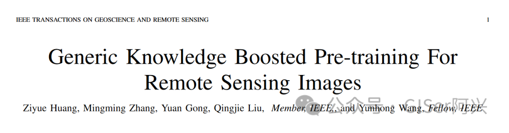

- **论文题目：**Generic Knowledge Boosted Pre-training For Remote Sensing Images
- **论文链接：**https://arxiv.org/pdf/2401.04614.pdf
- **发表时间：**2024.1.9

## 摘要

深度学习模型对于**场景分类、变化检测、土地覆盖分割**等遥感图像理解任务至关重要。大多数现有遥感深度学习模型的主干通常通过从ImageNet预训练（IMP）中获得的预训练权重进行初始化。然而，**遥感图像**与**自然图像**（例如ImageNet）之间存在**领域差距**，使得通过IMP预训练权重初始化的深度学习模型在遥感图像理解方面表现不佳。

本文提出了一种新颖的遥感预训练框架，即**通用知识增强遥感预训练**（**GeRSP**），用于从遥感和自然图像中学习用于遥感理解任务的强大表示。GeRSP包含两个预训练分支：

- （1）采用自监督预训练分支从未标记的遥感图像中学习与领域相关的表示；
- （2）将监督预训练分支集成到GeRSP中，从带标签的自然图像中学习通用知识。此外，GeRSP使用师生架构将两个预训练分支结合起来，同时学习具有通用和特殊知识的表示，生成强大的预训练模型，用于深度学习模型初始化。

最后，在三个下游任务上评估了GeRSP和其他遥感预训练方法，即**目标检测、语义分割和场景分类**。广泛的实验结果一致表明，GeRSP能够以一种统一的方式有效地学习强大的表示，提高遥感下游任务的性能。

## 背景

为了弥补现有的预训练范式的不足，本文提出了**通用知识增强遥感预训练（GeRSP**），以获得通用和遥感领域的知识，**如图1所示。**特别地，

- 使用自然图像上的一个有监督的预训练分支来获取下游任务的一般知识。
- 为了获取RS域知识，在RS图像上的一个自监督预训练分支与自然图像上的一个监督预训练分支合作，使所提出的GeRSP同时从RS图像中学习域相关特征。

RS图像包含丰富的特定领域知识，而自然图像提供更广泛的通用图像知识。GeRSP的动机是通过利用自然图像中存在的多样性来提高RSP的泛化性能。

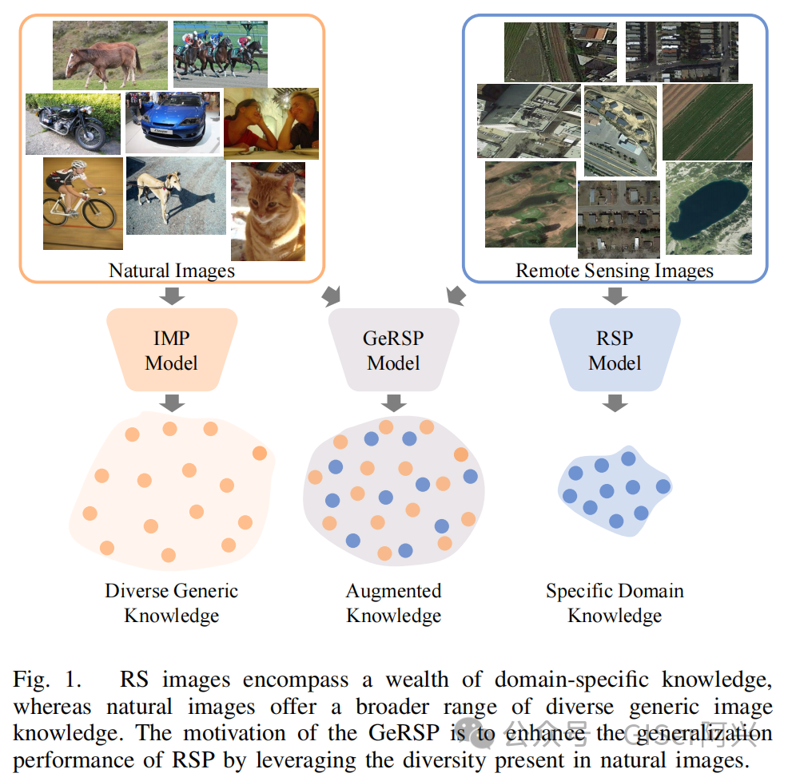

## 方法

### 模型总览

本文提出了**GeRSP**，一个**融合IMP和RSP**的新型预训练框架。GeRSP从IMP中学习基础知识，并捕捉专门为遥感图像定制的特定知识。下游任务使用GeRSP预训练权重作为微调的初始化权重。这种两阶段的训练方法见**图2**。

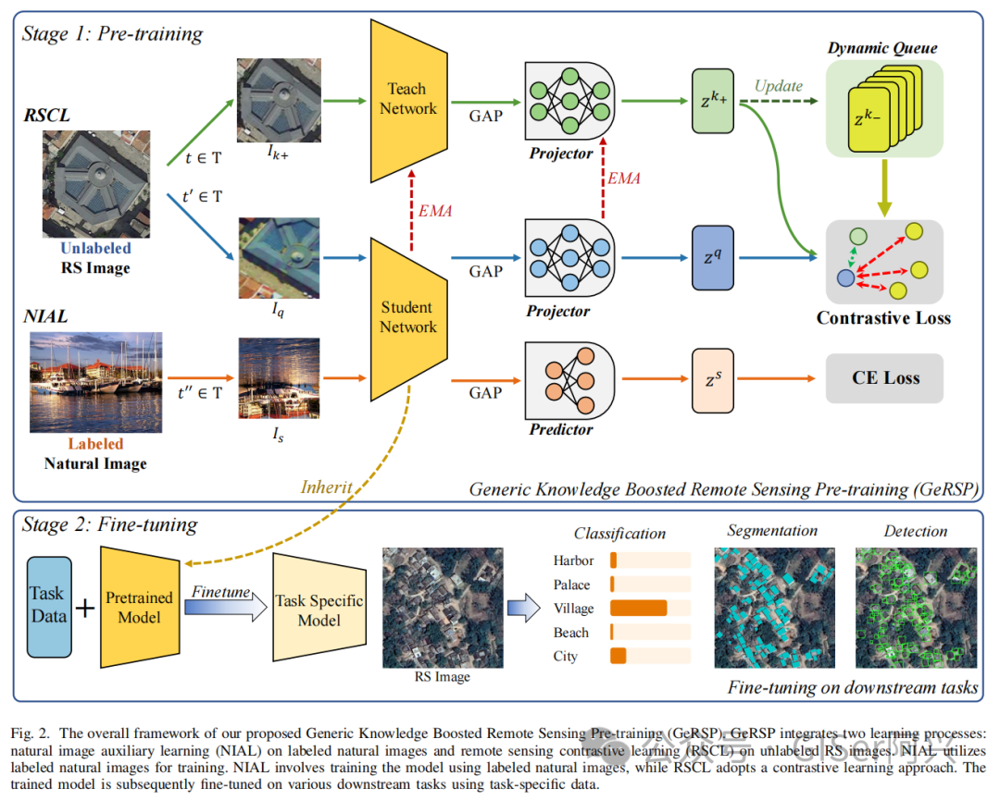

GeRSP采用师生架构实现协同学习。它包括两个学习过程：

- 在**标记的自然图像**上进行自然图像辅助学习**（NIAL）**
- 在未标记的遥感图像上进行**遥感对比学习（RSCL）**。RSCL同时训练师网络和生网络。

在训练过程中，使用生网络参数的指数移动平均值来更新师网络的参数。相反，在NIAL的情况下，训练仅专注于生网络。最终，生网络充当下游任务的预训练模型。在GeRSP的每个迭代中，从各自的数据集中随机抽取相等数量的自然图像和遥感图像。

### 数据增强

- 首先，从相应的原始图像中裁剪图像，裁剪比例在0.2到1之间，并调整大小为224。
- 随后，应用颜色抖动，概率为0.8，使用亮度、对比度、饱和度和色调因子分别为0.4、0.4、0.4和0.16。
- 此外，图像以0.2的概率转换为灰度。
- 最后，以0.5的概率翻转图像，并以0.5的概率进行高斯模糊。

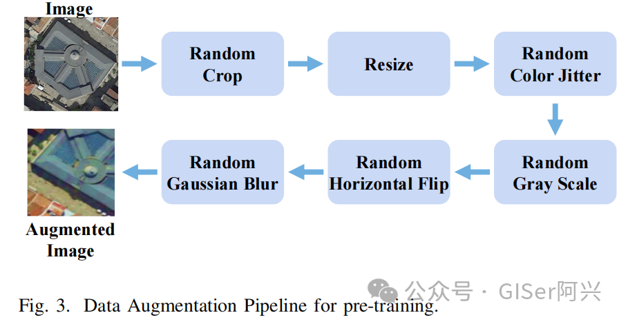

### 特征提取

- 选择**ResNet50**作为预训练的主干网络
- 在主干网络提取图像特征后，应用**全局平均池化（GAP）**以降低维度并获得**2048**维的特征
- 投影器由**两个具有ReLU激活的全连接层**组成，隐藏维度为2048，输出维度为128，生成特征。另一方面，预测器是一个单一的全连接层，将特征映射到分类的logits

### 损失函数

- 交叉熵损失**LCE**

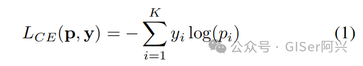

- **InfoNCE**损失作为对比损失函数

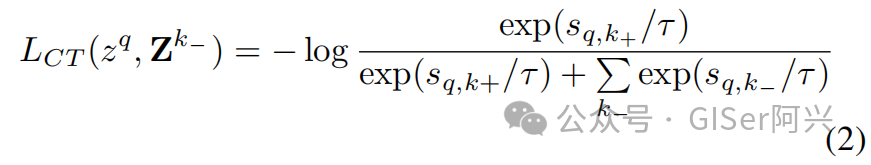

两个loss结合

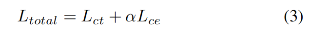

## 预训练

### 实验方案

- 选择ResNet50作为主干网络，并选择几种预训练方法，如监督预训练和自监督预训练。
- 为了验证GeRSP相对于RSP的优越性，选择SeCo、GeoAware、CACO、TOV、MoCo和 MoCov2作为比较方法。
- 为了展示GeRSP相对于IMP的优势，将其与监督预训练和MoCo进行比较。
- 此外，使用MoCo在混合数据上进行训练作为更强的基线，以展示GeRSP更好地利用混合数据的能力。

### 数据集

未标记的RS图像数据集**Million-AID（MAID）**和有标签的自然图像数据集**ImageNet**用于预训练。MAID是一个大规模的遥感场景分类数据集，包含1,000,848张图像，涵盖51个场景类别。MAID数据集是从Google Earth收集的，具有广泛的分辨率，每像素从0.5到153米不等。

### 学习率设置

所有的预训练方法都使用随机梯度下降（SGD）优化器进行100个epochs的训练，初始学习率为0.05，权重衰减为0.90，动量为0.00005。GeRSP的学习率使用余弦退火调度器进行优化，带有重新启动。

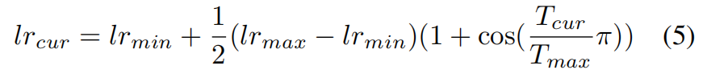

- 最小学习率lrmin设置为0.10，而最大学习率lrmax设置为0.01。在单一训练轮次中，Tmax被定义为最大的训练周期数，设置为20。Tcur表示当前轮次内的当前周期数。一旦Tcur达到Tmax，它将被重置为0以启动下一轮，lrcur表示当前学习率。
- 对于MoCo和MoCov2，学习率使用步进线性调度器进行优化，步长为30，学习率衰减为0.1。预训练方法以分布式方式进行训练，跨8个RTX-2080 GPU利用数据并行性，总批量大小为128。
- 在预训练阶段之后，移除不相关的组件，包括预测器、投影器和教师网络，学生网络作为下游任务的预训练模型。对于先前的RSP方法（SeCo、GeoAware、CACO和TOV），我们直接下载它们的预训练参数，并在下游任务上评估它们，以客观比较每种方法的性能。

## 实验

### 场景分类

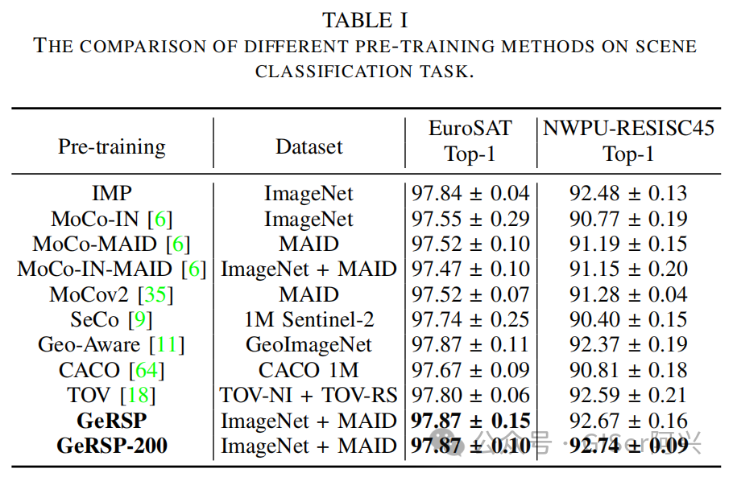

### 目标检测

- **DIOR数据集：**

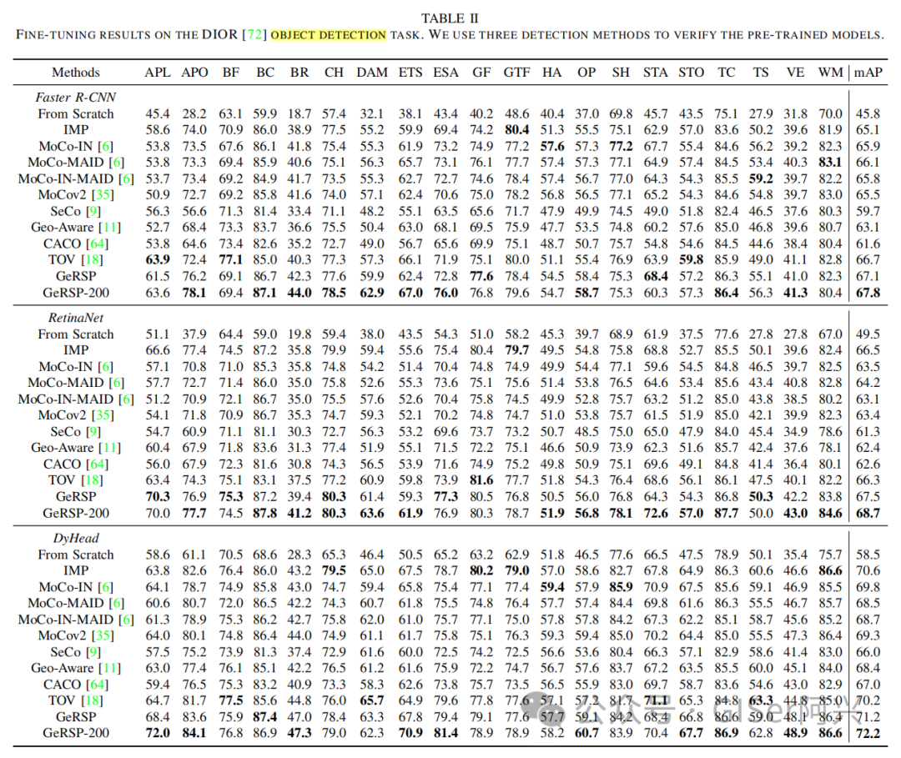

- **DOTA数据集：**

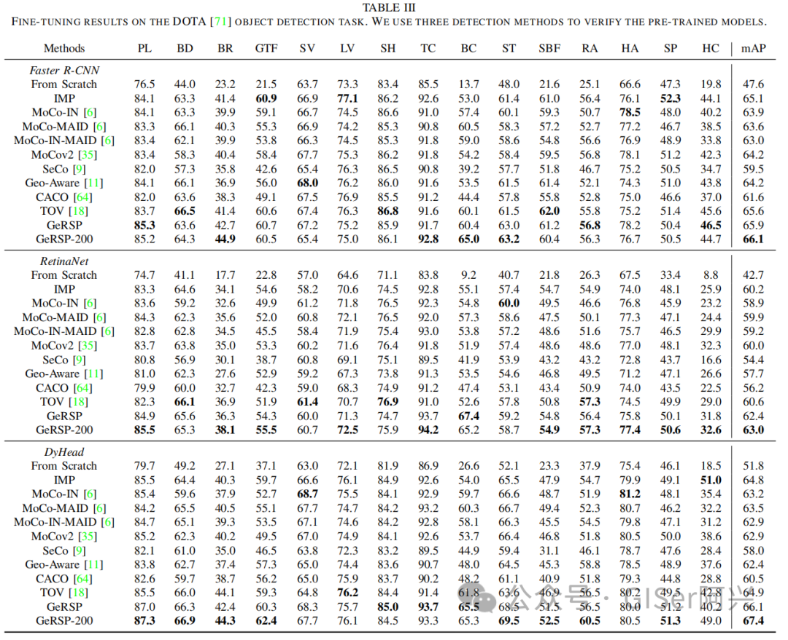

### 语义分割

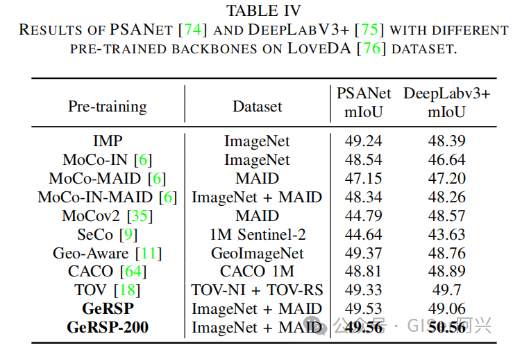

### α的取值

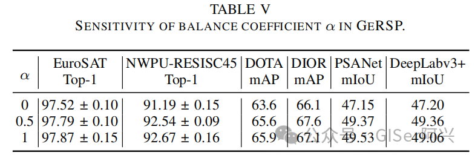

### 结果可视化

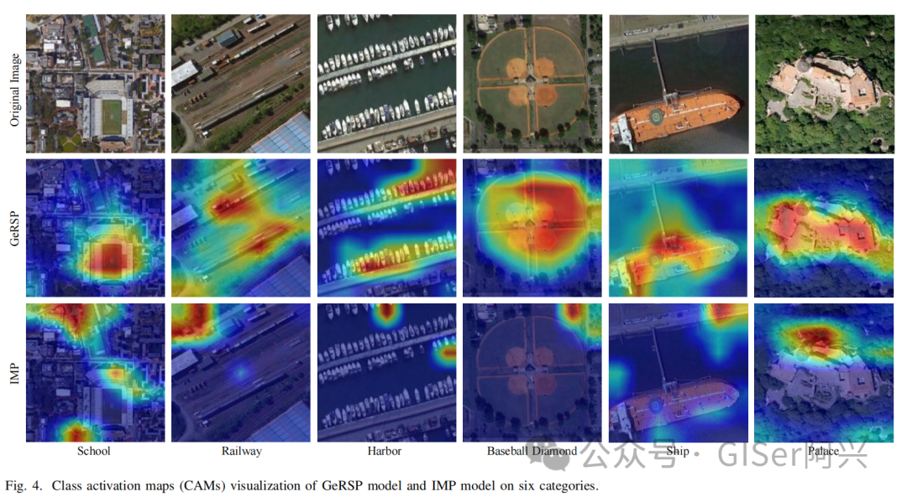

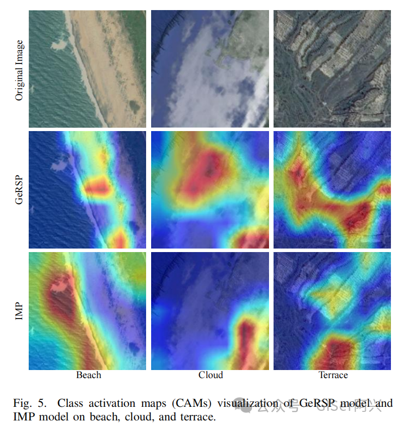

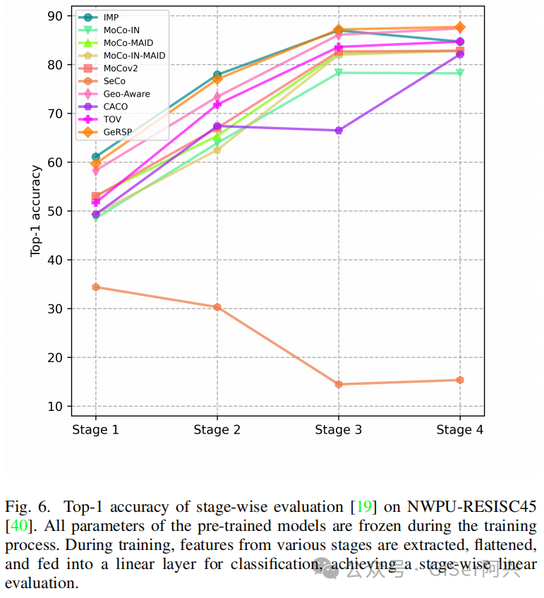
