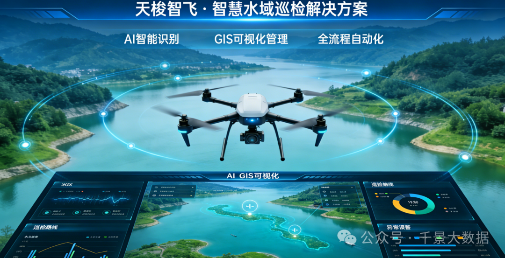
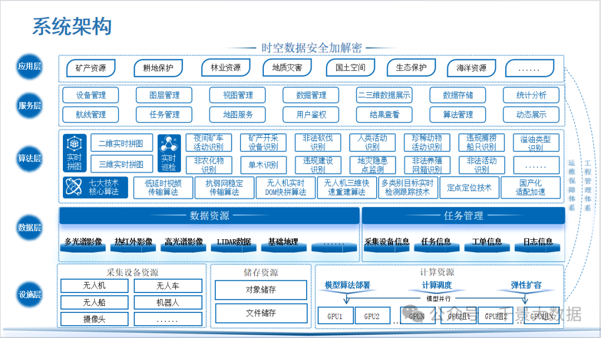
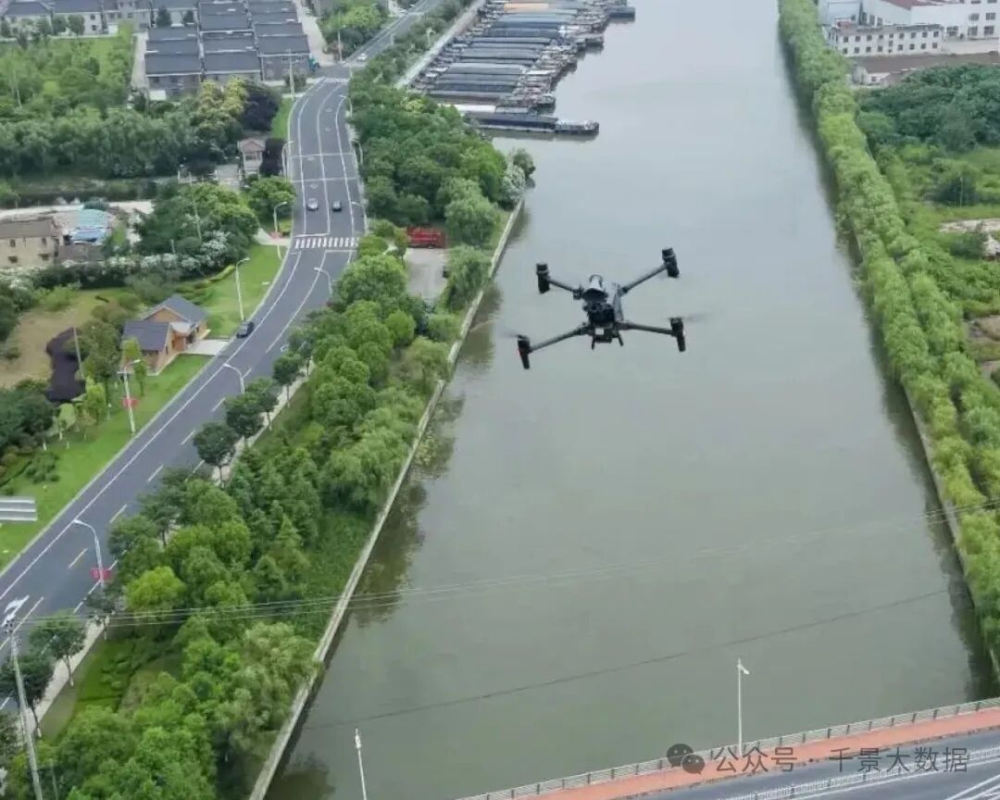
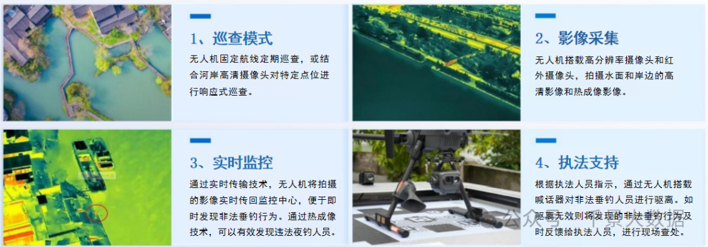
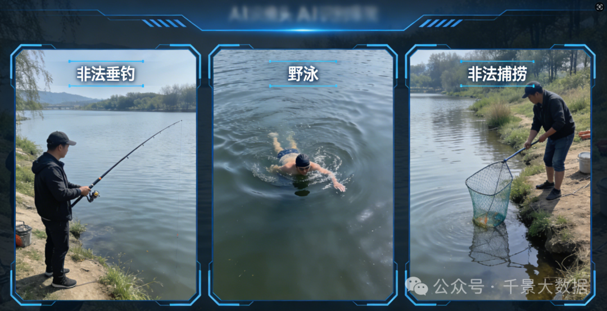
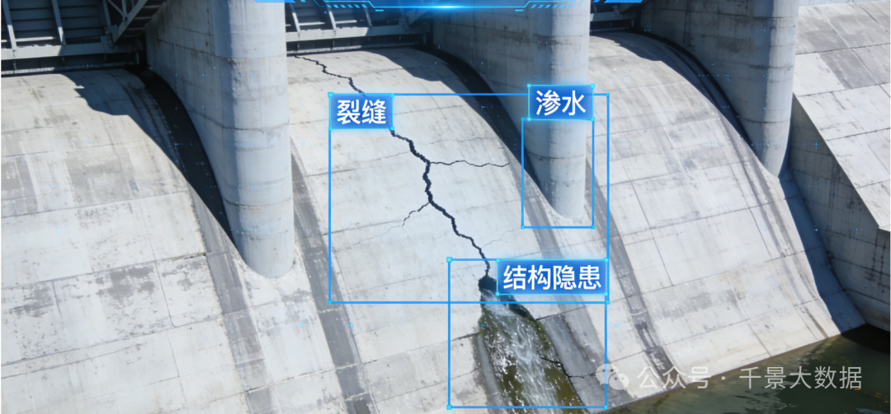
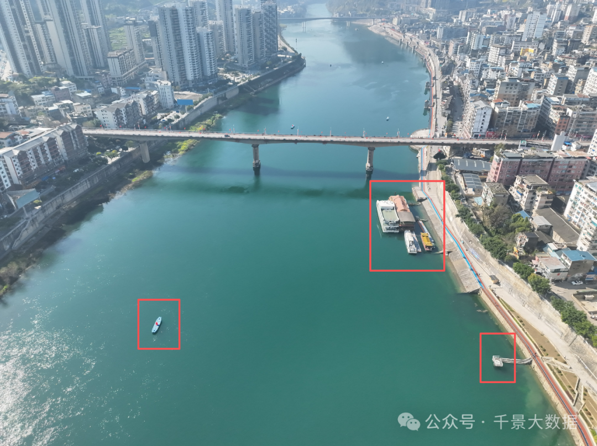
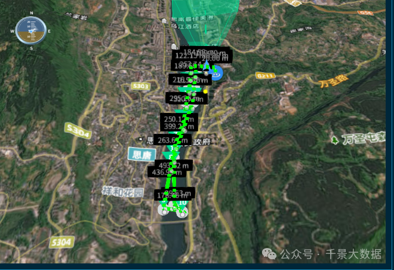
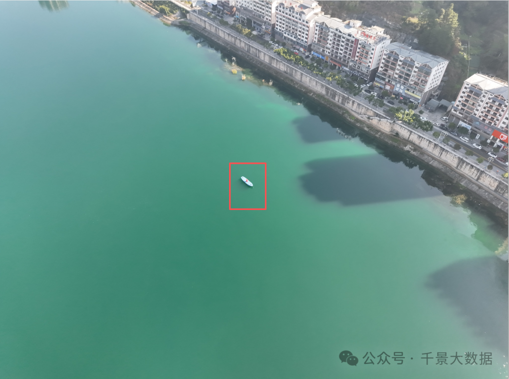

水资源保护与水域治理，是生态文明建设的关键一环。传统水域巡检依赖人工徒步、船只巡查与固定摄像头，效率低、盲区多、成本高、风险大，已难以满足现代化河湖管理需求。

天梭智飞・智慧水域巡检解决方案，以无人机 + AI+GIS 技术，打造全流程、自动化、智能化水域巡检体系，让河湖监管更高效、更精准、更安全。

一、硬核技术底座：六层架构 + 七大算法，业内领先

天梭智飞并非简单 “无人机 + 摄像头”，而是构建了设施层→数据层→算法层→服务层→应用层→保障体系的全链路智能架构，从硬件接入到 AI 决策全自主可控。

✦低延时视频传输算法：实时画面零卡顿，远程巡检如临现场；

✦抗弱网稳定传输算法：偏远水域、复杂信号环境不掉线；

✦无人机实时 DOM 快拼算法：飞行即成像，秒级生成正射影像；

✦无人机三维快速重建算法：河道、堤坝、岸线一键生成三维模型；

✦定点定位技术：厘米级 GPS + 飞行测量，排污口、隐患点精准落位；

✦多类别目标实时检测跟踪：人、船、违建、排污、漂浮物全识别；

✦国产化适配加速：全面适配国产芯片与系统，安全自主可控。

二、感知技术领先：多传感器融合，看得清、测得准

天梭智飞搭载可见光 + 红外 + 多光谱 + 激光雷达 + 喊话器五合一负载，实现 “一机多能、全域感知”。

✦ 白天高清巡检：亿级像素捕捉岸线违建、垃圾、非法垂钓；

✦ 夜间红外透视：热成像穿透黑夜，夜钓、偷排、隐蔽隐患无所遁形；

✦ 多光谱水质分析：直接反演水体污染指标，排污口精准溯源；

✦ 喊话器实时驱离：发现违规立即处置，执法闭环一步到位。

三、AI 智能识别：近百种算法，从 “人找问题” 到 “系统找人”

区别于普通航拍，天梭智飞内置水域场景专用 AI 模型，真正实现自动化巡检。可自动识别：

✦非法垂钓、野泳、非法捕捞；

✦非法排污口、污水异常排放；

✦河道 “四乱”：乱占、乱采、乱堆、乱建；

✦未备案船只、违规航行；

✦堤坝裂缝、渗水、结构隐患；

✦水面漂浮物、岸线垃圾。

识别→定位→告警→派单→归档，全流程 AI 自动完成，问题发现效率提升 10 倍以上。

四、平台技术优势：全自主可控，一站式智能管控

天梭智飞无人机智控平台，为水域巡检量身打造，10 大核心模块全自研：

✦二三维一体化地图引擎

自研高性能 GIS 引擎，支持点云、模型、影像融合展示，一屏统览全流域。

✦超低延时实时监控

多屏同步、AR 投影、远程操控，镜头无缝切换，画面实时回传。

✦智能航线规划

支持航点、面状、倾斜摄影、仿地飞行，复杂地形也能全自动巡航。

✦全自动任务调度

无人机巢 + 自动起降 + 定时巡检，7×24 小时无人值守作业。

✦电子围栏安全管控

自定义禁飞区、作业区，飞行安全全程可控。

✦成果自动生成

飞行轨迹、视频照片、识别报告、三维模型一键导出。

五、空天地一体化：覆盖无死角，巡检无盲区

针对陡峭河岸、密林河段、偏远水域等人工无法抵达区域，天梭智飞实现：

✦高空全覆盖：无人机快速扫面，消除巡检盲区；

✦数据全实时：边飞边传、边传边识、边识边警；

✦监测全维度：水面、岸线、堤坝、排污、水质等问题一网打尽。

技术赋能治水，智慧守护河湖

天梭智飞・智慧水域巡检解决方案，用硬核技术替代人工奔波，用AI 智能提升监管效能，用全域感知消除治理盲区。让水域巡检从 “被动处置” 转向 “主动防控”，让每一条河流、每一片湖泊都拥有24 小时空中智能卫士。

编辑：李沙沙

审核：王金桂
